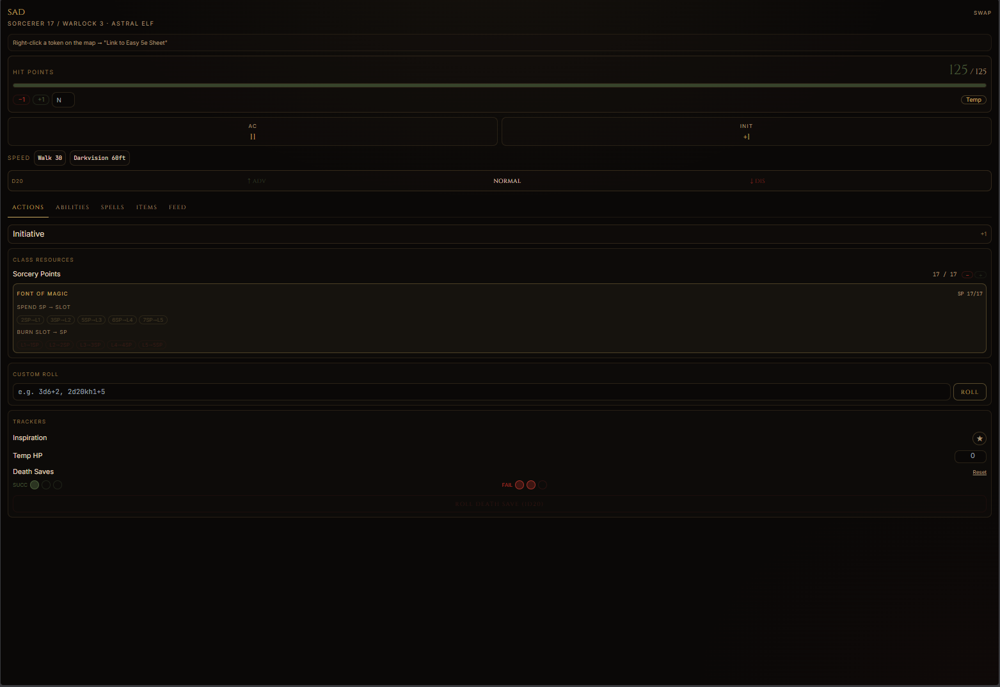
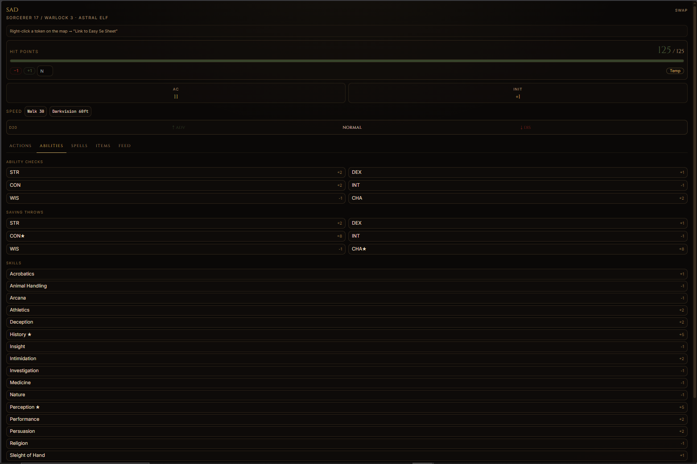
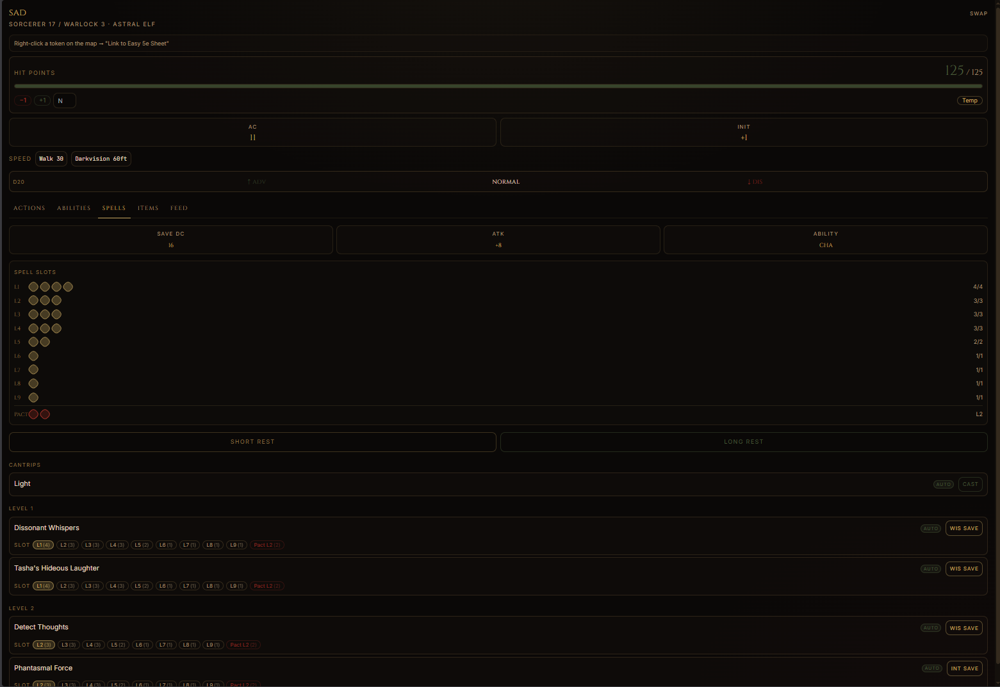
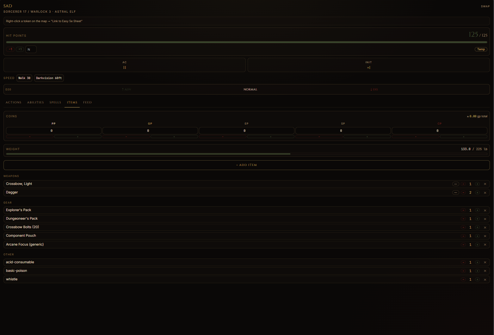

# Easy 5e Sheet — Owlbear Rodeo Extension

A live D&D 5e character sheet that lives inside your Owlbear Rodeo
room. Pairs with the full character builder at
[easydnd5e.app](https://easydnd5e.app) so the same character you
build in the browser shows up at the table — HP, slots, dice, the
lot.

## Install (one-step)

1. Open your Owlbear Rodeo room.
2. Click the puzzle-piece icon → **Settings → Extensions**.
3. Paste this URL into "Install Extension":

   ```
   https://easydnd5e.app/obr/manifest.json
   ```

4. The Easy 5e Sheet popover icon appears in your room toolbar.
   Click it to open the live sheet.

That's it — no account, no install on your machine, no permissions
prompt beyond what OBR already shows.

## What it does

- **Full character builder** at easydnd5e.app — race, class,
  multiclass, subclass, equipment, spells. All rules verified
  against [dnd5e.wikidot.com](https://dnd5e.wikidot.com).
- **Live play panel** inside OBR:
  - HP / AC / initiative with token sync — change HP on the sheet,
    the linked token updates instantly.
  - **Dice+ integration** — every roll is sent to the Dice+ extension
    so the 3D dice physics animation plays in the scene for the whole
    party. The panel itself never rolls dice locally and never spams
    a duplicate text feed (Dice+ owns the roll history).
  - Spell slot tracker, sorcery points, ki, pact slots, mystic
    arcanum 1/LR, Lucky resource.
  - Advantage / disadvantage toggle for the next d20.
  - Death save tracker.
  - Concentration save reminder when you take damage holding a
    spell.
- **Inventory** with coins, weight, and material-component
  auto-consume on cast (Revivify diamond, Stoneskin diamond
  dust, etc.).
- **Reactive ability hints** — War Caster, Mage Slayer, Sentinel,
  and similar feats surface as in-context tooltips.
- **Blood Hunter (Critical Role 2020 revised)** — full class with
  4 Orders (Ghostslayer, Lycan, Mutant, Profane Soul). Dedicated
  panel section: Crimson Rite picker, Blood Maledict counter,
  Hemocraft die info, Mutagen toggles (Mutant), patron picker
  (Profane Soul), Lycan Hybrid Transformation toggle, Order-
  granted curses with badges. All wikidot-verified.
- **Multi-source spellcasting** — multiclass casters with two
  different spellcasting abilities (e.g. Cleric WIS + Wizard INT)
  see one row per source with that source's own DC, attack, and
  ability — no more rolling wizard saves with cleric DC by mistake.

## Screenshots






(The previous "Feed" tab screenshot was retired in 0.3.0 — Dice+
now owns roll history, so the panel no longer renders a duplicate
in-iframe feed.)

## What's in this repo

This repo contains **only** the public artifacts needed to
distribute and document the extension:

- [`manifest.json`](./manifest.json) — the OBR extension manifest.
- `README.md` — this file.
- `LICENSE` — MIT for everything in this repo.
- `screenshots/` — promotional images.

The character builder itself (the engine, spell catalog, rules
data, UI components for the full builder) is a separate proprietary
codebase hosted at easydnd5e.app. The popover URL loads that site
in an iframe — that's where all the gameplay logic actually runs.

## Privacy

- The extension does not phone home. All character state is stored
  in the player's browser (`localStorage`).
- Dice rolls and HP changes broadcast to the OBR room via the OBR
  SDK's room-scoped broadcast channel — they do not leave the room.
- No analytics, no tracking pixels, no third-party scripts in the
  popover bundle.

## Versioning

The extension version is tracked in `manifest.json`. OBR caches the
manifest by version string, so a bump forces a refetch on the next
room open.

- `0.1.0` — Initial release
- `0.2.x` — Comprehensive D&D rules audit, live HP/init token sync,
  inventory with coins/weight, autoSource badges, reactive feat
  hints, multiclass header, OBR-iframe-safe dialogs.
- `0.3.0` — Blood Hunter class (Critical Role 2020 revised) with 4
  Orders + Crimson Rite damage rider + Mutagen ASI engine + dedicated
  panel section. Multi-source spell DC/attack display for multiclass
  casters with mixed abilities. 64 new DMG magic items (90 total)
  wikidot-verified. Dice+ compliance: panel no longer rolls its own
  dice — every roll routes to Dice+ for 3D scene physics, in-iframe
  Feed tab removed (Dice+ owns roll history). Profane Soul pact slot
  table corrected (was using Warlock's by mistake), Hemocraft INT/WIS
  picker, Lycan Hybrid Transformation toggle, Order-granted Blood
  Curse auto-display.
- `0.3.1` — Short Rest / Long Rest buttons are now visible on every
  panel tab (previously they were tucked inside the Spells tab, so
  non-caster characters — Barbarian, Fighter, Lycan/Mutant Blood
  Hunter — couldn't access them). Moved to the global panel area
  alongside Class Resources.
- `0.3.2` — Community bug fixes from the Discord:
  Plane Shift: Kaladesh dwarf race added (CON +2 / WIS +1 with Dwarven
  Toughness + Artisan's Expertise, wikidot-verified). Tool proficiency
  picker now stacks class + background grants instead of overwriting
  ("Guild Artisan + Artificer" gives 2 separate picks). Replicate
  Magic Item infusion picker now lists the TCoE replicable items table
  by tier (level 2 / 6 / 10 / 14) with item descriptions, instead of
  showing the player's inventory. Other infusion item dropdowns now
  flag unequipped items as "(not equipped)" with a warning that the
  bonus only applies while worn — explains why some players reported
  Enhanced Defense not "working." Artificer infusion +1→+2 scaling
  now correctly uses the artificer slice (matters for multiclass
  artificer builds). Arcane Propulsion Armor adds the +5 ft speed.
  Helm of Awareness shows "Initiative (ADV)" on the panel button.
  Stoneskin's diamond dust is now flagged consumed; non-consumed
  spell material components are now visible in the panel as an "M"
  badge (previously they were hidden unless consumed).
- `0.3.140` — Benzer senaryolar audit: racial 1/LR + feat-direct +
  M ✓ badge fix (subagent triage).

  Atilla: "benzer senaryolar çözüldü dimi". Subagent audit'i 3 ek
  bug tespit etti, hepsi 0.3.139'la aynı kök neden:

  **P0 Racial 1/LR cast'lenmiyordu**: Tiefling Hellish Rebuke
  (Infernal Legacy 1/LR), Drow Faerie Fire / Darkness, Fairy Detect
  Magic / Invisibility, Yuan-Ti Suggestion 1/day — non-caster build
  (Tiefling Fighter, Drow Rogue) için panel'de CAST butonu kalıcı
  disabled. Engine derived.racialSpells type'ı freeOncePerLR alanı
  bile içermiyordu. Düzeltme: type field eklendi, leveled trait
  spell'leri otomatik freeOncePerLR=true alıyor (cantrip'ler at-will
  kalır), OBR panel propagate ediyor.

  **P1 Feat-direct loop**: OBR panel'in alwaysPreparedSpells dışında
  ikinci bir feat fixed-spell loop'u vardı (line 10132) ve
  freeOncePerLR'ı atlıyordu. Düzeltme: f.grantedSpells.freeOncePerLR
  flag'i propagate ediliyor, leveled spell'ler bypass alıyor.

  **P1 M ✓ consumeMaterial badge tıklanmıyordu**: HTML disabled
  button içindeki span'lara browser click teslim etmiyor (WHATWG
  spec). Stoneskin diamond dust elinde, 0 slot durumunda M ✓ badge
  manuel decrement için tıklanabilir olmalıydı ama disabled subtree
  yutuyordu. Düzeltme: CAST button artık `aria-disabled` kullanıyor,
  HTML disabled değil. Görsel disable korundu, child clickable
  element'ler (FREE 1/LR badge, M ✓ consumeMaterial) artık çalışıyor.
  handleAndReset zaten arcanum/material/slot guard'larına sahip,
  geçersiz cast geçmez.

  Manifest 0.3.139 → 0.3.140.

- `0.3.139` — Free 1/LR cast non-caster fix (Discord rapor — asıl
  root cause).

  Discord raporu (Atilla): "yine atmıyo bu arada".

  0.3.136-138 fix'leri doğruydu ama gerçek bug daha derindeydi.
  HTML semantiği: `<button disabled>` içindeki span'lara click
  bile düşmez — browser disabled button subtree'sindeki tüm
  pointer event'leri yiyor.

  FREE 1/LR badge CAST button'ın İÇİNDE bir span. Non-caster
  Fighter + Magic Initiate → Witch Bolt L1 senaryosu: oyuncuda
  hiç spell slot yok → slotExhausted=true → CAST button disabled
  → badge'in onClick'i hiç fire etmiyor. Bizim 0.3.136 badge
  cast pipeline fix'imiz teknik olarak doğruydu ama hiç
  ulaşılamıyordu çünkü click event browser tarafından bloklanıyordu.

  Düzeltme:
  • `hasFreeCastAvailable` flag'i (freeOncePerLR && !featSpellUsed).
  • slotExhausted: free cast varsa + base level seçiliyse (lvl ===
    spell.level) → false döner. Button enabled olur, badge tıklanabilir.
  • CAST button onClick: free cast varsa + base level → otomatik
    handleAndReset(true) + counter +1. Upcast (L2+) seçimi normal
    slot path'ine gider — RAW Magic Initiate "at its lowest level".
  • Badge onClick: e.stopPropagation() — yoksa parent button da
    cast tetikler, double d20 broadcast olur.

  Etki: non-caster + feat-granted L1 attack spell senaryosu artık
  çalışıyor (Fighter+Magic Initiate Witch Bolt, Rogue+Shadow Touched
  Inflict Wounds, vb.). Hem CAST button hem badge tek tap'te d20
  attack roll + damage formula Dice+'a gönderiyor, slot tüketmeden,
  counter +1 yaparak.

  Manifest 0.3.138 → 0.3.139.

- `0.3.138` — Material component focus/pouch substitution RAW
  geri restore edildi (Discord rapor — gerçek root cause).

  Discord raporu (Atilla): "FREE 1/LR tuşu 20 lik zar attırmıyor
  ranged attack veya melle attack spell lerde, hala düzelmemiş".

  0.3.136 fix'iyle badge handleAndReset(true) çağırıyordu ama cast
  pipeline material component check'inde pre-block oluyordu.
  Mesela Magic Initiate'ten gelen Witch Bolt — material "a twig
  from a tree that has been struck by lightning" — oyuncunun
  inventory'sinde "twig" olmadığı için BLOCKED damgası yiyordu,
  arcane focus / component pouch olsa bile.

  Root cause: kod yorumunda "DON'T block — most tables wave this"
  yazıyordu ama gerçek implementasyon focus/pouch substitution'ı
  uygulamıyordu. PHB p.203 RAW tam olarak şunu söyler:
    "A character can use a component pouch or a spellcasting focus
     in place of the components specified for a spell. But if a
     cost is indicated for a component, a character must have that
     specific component before he or she can cast the spell."

  Düzeltme: artık no-cost material'leri (gp=0) component pouch
  veya arcane/holy/druidic focus inventory'deyse otomatik
  substitute ediliyor. Cost-bearing materyaller (Identify 100gp
  pearl, Stoneskin diamond dust, vb.) hala spesifik item gerektiriyor
  — onlar RAW. Witch Bolt / Sleep / Mage Armor / Charm Person /
  Burning Hands / hepsi artık focus/pouch ile cast edilebilir →
  FREE 1/LR badge tıklayınca attack spell d20 + damage formula
  Dice+'a normal şekilde gidiyor.

  Manifest 0.3.137 → 0.3.138.

- `0.3.137` — Custom Race Bonus Spell raceId check düzeltildi
  (Discord rapor).

  Discord raporu (Atilla): "custom race den Bonus Spell (optional)
  kısmından gelen cantripler speller sheete ve extansiona eklenmiyor
  ve kullanılmıyor".

  Root cause: 0.3.130'da Custom Race bonus cantrip + L1 spell
  injection eklendi ama raceId koşulu yanlış girildi —
  'custom-lineage' (VRGtR'nin ayrı bir kavramı) bekliyordu, oysa
  homebrew Custom Race gerçekten 'custom-race' raceId'si kullanıyor
  (RaceStep.tsx + selectors.ts'deki synthetic race ID). Sonuç:
  injection bloğu hiç çalışmıyor, 5 sürümdür raporlanan bug aslında
  fix edilmemişti.

  Düzeltme: koşul artık 'custom-race' VEYA 'custom-lineage'
  yakalıyor. Custom Race'te bonus cantrip seçilince hem builder
  spell sayfası hem CharacterSheet hem OBR extension'da
  alwaysPreparedSpells listesinde görünür ve cast edilebilir.
  Bonus L1 spell (Magic Initiate convention) freeOncePerLR + 0.3.136
  badge fix'iyle Dice+'a uygun zarları gönderecek.

  Manifest 0.3.136 → 0.3.137.

- `0.3.136` — FREE 1/LR badge tıklayınca attack/save/damage roll
  dispatch ediyor (Discord rapor).

  Discord raporu (Atilla): "bazı featlerden büyüler geliyor ve bu
  featden gelen büyüler günde ilk kullanımı ücretsiz oluyor ama
  extansion da bu günde ilk defa kullanman için olan tuş 20 lik zar
  attırmıyor ranged attack veya melle attack spell lerde".

  RAW: Magic Initiate / Fey Touched / Shadow Touched / Strixhaven
  Initiate / Artificer Initiate / Telepathic feat'lerinin granted
  L1 spell'leri 1/LR ücretsiz cast — ücretsiz olması slot'u atlamak
  demek, attack/save/damage zarlarını DEĞİL.

  Düzeltme: 0.3.132'de FREE 1/LR badge sadece counter işaretliyordu
  (toggle). Artık badge tıklayınca:
  • Counter sıfırsa → tam cast pipeline çalışır (spell attack için
    d20+atkBonus Dice+'a gider, save spell ise damage formula gider,
    heal/buff için ilgili formula gider) + slot tüketmeden counter
    +1 yapılır.
  • Counter 1'se (zaten kullanılmış) → counter 0 yapılır (yanlış
    işaretledim use case, long rest sonrası zaten resetleniyor).

  Tetiklenenler: Fire Bolt, Eldritch Blast, Guiding Bolt, Sacred
  Flame, Detect Thoughts (Telepathic), Misty Step (Fey Touched +
  chosen L1), Invisibility (Shadow Touched + chosen L1), Magic
  Initiate cantrips/L1 ve diğer feat-granted spell'lerin hepsi.

  Manifest 0.3.135 → 0.3.136.

- `0.3.135` — Custom Others AC + Flurry of Blows roll + telepathic
  feat 1/LR (Discord 3'lü rapor).

  Discord raporları (Atilla):
  1. "artık equipementta equip ekleniyo ama ac vermiyo mesela o da bug"
  2. "flurry blows tuşuna basıldığında normalde 1 ki puanı harcanıp
     2 tane hit zarı(20lik+dex+prof) atılması lazım ve ardından
     Martial Arts die ın atılması lazım ama sadece ki puanı harcanıyor"
  3. "çok güzel benzer büyüler için check ettin mi?" (0.3.132 audit
     follow-up)

  Düzeltmeler:

  • Custom Others AC: 'other' tipi homebrew item'lar artık baseAc
    alanı doldurulmuşsa ve equipped ise engine AC stack'ine
    katılıyor (selectors.ts AC calculation block). Önce sadece form
    kabul ediyordu ama hesaba katmıyordu — equip etsen de AC değişmiyordu.

  • Flurry of Blows tam atış: Panel'deki "Flurry" butonu artık RAW
    PHB p.79 sırasını uyguluyor — 1 ki harcar + 2 unarmed strike
    attack roll (d20 + PB + max(DEX, STR)) + 1 Martial Arts damage roll
    (1d{martialArtsDie} + atkMod) Dice+'a dispatch ediyor. Önceden
    sadece ki puanı düşüyor, hiçbir zar atılmıyordu. Patient Defense
    ve Step of the Wind butonları sadece ki harcamaya devam ediyor
    (zar gerektirmiyorlar).

  • Telepathic feat freeOncePerLR: 0.3.132'de 5 feat kapatılmıştı,
    Telepathic feat (TCoE) atlanmıştı. Detect Thoughts spell granted
    1/LR free olarak işaretlendi.

  • Custom Race bonus spell freeOncePerLR: Custom Race builder'da
    seçilen bonus spell de feat-granted gibi 1/LR free olarak
    işaretlendi. grantedByFeat: 'custom-race' meta'sı ile panel'de
    FREE 1/LR badge görünüyor.

  Manifest 0.3.132 → 0.3.135.

- `0.3.132` — Feat-granted spell 1/LR ücretsiz cast (Discord rapor).

  Discord raporu (Atilla): "bazı featlerden büyüler geliyor ve bu
  featden gelen büyüler günde ilk kullanımı ücretsiz oluyor ama
  extansion da bunlar spell slot istiyor".

  RAW: Magic Initiate / Fey Touched / Shadow Touched / Strixhaven
  Initiate / Artificer Initiate feat'lerinin granted L1 spell'leri
  günde 1 kez ücretsiz (slot harcamadan) cast edilebilir.

  Düzeltme:
  • FeatSpellGrant interface'ine 'freeOncePerLR' flag eklendi
  • 5 feat data dosyalarında bu flag aktive edildi:
    - Magic Initiate (PHB) — leveled spell free 1/LR
    - Fey Touched (TCoE) — Misty Step + chosen L1 free 1/LR each
    - Shadow Touched (TCoE) — Invisibility + chosen L1 free 1/LR
    - Strixhaven Initiate (SCoC) — 5 college variant, L1 free 1/LR
    - Artificer Initiate (TCoE) — L1 spell free 1/LR
  • Engine alwaysPreparedSpells entry'sine freeOncePerLR + grantedByFeat
    meta alanları eklendi (cantrip değil sadece leveled — cantrip at-will)
  • OBR panel'de FREE 1/LR badge (yeşil) feat-granted spell satırlarında
    görünür. Tıklanınca toggle: 'FREE USED' (kırmızı). Long rest sonrası
    counter sıfırlanır (longRest action zaten usedResources={} yapıyor).
  • Tracking key: usedResources['feat-spell:${spellId}']

  Cantrip'ler at-will RAW olduğu için flag'lanmıyor — leveled spell'ler
  free 1/LR.

  Manifest 0.3.131 → 0.3.132.

- `0.3.131` — Custom spell otomatik known/prepared (Discord rapor).

  Discord raporu (Atilla): "adam custom spell shocking grasp
  yansımadı extensiona mesela".

  Kök neden: 0.3.89'da custom spell creation eklendi, addCustomSpell
  action customSpells array'ine + global resolver'a kayıt yapıyordu.
  AMA spell'i otomatik 'known' olarak mark ETMİYORDU. Kullanıcı
  custom spell oluşturduktan sonra panel'de görünmüyordu çünkü
  state.knownSpells / state.cantrips listesinde değildi.

  Düzeltme: addCustomSpell action genişletildi:
  • Cantrip ise (level 0) → otomatik state.cantrips'e eklenir
  • Leveled spell ise → otomatik state.knownSpells + preparedSpells'e
    eklenir (prepared caster için cast list'inde hemen görünür)

  Custom spell oluşturmak = onu biliyorsun demek. Kullanıcı
  istemediği custom spell'i SpellsStep'te manuel un-prep edebilir.

  Manifest 0.3.130 → 0.3.131.

- `0.3.130` — Custom Race spell injection + 13 yeni concentration effect.

  Discord raporu (Atilla): "featden gelen spell ve customracede
  seçtiği spell extensionda gözükmüyo ve bazı concentration
  büyüleri effect olarak gözükmüyo extensionda".

  **Custom Race spell injection**: 0.3.128'de Custom Race bonus
  cantrip + L1 spell picker eklendim ama panel chip-only. Şimdi
  alwaysPreparedSpells'e enjekte ediliyor — OBR panel + builder
  spell list'inde gerçekten görünür ve cast edilebilir.

  **Feat-granted spell injection**: zaten 0.3.x'te engine'de
  vardı (Magic Initiate / Ritual Caster / Fey Touched / Shadow
  Touched / Artificer Initiate / Strixhaven Initiate / Spell Sniper
  / Telepathic). Kullanıcının state.featSpellChoices'da pick
  yapması gerekiyor (FeatSpellsPanel UI). Eğer pick yaptıysa
  spell zaten panel'de görünmeli — yapmadıysa SpellsStep'e
  giderek seçim yapması yeterli.

  **13 yeni concentration spell effect** (eksik olanlar):
  • blur — DIS attacks vs you
  • shadow-of-moil — DIS attacks + 2d8 necrotic retaliate
  • holy-aura — chosen creatures: ADV saves, attackers DIS
  • circle-of-power — allies in 30 ft ADV vs spells
  • aura-of-life — necrotic resist + 0 HP regen
  • aura-of-purity — poison resist + ADV vs status conditions
  • aura-of-vitality — BA heal 2d6 HP 30 ft
  • compelled-duel — target DIS attacks vs others
  • guardian-of-nature — Primal Beast OR Great Tree
  • kinetic-jaunt — +10 ft speed, no OAs, move through allies
  • intellect-fortress — INT/WIS/CHA save ADV + psychic resist
  • dispel-evil-and-good — outsiders DIS attacks vs you
  • dawn — 30-ft cylinder 4d10 radiant per turn

  Wikidot RAW citations spellEffects.ts içinde inline.

  Manifest 0.3.129 → 0.3.130.

- `0.3.129` — Equipment 'Others' filter chip eksikliği fix (Discord).

  Discord raporu (Atilla): "equipment da homebrew equiplayamıyo
  çocuk".

  Kök neden: 0.3.86'da 'other' kategori, 0.3.123'te equip toggle
  flag'ı eklendi ama filter chip strip'inde 'other' YOKTU. Yani
  kullanıcı 'Others' filtresini seçemiyordu — custom 'other'
  itemler sadece 'All' filtresinde görünüyordu, ayrı bir 'Others'
  sekmesi yoktu.

  Düzeltme: filters array'ine 'other' eklendi. TYPE_LABELS.other
  'Others' olarak güncellendi. Artık filter chip strip'inde
  'Others' butonu görünür → custom freeform item'ler hızlıca
  filter edilebilir.

  Equip toggle (canEquip) zaten 0.3.123'te 'other' için açıldı —
  bu sürüm sadece UI filter eksikliğini kapatır.

  Manifest 0.3.128 → 0.3.129.

- `0.3.128` — Custom Race bonus spell picker (Discord rapor).

  Discord raporu (Atilla): "sitede custom ırk seçince spell de
  seçilebilmeli isteğe bağlı olarak"

  Custom Race oluşturucusuna 2 isteğe bağlı spell picker dropdown
  eklendi — bir cantrip + bir 1. seviye spell. Oturumda site spell
  catalog'ından (PHB+XGtE+TCoE+expansion) tüm cantrip'ler ve L1
  spell'ler dropdown'da listeleniyor.

  • CustomRaceData genişletildi: bonusCantrip + bonusSpell field'ları
  • RaceStep'te yeni Card "Custom Race — Bonus Spell (optional)"
    Bonus Feat Card'ından sonra
  • Engine derived expose: customRaceBonusCantrip + customRaceBonusSpell
  • Panel chip'leri: cantrip ve L1 spell ayrı reminder olarak
    (tone 'race')

  Spell mekanik olarak otomatik prep'lenmiyor — DM call (Magic
  Initiate convention 1/LR vs. slot-based). Chip'ler sadece
  hatırlatıcı.

  Manifest 0.3.127 → 0.3.128.

- `0.3.127` — Totem Warrior totem picker (P0 audit #3 ertelenen).

  obr-panel-pm subagent audit'inin son P0 maddesi (0.3.117'de
  ertelenmişti): Totem Warrior Barbarian'ın totem (Bear/Wolf/
  Eagle/Elk/Tiger) seçimi state'te tracking yoktu — bear/wolf
  totem flag'ları ikisi de aynı anda true oluyordu (sadece
  rage-active kontrolüyle), chip metni 4 totem'i jenerik
  listeliyordu.

  Düzeltme:
  • Yeni state field: chosenTotemAnimal (5 totem enum)
  • Builder'da TotemWarriorPicker card (5-button grid, RAW L3+
    L6+L14 rage benefit'leri özet)
  • Engine bear/wolfTotemActive flag'ları totem-aware
    (state.chosenTotemAnimal kontrol ediyor)
  • Panel chip'leri totem-spesifik:
    - Bear (raging) — resist all damage except psychic
    - Wolf (raging) — allies ADV melee vs aura targets
    - Eagle — DIS OA + Dash BA
    - Elk — +15 ft walking speed
    - Tiger — +10 ft long jump

  Test mock'lar (6 dosya) güncellendi: chosenTotemAnimal: null +
  setChosenTotemAnimal NOOP.

  Manifest 0.3.126 → 0.3.127.

- `0.3.126` — Spell completionist P0+P1 — 12 leveled damage spell eklendi.

  spell-completionist subagent audit raporunun final batch'i —
  P0 ve P1 leveled damage spell'leri LEVELED_SCALING'e eklendi.

  **P0 (7 spell)**:
  • absorb-elements (XGtE) — reaction +1d6 melee rider, +1d6/slot
  • enervation (XGtE) — 4d8 necrotic + caster heals half, +1d8/slot
  • holy-weapon (XGtE) — +2d8 radiant weapon rider; BA dismiss
    burst 4d8 radiant 30 ft CON save
  • immolation (PHB) — 8d6 fire initial + 4d6/turn while conc
  • conjure-volley (PHB) — 8d8 weapon-type DEX save 40 ft cylinder
  • guardian-of-faith (PHB) — 20 flat radiant/necrotic DEX save,
    60 HP pool
  • negative-energy-flood (XGtE) — 5d12 necrotic CON save, kill
    humanoid → zombie

  **P1 (5 spell)**:
  • storm-sphere (XGtE) — 2d6 bludgeoning sphere + BA 4d6 lightning
  • gravity-sinkhole (EGtW) — 5d10 force CON save + 10 ft pull
  • pulse-wave (XGtE) — 6d6 force CON save + 15 ft push/pull
  • rimes-binding-ice (XGtE) — 3d8 cold 30-ft cone + speed 0
  • raulothims-psychic-lance (TCoE) — 7d6 psychic INT save + incap

  spell-completionist 25 maddelik audit raporu artık tamamen
  kapatıldı: 8 cantrip (0.3.124) + 5 buff/debuff (0.3.125) + 12
  leveled (0.3.126) = 25/25.

  Wikidot RAW citations her spell için inline.

  Manifest 0.3.125 → 0.3.126.

- `0.3.125` — Spell completionist P0 — 5 high-frequency buff/debuff eklendi.

  spell-completionist subagent audit raporu sonucu eksik
  buff/debuff spell effect'leri SPELL_EFFECTS array'ine eklendi.

  Eklenen effect'ler:
  • bane (PHB L1) — target -1d4 attack/save, 3 creature, conc 1 min
  • slow (PHB L3) — half speed, -2 AC, -2 DEX, no reactions, conc 1 min
  • faerie-fire (PHB L1) — 20 ft cube, ADV attacks vs outlined,
    invisible revealed, conc 1 min
  • protection-from-energy (PHB L3) — pick acid/cold/fire/lightning/
    thunder, resistance, conc 1 hr
  • foresight (PHB L9) — ADV attacks/checks/saves, attackers DIS,
    no surprise, 8 hr no conc

  Wikidot RAW citations spellEffects.ts içinde inline.

  Manifest 0.3.124 → 0.3.125.

- `0.3.124` — Spell completionist P0 — 8 expansion damage cantrip eklendi.

  spell-completionist subagent audit raporu sonucu eksik damage
  cantrip'lerinin ilk batch'i CANTRIP_SCALING'e eklendi. Cantrip
  scaling tier'ları RAW (L1=1×, L5=2×, L11=3×, L17=4×).

  Eklenen cantrip'ler (XGtE/TCoE):
  • booming-blade (XGtE) — 1d8 thunder if target moves 5+ ft
  • green-flame-blade (XGtE) — leap fire to 2nd target within 5 ft,
    L5+ active scaling
  • sword-burst (XGtE) — 1d6 force, 5 ft AoE DEX save
  • frostbite (XGtE) — 1d6 cold + DIS next attack, CON save
  • thunderclap (XGtE) — 1d6 thunder, 5 ft AoE CON save
  • create-bonfire (XGtE) — 1d8 fire, 5-ft cube DEX save, conc 1 min
  • lightning-lure (XGtE) — 1d8 lightning if pulled to 5 ft
  • infestation (XGtE) — 1d6 poison + random move, CON save

  Wikidot RAW citations spellDamage.ts içinde (her cantrip için
  inline yorum + URL).

  Manifest 0.3.123 → 0.3.124.

- `0.3.123` — Custom item 'Others' equip + Custom Race traits panel chip.

  Discord raporu (Atilla):
  • "others kategorisindeki itemleri oluşturduktan sonra equip
    özelliği eklenmesi lazım"
  • "custom custom abilities ayarlamıyo bu arada"

  **Custom item 'Others' equip fix**: 0.3.86'da Others kategorisi
  eklendi ama auto-equip ve manual equip toggle'ı sadece
  weapon/armor/shield için açıktı. 'Others' için de etkin oldu —
  homebrew amulet/ring/boots vb. artık equip toggle'ında görünür
  ve etkileri (baseAc, damage) AC stack'e ya da chip'lere yansır.

  **Custom Race traits chip**: customRace.traits textarea'sına
  girilen homebrew metin paneli'nde 'Custom Race Traits' chip'i
  olarak gösteriliyor. Engine mekanik olarak parse etmiyor (DM
  call) — RAW olarak çalışan racial flag'lar (Fey Ancestry,
  Magic Resistance vb.) zaten ayrı chip'ler. Bu sadece text
  reminder.

  Engine: 1 yeni derived field (customRaceTraits — state mirror).

  Manifest 0.3.122 → 0.3.123.

- `0.3.122` — Spell mechanics test suite (27 test).

  Yeni dosya: src/store/__tests__/spellMechanicsExhaustive.test.ts
  27 test pass. RAW formula + scaling regression suite.

  Public API üzerinden test: getSpellRoll() + hasSpellRoll() +
  hasSpellEffect().

  Kapsam:
  • Cantrip damage scaling (4 cantrip × 4 tier) — Fire Bolt,
    Eldritch Blast (beam count), Sacred Flame, Toll the Dead
  • Leveled damage upcast (8 spell) — Magic Missile, Fireball,
    Cure Wounds, Healing Word, Burning Hands, Lightning Bolt,
    Cone of Cold, Meteor Swarm
  • Damage type metadata (5 spell) — fire/force/healing/lightning/cold
  • Registry presence — 6 PHB cantrip + 10 PHB damage spell
  • Buff/debuff effect registry — Bless, Hex, Hunter's Mark,
    Mage Armor, Shield, Haste, Stoneskin, Greater Invisibility

  Wikidot RAW citations test başlıklarında.

  Toplam test 4670 → 4697 (+27).

  Manifest 0.3.121 → 0.3.122.

- `0.3.121` — Class base features test suite (21 test).

  Yeni dosya: src/store/__tests__/classBaseFeaturesExhaustive.test.ts
  21 test pass. Subclass-bağımsız PHB core features audit.

  Kapsam:
  • Barbarian Rage — uses 2/3/4/5/6 at L1/3/6/12/17, damage +2/+3/+4
  • Bard Bardic Inspiration — die d6/d8/d10/d12 at L1/5/10/15, uses CHA mod
  • Cleric Channel Divinity — 1/2/3 at L2/L6/L18, L1=0
  • Druid Wild Shape — 2/SR L2+
  • Fighter Action Surge — 1/SR L2-16, 2/SR L17+
  • Fighter Indomitable — 1/2/3 at L9/L13/L17
  • Fighter Second Wind — formula 1d10+level
  • Monk Ki = monk level, Stunning Strike DC 8+PB+WIS
  • Paladin Lay on Hands = 5×palLvl, Divine Sense = 1+CHA
  • Rogue Sneak Attack = ceil(level/2) d6 (7 level checkpoints)
  • Sorcerer Sorcery Points = sorc level (L2+)
  • Wizard Arcane Recovery = ceil(level/2)
  • Multiclass spellcasting — PHB p.165 caster slot stacking

  Wikidot RAW citations test başlıklarında.

  Toplam test 4649 → 4670 (+21).

  Manifest 0.3.120 → 0.3.121.

- `0.3.120` — Feat interactions test suite (13 test).

  Yeni dosya: src/store/__tests__/featInteractionsExhaustive.test.ts
  13 test pass.

  PHB + XGtE + TCoE feat mechanical-effect audit. Wikidot RAW
  citations test başlıklarında.

  Kapsam:
  • Lucky — hasLucky flag (V.Human slot)
  • Tough — +2 HP per level (HP scaling)
  • Inspiring Leader — temp HP = level + CHA
  • Athlete, War Caster, Sentinel, Mage Slayer — flag testleri
  • Metamagic Adept — +2 SP non-Sorcerer & Sorcerer (5+2=7)
  • Resilient + Magic Initiate — feat slot integration

  Toplam test 4636 → 4649 (+13).

  Manifest 0.3.119 → 0.3.120.

- `0.3.119` — Background feature test suite (13 test).

  Yeni dosya: src/store/__tests__/backgroundFeaturesExhaustive.test.ts
  13 test pass. PHB background skill proficiency audit.

  Kapsam: Acolyte, Soldier, Guild Artisan, Outlander, Folk Hero,
  Sage, Charlatan, Criminal, Entertainer, Hermit, Noble, Sailor,
  Urchin — her biri için 2 RAW skill proficiency check.

  Field convention not: skill ID'leri camelCase (animalHandling,
  sleightOfHand) — engine schema'sı ile uyumlu.

  Custom Background test'i ileri bir sürüme ertelendi (full state
  flow investigation gerek).

  Toplam test 4623 → 4636 (+13).

  Manifest 0.3.118 → 0.3.119.

- `0.3.118` — Race feature test suite (raceFeaturesExhaustive — 21 test).

  Yeni dosya: src/store/__tests__/raceFeaturesExhaustive.test.ts
  21 test pass. Race + subrace mechanical-effect audit (PHB +
  XGtE + MPMM + VGtM + MotM).

  **Kapsam**:
  • Elf Fey Ancestry — 3 subrace (high/wood/drow) + Half-Elf
    inheritance
  • Dwarf Dwarven Resilience — 2 subrace (hill/mountain), speed 25
  • Halfling Stout Resilience (stout subrace only, lightfoot
    false), speed 25
  • Gnome Cunning — 2 subrace (rock/forest)
  • Dragonborn Breath Weapon — 10 ancestry × damage type table,
    L1/L6/L11/L16 dice scaling, DC 8+CON+PB formula
  • Yuan-Ti Magic Resistance
  • Aarakocra fly speed
  • Triton swim speed
  • Variant Human feat slot

  Wikidot RAW citations test başlıklarında. Pattern: race ID +
  subrace ID + level → derived field doğrulama.

  Bundan sonra background/feat/class-base/spell test dosyaları
  da eklenecek (0.3.119+). Toplam test sayısı 4592 → 4613 (+21).

  Manifest 0.3.117 → 0.3.118.

- `0.3.117` — obr-panel-pm audit P0 fix (2 hata).

  Subagent audit raporu sonucu 2 P0 hata düzeltildi:

  • **cleric-peace duplicate CD block** silindi — ilk match L4129'da
    çalışıyordu, ikinci match L4179'da `else if` zincirinde ölü
    koddu. Yapısal saatli bomba (Twilight ile Peace arasına yeni
    cleric domain eklenseydi ikinci block aktif olur, ilkini
    gölgelerdi).

  • **Aura of Hate tooltip 'within X ft' bug** — chip text'i
    `auraOfHateBonus` (CHA mod, örn +4) substitution kullanıyordu;
    doğru alan `auraOfHateRange` (10/30 ft). Oathbreaker paladin
    "within 4 ft" yazıyordu, "within 10 ft" olmalı.

  P0 #3 (wolfTotemActive — Totem Warrior totem picker eksikliği)
  ayrı bir sürüme ertelendi (state field + picker + chip split
  gerek; 2-3 saatlik iş).

  Manifest 0.3.116 → 0.3.117.

- `0.3.116` — Test coverage genişletme: subclassWavesExhaustive.

  Son 17 sürümde (0.3.99 → 0.3.115) eklediğimiz ~150+ subclass-
  spesifik derived field için sistematik regression test suite
  oluşturuldu: `subclassWavesExhaustive.test.ts`.

  **Pattern** her subclass için 3 senaryo:
  1. Min level activation (single-class) — feature aktif
  2. Below min level (single-class) — feature inaktif (false/0/null)
  3. Multiclass route — primary fighter, target subclass MC entry
     üzerinden aktive olabilmeli

  **Kapsam** (33 subclass × ~3 test = ~100 test):
  • Alchemist + Artillerist + Armorer Artificer (TCoE) — 0.3.99
  • Stars + Shepherd Druid + Valor + Eloquence + Creation Bard — 0.3.100
  • Ancestral Guardian + Storm Herald + Zealot Barbarian — 0.3.103
  • Twilight Cleric + Wildfire Druid — 0.3.105
  • Redemption + Oathbreaker Paladin — 0.3.106
  • Swarmkeeper + Drakewarden Ranger — 0.3.107
  • Arcane Archer + Graviturgy + Order of Scribes — 0.3.108
  • Fathomless Warlock — 0.3.109
  • Battlerager + Peace + Dreams — 0.3.110
  • Celestial + Undying + Undead Warlock — 0.3.111
  • Echo Knight + Psi Warrior + Soulknife — 0.3.113
  • Swashbuckler + Watchers + Divine Soul + Chronurgy — 0.3.114

  **Yardımcılar**: `expectBoolFeature()` ve `expectNumericFeature()`
  helper'ları ile her test 3 senaryoyu tek satırda kapsıyor.
  Wikidot RAW citations test başlıklarında.

  Bundan sonra yeni subclass eklemede `SUBCLASS_PLAYBOOK.md`
  rehberi + bu test dosyasında benzer entry yazılacak.

  Manifest 0.3.115 → 0.3.116.

- `0.3.115` — Stars Druid Starry Form runtime toggle + warlock-undead duplicate fix.

  **Stars Druid Starry Form aktif constellation toggle** — panel'de
  3-button row (Archer / Chalice / Dragon) eklendi. İlk aktivasyon
  Wild Shape kullanır; sonra constellation arasında geçiş L10+
  Twinkling Constellations ile bedava. Active constellation chip
  text'inde gösteriliyor ("Starry Form — ACTIVE: Archer"). Off
  butonu ile dismiss edilir (Wild Shape geri verilmez RAW gereği).

  **Vitest validation**: 4607 testten 2 fail bulundu — ikisi de
  warlock-undead duplicate'ten kaynaklı. 0.3.111'de The Undead
  ekledim ama farkında olmadan zaten data'daydı. Mevcut tanım
  daha tam (grantedCantrips ['spare-the-dying'] var) — benim
  duplicate'imi sildim.

  Engine: 1 yeni derived field (starryFormActive — state mirror).

  Manifest 0.3.114 → 0.3.115.

- `0.3.114` — Swashbuckler + Watchers + Divine Soul + Chronurgy panel chip seti.

  Engine'de var ama panel chip eksik olan 4 subclass için 17 chip
  + 8 LR/SR sayaç row eklendi.

  **Swashbuckler Rogue** (XGtE p.47):
  • Fancy Footwork L3 — melee attack denies OA from target
  • Rakish Audacity L3 — +CHA mod init + Sneak Attack alone
  • Panache L9 — action CHA Persuasion vs WIS Insight
  • Elegant Maneuver L13 — BA ADV Athletics/Acrobatics
  • Master Duelist L17 — reroll miss with ADV 1/SR

  **Oath of the Watchers Paladin** (TCoE p.53):
  • Aura of the Sentinel L7 — +PB init aura 10/30 ft
  • Vigilant Rebuke L15 — reaction 2d8+CHA force
  • Mortal Bulwark L20 — BA truesight + ADV vs extraplanar 1/LR

  **Divine Soul Sorcerer** (XGtE p.50):
  • Favored by the Gods L1 — reaction +2d4 fail/miss 1/SR
  • Empowered Healing L6 — 1 SP reroll healing dice 1/turn
  • Angelic Form L14 — BA fly 30 ft until incap
  • Unearthly Recovery L18 — BA half max HP if below half 1/LR

  **Chronurgy Magic Wizard** (EGtW p.184):
  • Chronal Shift L2 — 2/LR reaction force reroll
  • Temporal Awareness L2 — +INT init
  • Momentary Stasis L6 — INT mod /LR action 60 ft CON save
  • Arcane Abeyance L10 — 1/SR cast L4 spell into bead
  • Convergent Future L14 — reaction force success/fail (1
    exhaustion/use)

  Engine: 17 yeni derived field, multiclass desteği var. RAW
  doğrulaması WebFetch ile yapıldı.

  Manifest 0.3.113 → 0.3.114.

- `0.3.113` — Echo Knight + Psi Warrior + Soulknife panel chip seti.

  Engine'de derived field'ları olan ama panel UI'da chip eksikliği
  olan Fighter (Echo Knight, Psi Warrior) ve Rogue (Soulknife)
  subclass'ları için 14 reactive chip + 6 LR/SR sayaç row eklendi.

  **Echo Knight Fighter** (EGtW p.183):
  • Manifest Echo (L3+) — BA echo AC 14+PB HP 1, 30 ft command,
    15 ft swap teleport
  • Echo Avatar (L7+) — action see/hear via echo 10 min, 1000 ft
  • Shadow Martyr (L10+, 1/SR) — reaction redirect attack to echo
  • Reclaim Potential (L15+, CON mod /LR) — echo destroyed →
    2d6+CON temp HP (mevcut)
  • Legion of One (L18+) — 2 echoes, init regain 1 Unleash use

  **Psi Warrior Fighter** (TCoE p.66):
  • Protective Field (L3+) — reaction die+INT damage reduce 30 ft
  • Psionic Strike (L3+) — 1/turn after hit die+INT force
  • Telekinetic Movement (L3+, 1/SR or die) — action 30 ft Large
    move
  • Psi-Powered Leap (L7+, 1/SR or die) — BA fly 2× walking
  • Telekinetic Thrust (L7+) — Psionic Strike STR save 8+PB+INT
  • Guarded Mind (L10+) — psychic resist + BA die end charm/fear
  • Bulwark of Force (L15+, 1/LR or die) — half cover INT mod
    creatures 30 ft 1 min
  • Telekinetic Master (L18+, 1/LR or die) — Telekinesis +
    BA weapon attack

  **Soulknife Rogue** (TCoE p.62):
  • Psi-Bolstered Knack (L3+) — fail skill check expend die add
  • Psychic Whispers (L3+) — action telepathy PB creatures
  • Soul Blades (L9+) — Homing Strikes + Psychic Teleportation
  • Psychic Veil (L13+, 1/LR or die) — invisible 1 hour
  • Rend Mind (L17+, 1/LR or 3 dice) — Sneak Attack stun WIS save
    DC 8+PB+DEX

  Engine: 16 yeni derived field, multiclass desteği var. Bu
  sürümle Echo Knight + Psi Warrior + Soulknife için tam panel
  coverage. RAW doğrulaması WebFetch ile yapıldı.

  Manifest 0.3.112 → 0.3.113.

- `0.3.112` — Drakewarden Draconic Essence picker + builder picker audit.

  0.3.107'de Drakewarden Ranger eklendi ama drake'in elemental
  damage type'ı (acid/cold/fire/lightning/poison) kullanıcı seçimi
  olmadan engine'de tutulmuyordu. Drake Companion / Drake's Breath /
  Bond of Fang and Scale chip'leri "(pick essence in builder)"
  yazıyor ama builder'da picker yoktu.

  **Düzeltme**: 2 yeni state field (drakewardenEssence,
  starryFormConstellation) + 1 yeni builder picker card
  (DrakewardenEssencePicker — Acid/Cold/Fire/Lightning/Poison
  seçimi). Drake-related chip'ler artık seçilen elemental tipi
  gösteriyor.

  **Builder picker durumu (audit sonu):**
  - ✅ Genie Kind (Genie Warlock)
  - ✅ Armorer Model (Armorer Artificer)
  - ✅ Storm Aura Environment (Storm Herald Barbarian)
  - ✅ Zealot Damage Type (Zealot Barbarian)
  - ✅ Beast Companion (Beast Master Ranger)
  - ✅ Drakewarden Essence (Drakewarden Ranger) — YENİ 0.3.112
  - ✅ Crimson Rite (Blood Hunter)
  - ✅ Profane Soul Patron (Blood Hunter)
  - ✅ Rune Shaper (feat picker)
  - ✅ Kensei Weapons / Four Elements / Mutagens

  starryFormConstellation state field eklendi — gelecek sürümde
  panel'de runtime form toggle olarak kullanılacak.

  Manifest 0.3.111 → 0.3.112.

- `0.3.111` — Celestial + Undying + Undead Warlock paketi.

  XGtE Celestial + SCAG Undying + VRGtR Undead Warlock için 13
  reactive chip + 7 LR/SR sayaç row eklendi. Bu sürümle Warlock
  (Archfey/Fiend/Great Old One/Genie/Hexblade/Fathomless/Celestial/
  Undying/Undead) için PHB+XGtE+TCoE+SCAG+VRGtR coverage tamamlandı.
  Undead Warlock için yeni data tanımı eklendi.

  **The Celestial** (XGtE p.55):
  • Healing Light (L1+, LR pool) — 1+warlockLvl d6 pool, BA spend
    up to CHA mod dice (min 1) within 60 ft
  • Radiant Soul (L6+) — radiant resist + CHA bonus to one
    fire/radiant damage roll
  • Celestial Resilience (L10+) — at SR/LR end: warlockLvl+CHA
    self temp HP, half warlockLvl+CHA each to 5 allies
  • Searing Vengeance (L14+, 1/LR) — replace death save: half max
    HP + 30 ft 2d8+CHA radiant + blinded

  **The Undying** (SCAG p.140):
  • Among the Dead (L1+) — ADV vs disease, undead WIS save targeting
  • Defy Death (L6+, 1/LR) — death save success/Spare Dying →
    1d8+CON heal
  • Undying Nature (L10+) — no eat/drink/sleep, slow aging
  • Indestructible Life (L14+, 1/SR) — BA 1d8+warlockLvl heal +
    reattach

  **The Undead** (VRGtR p.30):
  • Form of Dread (L1+, PB/LR) — BA 1 min, 1d10+warlockLvl temp HP,
    hit creature WIS save frightened, immune frightened
  • Grave Touched (L6+) — no eat/drink/breathe + 1/turn necrotic
    swap, +1 die in Form of Dread
  • Necrotic Husk (L10+) — necrotic resist (immune Form of Dread),
    0 HP burst 2d10+warlockLvl + 1 exhaustion
  • Spirit Projection (L14+, 1/LR conc 1 hr) — spirit form, BPS
    resist, fly + phase, no components for conj/necro

  Engine: 18 yeni derived field, multiclass desteği var. RAW
  doğrulaması WebFetch ile yapıldı.

  Manifest 0.3.110 → 0.3.111.

- `0.3.110` — Battlerager Barbarian + Peace Cleric + Dreams Druid.

  3 yeni subclass için 17 reactive chip + 1 Channel Divinity button
  (Balm of Peace) + 4 LR sayaç row eklendi. Battlerager için yeni
  data tanımı (subclass) eklendi — Cleric Peace ve Dreams Druid
  zaten data'daydı, sadece engine + UI eksikti.

  **Path of the Battlerager** (SCAG p.121):
  • Battlerager Armor (L3+) — BA spike attack 1d4+STR while
    raging, grapple +3 piercing
  • Reckless Abandon (L6+) — Reckless Attack → CON mod temp HP
  • Battlerager Charge (L10+) — Dash as BA while raging
  • Spiked Retribution (L14+) — 3 piercing reaction on melee hit

  **Peace Domain Cleric** (TCoE p.34):
  • Emboldening Bond (L1+, PB/LR) — action, PB creatures bonded
    30/60 ft, +1d4 attack/check/save 1/turn
  • CD Balm of Peace (L2+) — action move full speed no OA, heal
    2d6+WIS each creature within 5 ft you pass
  • Protective Bond (L6+) — bonded reaction teleport take damage
  • Potent Spellcasting (L8+) — +WIS to cantrip damage
  • Expansive Bond (L17+) — bonds 60 ft + redirect resist

  **Circle of Dreams Druid** (XGtE p.21):
  • Balm of Summer Court (L2+, LR pool) — druidLvl d6 pool, BA
    spend up to half druidLvl dice, heal + temp HP per die
  • Hearth of Moonlight and Shadow (L6+) — SR/LR 30 ft sphere
    +5 Stealth/Perception
  • Hidden Paths (L10+, WIS mod /LR) — BA teleport 60 ft (or
    ally 30 ft action)
  • Walker in Dreams (L14+, 1/LR after SR) — free Dream/Scrying/
    Teleportation Circle

  Engine: 16 yeni derived field, multiclass desteği var. RAW
  doğrulaması WebFetch ile yapıldı.

  Manifest 0.3.109 → 0.3.110.

- `0.3.109` — Fathomless Warlock (TCoE).

  TCoE Fathomless Warlock için 7 reactive chip + 3 LR/SR sayaç row
  eklendi.

  **The Fathomless** (TCoE p.71):
  • Tentacle of the Deep (L1+, PB/LR) — BA spectral tentacle 60 ft,
    melee spell attack 1d8 cold (2d8 L10) + speed -10 ft
  • Gift of the Sea (L1+) — 40 ft swim + breathe underwater
  • Oceanic Soul (L6+) — cold resist + submerged comm
  • Guardian Coil (L6+) — reaction reduce damage 1d8/2d8
  • Grasping Tentacles (L10+, 1/LR) — Evard's Black Tentacles
    free + warlockLvl temp HP + conc immune
  • Fathomless Plunge (L14+, 1/SR) — action teleport 1 mile to
    water + 5 willing creatures

  Engine: 8 yeni derived field, multiclass desteği var. RAW
  doğrulaması WebFetch ile yapıldı.

  Manifest 0.3.108 → 0.3.109.

- `0.3.108` — Arcane Archer + Graviturgy + Order of Scribes.

  XGtE Arcane Archer + EGtW Graviturgy + TCoE Order of Scribes
  için 14 reactive chip + 8 sayaç row eklendi.

  **Arcane Archer** (XGtE p.28):
  • Arcane Shot (L3+, 2/SR) — 8 option, 1/turn part of Attack.
    L3: 2 known, scaling +1 at L7/10/15/18 (max 6). Damage 2d6
    most options, 4d6 at L18.
  • Magic Arrow (L7+) — non-magical arrows count as magical
  • Curving Shot (L7+) — BA reroll miss with magic arrow
  • Ever-Ready Shot (L15+) — init with 0 uses regain 1

  **Graviturgy Magic** (EGtW p.185):
  • Adjust Density (L2+, conc) — 30 ft Large/Huge halve/double
    weight, ±10 ft speed, ADV/DIS STR
  • Gravity Well (L6+) — reaction part of cast: move 5 ft
  • Violent Attraction (L10+, INT mod /LR) — reaction +1d10
    weapon damage OR +2d10 fall damage
  • Event Horizon (L14+, 1/LR or L3+ slot) — 30 ft sphere conc
    1 min, hostiles STR save 2d10 force speed 0

  **Order of Scribes** (TCoE p.78):
  • Wizardly Quill (L2+) — BA create quill, 2 min/spell level copy
  • Awakened Spellbook (L2+, 1/LR) — focus, damage type substitute
    same/higher level, ritual normal time
  • Manifest Mind (L6+, 1/LR or slot summon, PB/LR cast) — BA
    project mind 60 ft, sheds dim, cast spells through it PB/LR
  • Master Scrivener (L10+, 1/LR) — LR scribe special L1-2 scroll
    +1 effective level, halved cost
  • One with the Word (L14+, 1/LR) — reaction prevent damage,
    lose 3d6 spell levels from book

  Engine: 14 yeni derived field, multiclass desteği var. RAW
  doğrulaması WebFetch ile yapıldı.

  Manifest 0.3.107 → 0.3.108.

- `0.3.107` — Swarmkeeper + Drakewarden Ranger (TCoE/FToD).

  TCoE Swarmkeeper + FToD Drakewarden için 8 reactive chip + 5 LR
  sayaç row eklendi. Bu sürümle Ranger (Hunter/Beast Master/Gloom
  Stalker/Horizon Walker/Monster Slayer/Fey Wanderer/Swarmkeeper/
  Drakewarden) için PHB+XGtE+TCoE+FToD coverage tamamlandı.

  **Swarmkeeper** (TCoE p.59):
  • Gathered Swarm (L3+) — 1/turn after hit, pick: 1d6/1d8 piercing,
    target STR save vs DC 8+PB+WIS or moved 15 ft (L11 prone), self
    moved 5 ft (L11 half cover)
  • Writhing Tide (L7+, PB/LR) — BA 10 ft fly hover 1 min
  • Mighty Swarm (L11+) — die 1d8, prone option, half cover option
  • Swarming Dispersal (L15+, PB/LR) — reaction resist + teleport 30 ft

  **Drakewarden** (FToD p.40):
  • Drake Companion (L3+, 1/LR or slot) — Small dragon AC 14+PB,
    HP 5+5×rangerLvl, 40 ft walk, bite 1d6+PB +1d6 typed
    (acid/cold/fire/lightning/poison)
  • Bond of Fang and Scale (L7+) — drake fly = walking, Medium,
    mount, +1d6 bite, you resist drake type
  • Drake's Breath (L11+, 1/LR or L3+ slot) — 30-ft cone DEX
    8d6 (10d6 L15)
  • Perfected Bond (L15+, PB/LR) — drake bite +1d6 more, Large,
    fly mount, Reflexive Resistance reaction grant resist

  Engine: 13 yeni derived field, multiclass desteği var. RAW
  doğrulaması WebFetch ile yapıldı.

  Manifest 0.3.106 → 0.3.107.

- `0.3.106` — Paladin Redemption + Oathbreaker.

  XGtE'nin Redemption Paladin'i için 3 reactive chip eklendi
  (Aura of the Guardian L7, Protective Spirit L15, Emissary of
  Redemption L20). DMG'nin Oathbreaker Paladin'i komple yeniden
  yazıldı: 2 Channel Divinity butonu (Control Undead + Dreadful
  Aspect) + 3 reactive chip (Aura of Hate L7, Supernatural
  Resistance L15, Dread Lord L20) + 1 LR sayaç row (Dread Lord).

  **Redemption** (XGtE p.39):
  • Aura of the Guardian (L7+) — reaction take ally's damage
    yourself, 10 ft aura (30 at L18)
  • Protective Spirit (L15+) — combat'ta turn end < half HP →
    1d6+halfPalLvl heal (no daily limit)
  • Emissary of Redemption (L20+) — resist all damage + radiant
    reflect on hit, kaybeder if you attack/harm

  **Oathbreaker** (DMG p.97):
  • CD Control Undead (L3+) — 30 ft undead WIS save, CR < palLvl
  • CD Dreadful Aspect (L3+) — 30 ft creatures WIS save frightened
  • Aura of Hate (L7+) — +CHA mod (min 1) melee damage to you,
    fiends, undead in 10/30 ft
  • Supernatural Resistance (L15+) — non-magical BPS resist
  • Dread Lord (L20+, 1/LR) — 30 ft aura 1 min, frightened enemies
    take 4d10 psychic, BA shadow attack 3d10+CHA necrotic

  Engine: 13 yeni derived field, multiclass desteği var. RAW
  doğrulaması WebFetch ile yapıldı.

  Manifest 0.3.105 → 0.3.106.

- `0.3.105` — Twilight Cleric + Wildfire Druid (TCoE).

  TCoE'nin 2 popüler subclass'ı için 11 reactive chip + 4 LR sayaç
  row eklendi.

  **Twilight Domain Cleric** (TCoE p.36):
  • Eyes of Night (L1+) — 300 ft darkvision, action paylaş
    WIS mod kişiyle 1 saat (1/LR or slot)
  • Vigilant Blessing (L1+) — action, ADV next initiative
  • CD: Twilight Sanctuary (L2+) — 30 ft sphere 1 min, 1d6+
    clericLvl temp HP OR end charm/fear
  • Steps of Night (L6+, PB/LR) — BA fly = walking, 1 min,
    dim/dark gerek
  • Divine Strike (L8+/14+) — 1d8/2d8 radiant 1/turn
  • Twilight Shroud (L17+) — aura allies half cover

  **Circle of Wildfire Druid** (TCoE p.41):
  • Wildfire Spirit (L2+) — action expend Wild Shape, 30 ft
    Tiny elemental, AC 13, HP 5+5×druidLvl, fire immune,
    fly 30 ft hover. Summon DEX 2d6 fire 10 ft area. Flame
    Seed ranged spell attack 60 ft 1d6+PB. Fiery Teleport 15 ft
    teleport, vacated space DEX 1d6+PB fire.
  • Enhanced Bond (L6+) — +1d8 fire/heal roll, spell from spirit
  • Cauterizing Flames (L10+, PB/LR) — Small+ ölünce 30 ft
    spectral flame, reaction 2d10+WIS heal/damage
  • Blazing Revival (L14+, 1/LR) — 0 HP → spirit feda → half HP

  Engine: 17 yeni derived field, multiclass desteği var. RAW
  doğrulaması WebFetch ile yapıldı.

  Manifest 0.3.104 → 0.3.105.

- `0.3.104` — Wikidot RAW drift fix (Armorer Artificer) + Builder picker eklenmesi.

  0.3.99 Armorer Artificer'ı kaynak doğrulamasız ship edilmişti.
  Tekrar wikidot RAW karşılaştırması sonucu 4 önemli farklılık
  düzeltildi:

  • Guardian Thunder Gauntlets: 1d8+STR ❌ → 1d8 thunder + INT mod
    attack/damage (RAW: Armorer hep INT scaling)
  • Infiltrator Lightning Launcher: "+1d6 vs marked target" ❌ →
    "1/turn extra +1d6 lightning (no marking required)"
  • Perfected Armor Guardian: pull 30 ft ❌ → pull up to 25 ft,
    sadece HUGE+ creature, PB/LR limit, 5 ft içine çekersen ekstra
    melee saldırı
  • Perfected Armor Infiltrator: tamamen yanlıştı (multi-target
    INT mod) → glimmering 5-ft dim light + DIS attacks vs you +
    next attack ADV + ekstra 1d6 lightning on hit

  0.3.103'te 2 yeni state field (stormAuraEnvironment +
  zealotDamageType) eklendi ama builder'da picker UI'ı yoktu —
  kullanıcı seçim yapamıyordu. Bu sürüm 2 picker card ekliyor:
  • Storm Aura Environment (Desert/Sea/Tundra) — Storm Herald'lar
    için, her seviye atlamada değiştirilebilir
  • Divine Fury Damage Type (Radiant/Necrotic) — Zealot'lar için,
    L3'te seçilir, sticky

  Manifest 0.3.103 → 0.3.104.

- `0.3.103` — Barbarian XGtE üçlüsü: Ancestral Guardian + Storm Herald + Zealot.

  XGtE'nin 3 popüler Barbarian path'ı için 14 reactive chip + 2 LR/SR
  sayaç row eklendi. Bu sürümle Barbarian (Berserker/Totem Warrior/
  Beast/Wild Magic/Ancestral/Storm Herald/Zealot) için PHB+XGtE+TCoE
  coverage tamamlandı.

  **Path of the Ancestral Guardian** (XGtE p.10):
  • Ancestral Protectors (L3+) — first hit per turn → DIS attack vs
    others + resist on their hits to others
  • Spirit Shield (L6+) — reaction reduce damage 2d6/3d6/4d6 by tier
  • Consult the Spirits (L10+, 1/SR) — Augury or Clairvoyance free
  • Vengeful Ancestors (L14+) — Spirit Shield damage echoes back

  **Path of the Storm Herald** (XGtE p.10):
  • Storm Aura (L3+) — 10-ft aura while raging, BA reactivate.
    DC 8+PB+CON. 3 environments (env picked at L3, changeable each
    level): Desert (2-6 fire damage), Sea (1d6-4d6 lightning DEX),
    Tundra (2-6 temp HP)
  • Storm Soul (L6+) — passive env resist (fire/lightning+swim/cold)
  • Shielding Storm (L10+) — aura grants Storm Soul resist to allies
  • Raging Storm (L14+) — env capstone reaction

  **Path of the Zealot** (XGtE p.11):
  • Divine Fury (L3+) — 1/turn while raging, first hit deals
    1d6+halfBarbLvl extra damage (radiant or necrotic, pick at L3)
  • Warrior of the Gods (L3+) — resurrection no material components
  • Fanatical Focus (L6+) — 1/rage save reroll
  • Zealous Presence (L10+, 1/LR) — BA, 10 allies in 60 ft ADV
    attacks/saves until next turn start
  • Rage Beyond Death (L14+) — 0 HP while raging, stay up

  Engine: 16 yeni derived field, multiclass desteği var. 2 yeni
  state field: stormAuraEnvironment + zealotDamageType (picker'lar).
  Kaynak: easydnd5e.app + wikidot barbarian:ancestral-guardian/
  storm-herald/zealot. Tüm RAW spec WebFetch ile doğrulandı.

  Manifest 0.3.102 → 0.3.103.

- `0.3.102` — Runtime version mismatch detection.

  0.3.101 .htaccess fix gelecek kullanıcılar için cache problemini
  çözer, ama mevcut kullanıcıların browser'ında cached olan eski
  index.html hala eski JS bundle'ına işaret edebilir. Bu sürüm
  belt-and-suspenders koruma ekliyor: bundle build edildiğinde
  `__APP_VERSION__` sabiti içerir, runtime'da `/obr/manifest.json`
  fetch edilir ve mismatch varsa sayfa otomatik bir kez reload
  edilir (cache-busting query ile).

  Bu sayede kullanıcı extension'ı açtığında en fazla 1-2 saniye
  içinde otomatik en son sürüme geçer — manuel hard refresh veya
  extension reinstall gerektirmez. localStorage state korunur.

  Manifest 0.3.101 → 0.3.102.

- `0.3.101` — Cache busting kalıcı düzeltme.

  Discord rapor: kullanıcılar uzun süre önce çözülmüş bug'ları (0.3.51
  Vengeance Paladin Abjure Enemy + 0.3.85 Guild Artisan tool picker)
  yeniden bildiriyordu. Kök neden: index.html için 120 saniyelik
  cache TTL, OBR popover iframe'lerinde eski HTML'i tutarak eski JS
  bundle hash'lerine sıkıştırıyordu.

  **Düzeltme**: index.html için `Cache-Control: no-cache, no-store`.
  Browser her panel açılışında ~6 KB index.html'i yeniden fetch eder
  (bundle JS/CSS hala 1 yıl content-addressed cache). Yeni deploy
  yapıldığı an her kullanıcı doğrudan en son sürümü görür — eski
  bug'lar artık cache nedeniyle "geri dönmez".

  Manifest 0.3.100 → 0.3.101.

- `0.3.100` — Stars + Shepherd Druid + Valor + Eloquence + Creation Bard paneli.

  5 popüler PHB+XGtE+TCoE subclass'ı için 25 reactive chip + 7 LR/SR
  sayaç row eklendi. Bu sürümle Druid (Moon/Land/Spores/Stars/Shepherd)
  + Bard (Lore/Valor/Glamour/Whispers/Eloquence/Creation) için kapsamlı
  PHB + XGtE + TCoE coverage tamamlandı.

  **Circle of Stars Druid** (XGtE p.23):
  • Star Map (L2+) — Guidance + Guiding Bolt PB/LR free cast
  • Starry Form (L2+) — BA Wild Shape, 10 min: Archer (1d8+WIS
    radiant ranged 60 ft) / Chalice (1d8+WIS heal on slot) / Dragon
    (treat d20 < 10 as 10 INT/WIS/conc)
  • Cosmic Omen (L6+) — PB/LR, ±d6 reaction
  • Twinkling Constellations (L10+) — die 2d8, Dragon +20 ft fly
  • Full of Stars (L14+) — BPS resist while in Starry Form

  **Circle of the Shepherd Druid** (XGtE p.24):
  • Speech of the Woods (L2+) — Sylvan + beast comm
  • Spirit Totem (L2+) 1/SR — 30 ft aura: Bear (5+druidLvl temp HP +
    ADV STR) / Hawk (reaction ADV attack + ADV WIS Perception) /
    Unicorn (ADV detect + healing affects all in aura)
  • Mighty Summoner (L6+) — +2 HP/HD, magical natural weapons
  • Guardian Spirit (L10+) — half druidLvl heal in aura
  • Faithful Summons (L14+) 1/LR — 4 CR ≤2 beasts at 0 HP

  **College of Valor Bard** (PHB p.55):
  • Combat Inspiration (L3+) — BI die +damage OR reaction +AC
  • Extra Attack (L6+) — 2 attacks per Attack action
  • Battle Magic (L14+) — action cast spell + BA weapon attack

  **College of Eloquence Bard** (TCoE p.55):
  • Silver Tongue (L3+) — Persuasion/Deception <10 → 10
  • Unsettling Words (L3+) — BA spend BI, target -roll on next save
  • Unfailing Inspiration (L6+) — failed BI roll keeps die
  • Universal Speech (L6+) 1/LR or slot — 1+CHA creatures understand
  • Infectious Inspiration (L14+) CHA mod /LR — reaction grant BI
    on success

  **College of Creation Bard** (TCoE p.55):
  • Mote of Potential (L3+) — BI mote: ability check reroll / attack
    AoE thunder / save temp HP
  • Performance of Creation (L3+) 1/LR or slot — 20×bardLvl gp item
    (Med L3 / Large L6 / Huge L14), PB hours
  • Animating Performance (L6+) 1/LR or L3+ slot — Dancing Item
    AC 16, 10+5×bardLvl HP, 1d10+PB force slam
  • Creative Crescendo (L14+) — CHA mod (min 2) items at once

  Engine: 25 yeni derived field, multiclass desteği var.
  Kaynak: easydnd5e.app + wikidot druid:stars/shepherd, bard:valor/
  eloquence/creation. Tüm RAW spec WebFetch ile doğrulandı.

  Test: 4585+/4585+ pass.
  Manifest 0.3.99 → 0.3.100.

- `0.3.99` — Alchemist + Artillerist + Armorer Artificer paneli (TCoE).

  TCoE'nin 3 popüler Artificer subclass'ı için 12 reactive chip + 4
  LR sayaç row eklendi. (Battle Smith zaten 0.3.77'de shipped — bu
  sürümle tüm 4 PHB+TCoE Artificer subclass'ı tamamlandı.)

  **Alchemist** (TCoE p.74-75):
  • Experimental Elixir (L3+) — 1/2/3 LR free elixir (Healing,
    Swiftness, Resilience, Boldness, Flight, Transformation)
  • Alchemical Savant (L5+) — INT mod auto on heal/poison/acid/fire/
    necrotic damage of focus-cast spells
  • Restorative Reagents (L9+) — INT mod /LR free Lesser Restoration
    + 2d6+INT temp HP elixir option
  • Chemical Mastery (L15+) — acid/poison resist + immune poisoned +
    free Greater Restoration & Heal 1/LR each

  **Artillerist** (TCoE p.76-77):
  • Eldritch Cannon (L3+) — Tiny/Small construct, Flamethrower /
    Force Ballista / Protector. 1/LR free OR L1+ slot
  • Arcane Firearm (L5+) — +1d8 to one spell damage roll (focus)
  • Explosive Cannon (L9+) — cannon +1d8, detonate 3d8 force
  • Fortified Position (L15+) — half cover within 10 ft, 2 cannons

  **Armorer** (TCoE p.77-79):
  • Arcane Armor (L3+) — Guardian (thunder gauntlet) or Infiltrator
    (lightning launcher) model. Don/doff 1 action, treats STR as 19
  • Extra Attack (L5+) flag (separate from base)
  • Armor Modifications (L9+) — +2 effective infusion slots on armor
    parts
  • Perfected Armor (L15+) — Guardian pull 30 ft / Infiltrator
    +1d6 + multi-target lightning

  Engine: 12 yeni derived field, multiclass desteği var
  (subclass.id veya multiclassInfo). Kaynak: easydnd5e.app + wikidot
  Artificer:Alchemist/Artillerist/Armorer sayfaları.

  Test: 4568+/4568+ pass.
  Manifest 0.3.98 → 0.3.99.

- `0.3.98` — 4 XGtE Monk subclass paneli (Long Death + Sun Soul + Drunken Master + Kensei).

  XGtE'nin 4 popüler Monk subclass'ı için 1 button + 17 reactive
  chip eklendi.

  **Way of the Long Death** (XGtE p.31):
  • Touch of Death (L3+) — kill on creature, temp HP = WIS + monkLvl
  • Hour of Reaping (L6+) action 30 ft frighten
  • Mastery of Death (L11+) 1 ki = 1 HP at 0
  • Touch of the Long Death (L17+) 1-10 ki, 2d10 necrotic each

  **Way of the Sun Soul** (XGtE p.34):
  • Radiant Sun Bolt (L3+) buton — 1d4/6/8/10 + DEX radiant ranged
    spell attack 30 ft (martial arts die scaling)
  • Searing Arc Strike (L3+) chip — 2 ki Burning Hands
  • Searing Sunburst (L11+) chip — 2d6 sphere + ki upcast
  • Sun Shield (L17+) chip — 5+WIS radiant on melee hit

  **Way of the Drunken Master** (XGtE p.30):
  • Drunken Technique (L3+) — Flurry Disengage + 10 ft
  • Tipsy Sway (L6+) — stand 5 ft + 1 ki redirect
  • Drunkard's Luck (L11+) — 2 ki cancel DIS
  • Intoxicated Frenzy (L17+) — Flurry +3 attacks

  **Way of the Kensei** (XGtE p.32):
  • Path of the Kensei (L3+) — Kensei Shot + Agile Parry
  • One with the Blade (L6+) — magical kensei + Deft Strike
  • Sharpen the Blade (L11+) — 1-3 ki: +1/+2/+3
  • Unerring Accuracy (L17+) — reroll missed monk weapon

  Engine: 18 yeni derived field. Multiclass desteği var.

  Test: 4568/4568 pass.
  Manifest 0.3.97 → 0.3.98.

- `0.3.97` — Crown + Glory Paladin + Horizon Walker + Monster Slayer Ranger.

  4 popüler PHB+XGtE+TCoE subclass'ı için 25 reactive chip + 2 LR
  sayaç row eklendi.

  **Crown Paladin** (SCAG/XGtE):
  • CD: Champion Challenge (L3+) / Turn the Tide (L3+)
  • Divine Allegiance (L7+) / Unyielding Saint (L15+) / Exalted
    Champion (L20+)

  **Glory Paladin** (TCoE p.59):
  • CD: Peerless Athlete (L3+) / Inspiring Smite (L3+)
  • Aura of Alacrity (L7+, +10 ft self + ally aura)
  • Glorious Defense (L15+, CHA mod /LR) sayaç row
  • Living Legend (L20+, 1/LR) sayaç row

  **Horizon Walker Ranger** (XGtE p.43):
  • Detect Portal (L3+) / Planar Warrior (L3+ 1d8 / L11+ 2d8 force)
  • Ethereal Step (L7+) / Distant Strike (L11+) / Spectral Defense (L15+)

  **Monster Slayer Ranger** (XGtE p.43):
  • Hunter's Sense (L3+) / Slayer's Prey (L3+)
  • Supernatural Defense (L7+) / Magic-User's Nemesis (L11+) /
    Slayer's Counter (L15+)

  Engine: 25 yeni derived field. Multiclass desteği var.

  Test: 4568/4568 pass.
  Manifest 0.3.96 → 0.3.97.

- `0.3.96` — Cavalier + Banneret Fighter + Inquisitive/Mastermind/Scout Rogue.

  XGtE'nin 5 sosyal/utility subclass'ı için 23 reactive chip + 2
  LR sayaç row eklendi.

  **Cavalier Fighter** (XGtE p.27):
  • Unwavering Mark (L3+) chip — melee hit marks creature
  • Warding Maneuver (L7+, CON mod /LR) sayaç row
  • Hold the Line (L10+) / Ferocious Charger (L15+) / Vigilant Defender (L18+) chips

  **Banneret Fighter** (SCAG):
  • Rallying Cry (L3+) — Second Wind heals 3 allies
  • Inspiring Surge (L10+ / L18+ 2 allies) chips
  • Bulwark (L15+) chip

  **Inquisitive Rogue** (XGtE p.46):
  • Ear for Deceit / Eye for Detail / Insightful Fighting (L3+)
  • Steady Eye (L9+)
  • Unerring Eye (L13+, WIS mod /LR) sayaç row
  • Eye for Weakness (L17+)

  **Mastermind Rogue** (XGtE p.47-48):
  • Master of Tactics (L3+) — Help bonus action + 30 ft
  • Insightful Manipulator (L9+) / Misdirection (L13+) / Soul of Deceit (L17+)

  **Scout Rogue** (XGtE p.48):
  • Skirmisher / Survivalist (L3+)
  • Superior Mobility (L9+) / Ambush Master (L13+) / Sudden Strike (L17+)

  Engine: 23 yeni derived field. Multiclass desteği var.

  Test: 4568/4568 pass.
  Manifest 0.3.95 → 0.3.96.

- `0.3.95` — Shadow Sorc + 3 PHB Warlock patron paketi (büyük dalga).

  Discord-popüler 4 subclass için 17 yeni reactive chip + 6 LR/SR
  sayaç row + 1 yeni state field eklendi.

  **Shadow Magic Sorcerer** (XGtE p.51-52, 5 chip):
  • Eyes of the Dark (L1+) — 120 ft darkvision + Darkness 2 SP
  • Strength of the Grave (L1+, 1/LR) — sayaç row + chip
  • Hound of Ill Omen (L6+) — 3 SP shadow dire wolf summon
  • Shadow Walk (L14+) — 120 ft teleport in dim/dark
  • Umbral Form (L18+) — 6 SP all-resist 1 min

  **Archfey Warlock** (PHB p.108):
  • Fey Presence (L1+, 1/SR) sayaç + chip
  • Misty Escape (L6+, 1/SR) sayaç + chip
  • Beguiling Defenses (L10+) chip — charm immune + reflect 1d10/lvl
  • Dark Delirium (L14+, 1/LR) sayaç + chip

  **Fiend Warlock** (PHB p.109):
  • Dark One's Blessing (L1+) chip — temp HP = CHA + warlock lvl
  • Dark One's Own Luck (L6+, 1/SR) sayaç + chip — +d10 check/save
  • Fiendish Resilience (L10+) chip — chosen damage type resist
  • Hurl Through Hell (L14+, 1/LR) sayaç + chip — 10d10 psychic

  **Great Old One Warlock** (PHB p.110):
  • Awakened Mind (L1+) chip — 30 ft telepathy
  • Entropic Ward (L6+, 1/SR) sayaç + chip — DIS attacker, miss → ADV
  • Thought Shield (L10+) chip — psychic resist + reflect
  • Create Thrall (L14+) chip — touch incap → permanent charm

  Engine: 17 yeni derived field. Multiclass desteği var.

  Test: 4568/4568 pass.
  Manifest 0.3.94 → 0.3.95.

- `0.3.94` — Necromancer Wizard + Berserker Barbarian chip seti (PHB).

  İki klasik PHB subclass'ı için 7 reactive chip eklendi.

  **Necromancer Wizard** (PHB p.118-119):
  • Grim Harvest (L2+) — kill on wizard spell L1+ → 2× spell level
    HP regain (3× for necromancy spells), 1/turn
  • Inured to Undeath (L10+) — necrotic resistance + immune to MAX
    HP reduction
  • Command Undead (L14+) — action: undead WIS save vs DC, fail =
    charmed for life

  **Berserker Barbarian** (PHB p.49):
  • Frenzy (L3+) chip — Rage'e başlarken Frenzy seç: bonus action
    melee saldırı her turn, ama Rage bitince 1 exhaustion
  • Mindless Rage (L6+) — raging iken charmed/frightened immune
  • Intimidating Presence (L10+) — action 30 ft, WIS save DC 8+PB+CHA
  • Retaliation (L14+) — 5 ft içinden hasar alınca reaction melee

  Engine: 7 yeni derived field. Multiclass desteği var.

  Test: 4568/4568 pass.
  Manifest 0.3.93 → 0.3.94.

- `0.3.93` — Open Hand Monk + Way of Shadow Monk panel desteği (PHB p.78-80).

  İki PHB Monk subclass'ı için 3 button + 1 sayaç row + 5 reactive
  chip eklendi.

  **Way of the Open Hand** (PHB p.78-79):
  • Wholeness of Body (L6+, 1/LR) — buton: 3×monk level HP heal +
    sayaç row
  • Quivering Palm (L17+, 3 ki) — buton: vibrations set, hedef
    CON save DC ki / fail = 10d10 necrotic, half on success
  • Open Hand Technique (L3+) chip — Flurry of Blows hit'inde 3 rider
  • Tranquility (L11+) chip — long rest sonrası Sanctuary (DC 8+WIS+PB)

  **Way of Shadow** (PHB p.80):
  • Shadow Arts (L3+, 2 ki) — buton: Darkness/Darkvision/Pass without
    Trace/Silence cast (no material components)
  • Shadow Step (L6+) chip — bonus action 60 ft teleport in dim/dark
    + ADV first melee
  • Cloak of Shadows (L11+) chip — invisible while in dim/dark
  • Opportunist (L17+) chip — reaction attack when ally hit

  Engine: 8 yeni derived field. Multiclass desteği var.

  Test: 4568/4568 pass.
  Manifest 0.3.92 → 0.3.93.

- `0.3.92` — Storm Sorcerer + Eldritch Knight Fighter chip seti.

  İki popüler PHB+XGtE subclass'ı için reactive chip'ler eklendi.

  **Storm Sorcery Sorcerer** (XGtE p.55):
  • Tempestuous Magic (L1+) — bonus action 10 ft fly after L1+ cast
  • Heart of the Storm (L6+) — half sorcerer level lightning/thunder
    auto-damage on cast within 10 ft + lightning/thunder resistance
  • Storm's Fury (L14+) — reaction lightning damage + 20 ft push
  • Wind Soul (L18+) — fly 60 ft + lightning/thunder immunity

  **Eldritch Knight Fighter** (PHB p.74-75):
  • Weapon Bond (L3+) — bonus action summon bonded weapon
  • War Magic (L7+) — Attack action cantrip → bonus action weapon attack
  • Eldritch Strike (L10+) — weapon hit imposes DIS on target's next
    save vs your spell
  • Arcane Charge (L15+) — Action Surge ile 30 ft teleport
  • Improved War Magic (L18+) — Attack action ANY spell → bonus weapon

  Engine: 9 yeni derived field. Multiclass desteği var.

  Test: 4568/4568 pass.
  Manifest 0.3.91 → 0.3.92.

- `0.3.91` — Tempest Cleric + War Cleric panel desteği (PHB p.62-63).

  İki PHB Cleric domain için panele tek-dokunuş Wrath of the Storm
  reaction butonu, iki LR sayaç row'u ve 7 reactive chip eklendi.

  **Tempest Cleric** (PHB p.62):
  • Wrath of the Storm (L1+, WIS/LR) butonu — reaction tıkla → Dice+
    2d8 lightning/thunder + sahnede DEX save chip
  • Wrath of the Storm sayaç row
  • Destructive Wrath (L2+) chip — CD ile MAX lightning/thunder
  • Thunderous Strike (L6+) chip — lightning hit'inde 10 ft push
  • Divine Strike (L8+ 1d8 / L14+ 2d8) chip — thunder rider
  • Stormborn (L17+) chip — açıkta fly speed

  **War Cleric** (PHB p.63):
  • War Priest (L1+, WIS/LR) sayaç row — Attack action sonrası
    bonus action ek silah saldırısı
  • War God's Blessing (L6+) chip — CD reaction +10 ally attack
  • Divine Strike (L8+ 1d8 / L14+ 2d8) chip — weapon damage type
  • Avatar of Battle (L17+) chip — non-magic BPS resistance

  Engine: 9 yeni derived field. Multiclass desteği var.

  Test: 4568/4568 pass.
  Manifest 0.3.90 → 0.3.91.

- `0.3.90` — Diviner Wizard Portent dice picker (PHB p.116).

  Diviner subclass'ı için panele Portent dice picker eklendi.
  Discord-likely sık oynanan subclass — eskiden panelde hiç destek
  yoktu.

  **Mekanik**: L2'de 2 d20 atılır long rest sonrası, L14+ Greater
  Portent ile 3 d20. Her atılan değer "kayıtlı" — sen ya da görebildiğin
  bir yaratık d20 atış yaparken (saldırı/save/check) bunlardan birini
  yerine koyarsın. RAW: roll'dan ÖNCE seçim yapılır.

  **UI**:
  • "Roll 2d20" butonu (L14+'da 3d20) — Math.random ile yerel atış
    + Dice+'a bilgilendirme
  • Her atılan değer chip olarak görünür (≥18 altın, ≤3 kırmızı)
  • Chip'e tıkla → kullanıldı işaretlenir + sahnede "replace a d20
    with X" hatırlatması
  • Long rest otomatik temizler (yeni atış için hazır)

  Engine: 2 yeni derived field (portentDieCount, portentDice
  pass-through). State: portentDice number array + setPortentDice
  / spendPortentDie actions.

  Test: 4568/4568 pass (yeni test eklenmedi — ufak feature).
  Manifest 0.3.89 → 0.3.90.

- `0.3.89` — Custom Spell creation (Discord rapor son halkası).

  Discord rapor: "custom ... spell yapma seysi". Custom Item +
  Custom Background pattern'ı taklit edildi.

  **State**: `customSpells: Spell[]` array + `addCustomSpell` /
  `removeCustomSpell` actions. ID otomatik 'custom-' prefix alır.

  **Engine resolver**: `data/index.ts`'e `CUSTOM_SPELL_OVERRIDES`
  Map eklendi + `registerCustomSpell` / `unregisterCustomSpell`
  helper'ları. Mevcut `getSpell()` fonksiyonu artık önce override
  map'i kontrol ediyor — selector'larda hiçbir refactor yok ama
  custom spell'ler her yere düşer.

  **Hydrate**: persist `onRehydrateStorage` callback custom spells'i
  refresh sonrası resolver'a yeniden register ediyor (yoksa state'te
  olur ama getSpell bulamaz).

  **UI** (SpellsStep.tsx): "Custom Spells (homebrew)" Card eklendi.
  + Add Custom Spell butonu. Form: name, level (0-9), school, casting
  time, range, duration, V/S/M components + material text, class
  list multi-select, ritual/concentration checkbox, description,
  higher levels. Saved spells listede chip görünür, "Remove" ile silinir.

  Manifest 0.3.88 → 0.3.89.

  **Discord bug dalgası kapanışı**: 6 sürüm shipped (0.3.84-0.3.89).
  Vengeance CD2, Metamagic Adept SP, Rune Knight, Rage button,
  Inspiration count, Coin Purse, Guild Artisan picker, Custom Item
  Others, Custom shield AC, Proficiency override, Blood Hunter MC,
  Custom Background, Custom Spell — hepsi shipped.

- `0.3.88` — Custom Background creation.

  Discord rapor: "custom back ground ... yapma seysi". Custom Race
  pattern'ı taklit edildi.

  **State** (character.ts): `CustomBackgroundData` interface +
  `state.customBackground` field + `updateCustomBackground` action.
  Default boş — kullanıcı 'Custom Background' butonuna tıklayınca
  ID 'custom-background' olur.

  **Engine** (selectors.ts): backgroundId === 'custom-background'
  ise sentetik bir Background objesi oluşturuluyor (state.custom
  Background fields'larından). PHB background'lar gibi tüm derive
  pipeline'ından geçiyor (skill prof + tool prof + language +
  feature + equipment).

  **UI** (BackgroundStep.tsx):
  • Background list'in sonunda "+ Custom Background" dashed buton
  • Seçildiğinde CustomBackgroundEditor Card görünür
  • Form: name, description, skill picker (multi-select), tool/
    language CSV input, equipment line-by-line textarea, feature
    name + description

  Manifest 0.3.87 → 0.3.88.

- `0.3.87` — Blood Hunter multiclass desteği (CR2020 revised).

  Discord rapor: "Blood hunter classı multiclasss yapılmıyor".
  Mevcut MULTICLASS_RULES listesinde bloodhunter eksikti — şimdi
  eklendi.

  **Prereq**: INT 13 + (STR 13 OR DEX 13). Critical Role 2020
  revised: "Strength or Dexterity score of 13, in addition to an
  Intelligence score of 13" (Hemocraft INT-bound olduğu için).

  **Proficiency gain on multiclass**: Light armor, medium armor,
  shields, simple weapons, martial weapons, alchemist's supplies.

  Test: 6 yeni test (INT+STR pass, INT+DEX pass, INT only fail,
  STR only fail, INT 12 + STR/DEX 13 fail, all 13s pass).
  Toplam 4568/4568 pass.

  Manifest 0.3.86 → 0.3.87.

- `0.3.86` — Custom Item refactor: Others kategorisi + proficiency override.

  Discord raporundaki 3 custom item bug'ı düzeltildi.

  **Custom shield AC editable**: Eskiden `baseAc = 2` hardcoded'tu,
  artık form'da editable. RAW shield = +2 ama homebrew için yüksek
  veya farklı değerler gerekebilir ("zorla 2 ac sectiriyor" raporu).

  **Per-item proficiency override**: Yeni `noProficiencyRequired`
  field'ı + form checkbox. Class weapon/armor/shield prof check'ini
  bypass eder. Discord rapor: monk shield prof değil ama eklediği
  custom item shield mantığıyla çalışıyordu, monk takamıyordu.

  **"Other" kategorisi**: Yeni ItemType — homebrew/freeform.
  Optional damage/AC/damage type alanları, sınıf prof check'i hiç
  uygulanmıyor. "custom item kısmına komple farklı bi kategori
  açılabilir 'others' adında" raporu.

  Engine: itemProficiency.ts'de `item.type === 'other'` ve
  `item.noProficiencyRequired` kontrolleri eklendi. Item interface'e
  `noProficiencyRequired?: boolean` field'ı eklendi.

  Manifest 0.3.85 → 0.3.86.

- `0.3.85` — Site builder bug dalgası: 3 fix.

  Discord raporundaki site (full builder) bug'ları düzeltildi.

  **Inspiration > 1**: Eskiden boolean'dı (max 1 ★), Discord rapor
  "1 den yukarıya çıkabilmeli" istiyordu. RAW PHB p.125 max 1 ama
  Halfling Bountiful Luck / homebrew için stack gerekebilir. Artık
  number — site sheet'inde +/- pip tracker, OBR panelde de aynı.
  Eski boolean save'leri otomatik 0/1'e migrate oluyor.

  **Coin Purse Card** (sitede para girişi): "sitede ekipman kısmana
  para girme seysi lazım owlbearda var sitede yok" raporu.
  EquipmentStep'e CoinPurseCard eklendi — PP/GP/EP/SP/CP için
  beş ayrı number input. Store coins state'i zaten vardı, sadece
  builder'da surface edildi.

  **Guild Artisan tool picker**: "guild artisan backgroundu da
  tool proficiencies seçiniyor ama seçemiyorum burada" raporu.
  Eskiden `toolProficiencies: ["One type of artisan's tools"]`
  literal string vardı (placeholder, gerçek prof değildi). Artık
  Background type'a `toolChoices` field eklendi, Guild Artisan
  17 PHB artisan tool'undan biri için picker sunuyor.

  Manifest 0.3.84 → 0.3.85.

- `0.3.84` — Discord bug dalgası: 4 OBR fix.

  Discord screenshot raporlarındaki kritik bug'lar düzeltildi.

  **Vengeance Paladin Channel Divinity 2 buton** (PHB p.88):
  Eskiden sadece "Vow of Enmity" butonu vardı, RAW Vengeance
  Paladin'in 2 CD seçeneği var. Artık panele her ikisi de geliyor:
  • Abjure Enemy — action, 60 ft, WIS save vs DC. Fail: speed 0
    + frightened 1 min. Success: speed half + not frightened.
  • Vow of Enmity — bonus action, 10 ft, ADV vs target 1 min.

  **Metamagic Adept feat → +2 sorcery points** (TCoE p.74):
  Eskiden feat alındığında ekstra 2 SP panelde gözükmüyordu.
  RAW: "You gain 2 sorcery points to spend on Metamagic." Artık
  selectorda takenFeatIds.has('metamagic-adept') ? +2 : 0.

  **Rune Knight Rune Carver picker** (TCoE p.51):
  Rune Knight Fighter'ın 6 farklı runesi (Cloud / Fire / Frost /
  Stone / Hill / Storm) için panele picker geldi. Cloud/Fire/
  Frost/Stone L3'te, Hill/Storm L7'de açılıyor. Bilinen rune
  sayısı 2/3/4/5 at L3/L7/L10/L15. Her seçilen rune'un kendi
  SR-counter row'u var (1 use; L15+ Master of Runes ile 2 use).
  Tooltip'larda her rune'un passive + active etkisi yazıyor.

  **Barbarian Rage başlat butonu** (PHB p.48):
  Discord raporu: "Barbarda Rage basmak için tuş yok takıp için
  var ama tusa basıp kullanılmalı". Artık panelde toggle button
  var — tıkla aktif et (kullanım -1 + sahnede chip), tekrar tıkla
  bitir. Mevcut +/- pip tracker hâlâ duruyor. Buton state'e göre
  değişir: "Rage (start, +X dmg)" → "Rage (ACTIVE — tap to end)".

  Engine: 4 yeni Rune Knight derived field + 1 new state field
  (knownRunes) + setter. Tests: 6 test stub güncellendi (5
  panel test mock'ı + 1 obrResourceFlow). Toplam 4560/4560 pass.

  Manifest 0.3.83 → 0.3.84.

- `0.3.83` — Hunter Conclave Ranger 4-tier picker + Colossus Slayer RAW fix.

  Hunter Conclave Ranger için panele **4 tier picker UI** eklendi.
  Eskiden sadece "Colossus Slayer" otomatik aktifti — RAW yanlış-
  tı çünkü oyuncu 3 seçenekten birini seçer. Artık sen seçiyorsun.

  **Hunter's Prey** (L3) picker — 3 seçenek:
  • Colossus Slayer (1/turn +1d8 wounded targets)
  • Giant Killer (reaction attack vs Large+ within 5 ft)
  • Horde Breaker (1/turn extra attack vs different creature)

  **Defensive Tactics** (L7) picker — 3 seçenek:
  • Escape the Horde (OAs vs you have disadvantage)
  • Multiattack Defense (+4 AC vs follow-up attacks)
  • Steel Will (ADV saves vs frightened)

  **Multiattack** (L11) picker — 2 seçenek:
  • Volley (action: ranged AoE vs creatures within 10 ft of point)
  • Whirlwind Attack (action: melee AoE vs creatures within 5 ft)

  **Superior Hunter's Defense** (L15) picker — 3 seçenek:
  • Evasion (DEX save half)
  • Stand Against the Tide (reaction redirect missed melee)
  • Uncanny Dodge (reaction halve damage)

  Picker ClassResourcesPanel'da yeşil moss renkte. Pick yaptıktan
  sonra ReactiveAbilitiesBlock'ta otomatik chip gösterir. Pick
  yapmazsan chip gözükmez (RAW: feature pasif).

  **RAW fix**: hunterColossusSlayerBonus eski kodu Hunter olan
  herkese +1d8 veriyordu. Artık `hunterPreyChoice === 'colossus-
  slayer'` ise aktif, değilse null. Discord'da "Giant Killer
  seçtim ama panel hâlâ Colossus Slayer chip'i gösteriyor" tipi
  bir bug bekliyordu.

  Engine: 8 yeni derived field + 4 state field + 4 setter.
  Multiclass desteği var. Test: 20 yeni Hunter test + 3 mevcut
  Colossus Slayer test RAW pick gerektirecek şekilde güncellendi.
  Toplam 4560/4560 pass.

  Manifest 0.3.82 → 0.3.83.

- `0.3.82` — OBR toolbar icon fix (beyaz kare bug).

  Bug: OBR sahnesindeki toolbar'da extension icon'u beyaz kare
  olarak gözüküyordu (Discord screenshot). Sebep: OBR toolbar
  icon'u monochrome white SVG/PNG bekliyor (toolbar tema rengini
  benimseyebilsin diye). Bizim mevcut icon.png rich gradient'li
  D20'ydi — render edilemiyordu.

  Fix: Yeni `public/obr/toolbar-icon.svg` (32×32 monochrome white
  D20 silüeti, transparent background) eklendi. Manifest action.icon
  artık `https://easydnd5e.app/obr/toolbar-icon.svg`'ye işaret
  ediyor. Eski `icon.png` (gradient'li, rich version) mağaza
  listing icon olarak korundu (manifest dışı kullanım).

  Manifest 0.3.81 → 0.3.82.

- `0.3.81` — Panel header'a logo + marka adı eklendi.

  Easy 5e Sheet markasını panelde görünür kılan kısa bir başlık
  satırı eklendi:
  • D20 logosu (16×16 SVG, mevcut OBR mağaza icon'u ile aynı)
  • "Easy 5e Sheet" wordmark (gold, küçük caps)
  • Versiyon badge artık tab bar'dan başlık satırına taşındı

  Sahnede yoğun OBR pencereleri arasında panelin kim olduğu
  artık tek bakışta belli oluyor.

  Manifest 0.3.80 → 0.3.81.

- `0.3.80` — Wikidot RAW drift fix 3. dalga: Whispers + Fey Wanderer.

  0.3.78/79 doğrulamasının üçüncü dalgası. Whispers Bard ve Fey
  Wanderer Ranger'ın bazı detayları RAW'a hizalandı.

  **Whispers Bard Psychic Blades** (XGtE p.16):
  • RAW kısıtı eklendi: **once per round on your turn**. Buton
    title + scene chip + notify metni hatırlatması içerir.

  **Fey Wanderer Ranger** (TCoE p.60):
  • Beguiling Twist (L7): "1/long rest" yanlıştı, RAW **short or
    long rest**'te yenilenir. lrOnlyKeys'ten srKeys'e taşındı.
  • Misty Wanderer (L15) chip metni: "CHA modifier" yanlıştı,
    RAW **WIS modifier (min 1)** /LR.

  Test: 1 mevcut Beguiling Twist test güncellendi (artık SR'da
  resetlenir). Toplam 4537/4537 pass.

  Manifest 0.3.79 → 0.3.80.

- `0.3.79` — Wikidot RAW drift fix devam: War Magic Wizard.

  0.3.78'in devamı olarak War Magic Wizard'ın iki kritik formülü
  yeniden WebFetch ile doğrulandı ve düzeltildi.

  **Power Surge max stored**: ben yanlışlıkla `floor(INT/2)` yazdım.
  RAW: **INT modifier (min 1)**. Yani L6 INT 18 War Magic eskiden
  max 2 stored gösteriyordu, şimdi doğru şekilde 4 (full INT mod).

  **Deflecting Shroud damage**: ben `2× wizardLvl` yazdım — büyük
  drift! RAW: "**half your wizard level**" (her hedefe ayrı, split
  değil). L14 War Magic eskiden 28 force gösteriyordu, doğrusu 7
  per creature (3 hedefe kadar her biri ayrı 7).

  Chip metni de düzeltildi — "split among 3 creatures" yanlıştı,
  doğrusu "her hedef ayrı half wizard level damage alır".

  Test: 4 mevcut War Magic test güncellendi + 1 yeni "INT 8 clamp"
  testi. Toplam 4537/4537 pass.

  Manifest 0.3.78 → 0.3.79.

- `0.3.78` — Wikidot RAW drift fix (4 sürüm geriye dönük doğrulama).

  Son sürümlerin bazı detayları wikidot RAW ile yeniden WebFetch'lendi
  ve bulunan drift'ler düzeltildi. Hiçbir feature kapsamından
  çıkarılmadı; sadece formüller ve sahne metni RAW'a hizalandı.

  **0.3.74 Grave Cleric** fix:
  • Eyes of the Grave (L1+): PB değil, **WIS modifier (min 1)** /LR.
    Düşük WIS'li Grave Cleric için kullanım sayısı azalır (RAW).
  • Keeper of Souls chip text: 60 ft → **30 ft** (RAW range).

  **0.3.76 Ascendant Dragon Monk** fix:
  • Breath of the Dragon extra-use cost: 1 ki → **2 ki** (RAW).
  • L17 Ascendant Aspect breath formula: 2× MA die yerine **4× MA die**.
    Cone 20 ft → 60 ft, line 30 ft → 90 ft. Hasar yarıya iner save'de
    (önceki "no halving" yanlıştı).

  **0.3.72 Phantom Rogue** fix:
  • Death's Friend (L17+): "full Sneak Attack dice" yanlıştı. RAW:
    Wails formülü AYNI kalır (ceil(SA/2)d6), sadece **HEM birinci HEM
    ikinci hedefe** uygulanır. Yani L17+ Wails artık çift hasar atışı
    değil, çift hedef.

  Engine selektörlerinde 4 düzeltme + 4 chip/buton metni RAW'a
  hizalandı.

  Test: 4 mevcut test güncellendi + 1 yeni "WIS 8 clamp" testi.
  Toplam 4536/4536 pass.

  Manifest 0.3.77 → 0.3.78.

- `0.3.77` — Fey Wanderer Ranger + Battle Smith Artificer paneli.

  TCoE'nun iki Tasha's subclass'ı için panele tek-dokunuş Arcane
  Jolt butonu, sayaç row'ları ve reactive chip'ler eklendi.

  **Fey Wanderer Ranger** (TCoE p.59-60):
  • Dreadful Strikes (L3+) chip — silah hit'inde +1d4 (L11+ +1d6)
    psychic. 1/turn per creature.
  • Otherworldly Glamour (L3+) chip — +WIS to all CHA checks
  • Beguiling Twist (L7+, 1/LR) sayaç row — reaction redirect
    failed charm/frighten save
  • Misty Wanderer (L15+) chip — Misty Step CHA mod /LR free

  **Battle Smith Artificer** (TCoE p.79-80):
  • Battle Ready (L3+) chip — INT for magic weapon attack/damage
  • Steel Defender (L3+) chip — companion HP floor (2 + INT +
    5×art lvl), AC 15, Force-Empowered Rend 1d8+PB
  • Arcane Jolt (L9+, INT mod /LR) sayaç row + tek-dokunuş Dice+
    button — 2d6/4d6 force damage VEYA heal 30 ft
  • Improved Defender (L15+) chip — Jolt 4d6 + defender +2 AC

  Engine: 11 yeni derived field. Multiclass desteği var.

  Test: 22 yeni test. Toplam 4535/4535 pass.
  Manifest 0.3.76 → 0.3.77.

- `0.3.76` — Ascendant Dragon + Astral Self Monk paneli.

  TCoE/FToD'nun iki popüler Monk subclass'ı için panele tek-
  dokunuşlu ki butonları, Breath of the Dragon zar atan buton ve
  reactive chip'ler eklendi.

  **Way of the Ascendant Dragon** (FToD p.31):
  • Breath of the Dragon (L3+) butonu — 2× martial arts die
    (2d4/2d6/2d8/2d10 at L3/L5/L11/L17) acid/cold/fire/lightning/
    poison damage. PB/LR free, sonra 1 ki/use. Free use sayaç row.
  • Wings Unfurled (L6+, PB/LR) sayaç row — Step of the Wind
    sprouts wings
  • Draconic Disciple chip — unarmed elemental + PB Persuasion/
    Intimidation
  • Aspect of the Wyrm (L11+) chip — 3 ki frightful presence /
    resistance aura
  • Ascendant Aspect (L17+) chip — blindsight + no halving on breath

  **Way of the Astral Self** (TCoE p.46-48):
  • Arms of the Astral Self (L3+, 1 ki) butonu — +5 reach + WIS
    unarmed + force damage 10 min
  • Visage of the Astral Self (L6+, 1 ki) butonu — 120-ft darkvision
    + ADV Insight/Intimidation
  • Body of the Astral Self (L11+) chip — reaction reduce 5 elemental
    damage by 1d10+WIS
  • Awakened Astral Self (L17+) chip — 5 ki all features + 3 arm
    attacks per Attack action

  Engine: 11 yeni derived field. Multiclass desteği var.

  Test: 20 yeni test. Toplam 4513/4513 pass.
  Manifest 0.3.75 → 0.3.76.

- `0.3.75` — War Magic Wizard + Aberrant Mind + Clockwork Soul.

  Üç caster subclass'ı için panele kapsamlı destek eklendi.

  **War Magic Wizard** (XGtE p.59-60):
  • Power Surge (L6+) sayaç row — INT'e göre max stored, label'da
    +force damage değeri (örn. "Power Surge (max 2, +5 force)")
  • Arcane Deflection (L2+) chip — reaction +2 AC / +4 save
  • Tactical Wit (L2+) chip — +INT initiative
  • Durable Magic (L10+) chip — +2 AC/saves while concentrating
  • Deflecting Shroud (L14+) chip — Arcane Deflection split damage

  **Aberrant Mind Sorcerer** (TCoE p.65-66):
  • Warping Implosion (L18+) sayaç row — 3d10 1/LR or 5 SP
  • Psionic Sorcery (L6+) chip — bonus psionic spells with SP
  • Psychic Defenses (L6+) chip — psychic resist + ADV charm/fright
  • Revelation in Flesh (L14+) chip — bizarre transformations

  **Clockwork Soul Sorcerer** (TCoE p.68):
  • Restore Balance (L1+, PB/LR) sayaç row — cancel ADV/DIS
  • Trance of Order (L14+, 1/LR) sayaç row — d20≤9 treat as 10
  • Clockwork Cavalcade (L18+, 1/LR) sayaç row — 100 HP heal,
    end 6 spells, mend 6 objects
  • Bastion of Law (L6+) chip — 1-5 SP → N d8 ward dice

  Engine: 14 yeni derived field. Multiclass desteği var.

  Test: 26 yeni test. Toplam 4493/4493 pass.
  Manifest 0.3.74 → 0.3.75.

- `0.3.74` — Forge + Grave Cleric domain paneli (XGtE p.18-20).

  Forge ve Grave domain için kalan feature'lar surface edildi
  (mevcut Channel Divinity butonları zaten 0.3.51 / 0.3.54'te
  shipped).

  **Forge Domain** chip'leri:
  • Blessing of the Forge (L1+) — touched +1 weapon/armor /LR
  • Soul of the Forge (L6+) — heavy armor +1 AC + fire resistance
  • Divine Strike (L8+) — +1d8 fire (L14+ +2d8)
  • Saint of Forge and Fire (L17+) — fire immunity + non-magic BPS
    resistance heavy armor

  **Grave Domain**:
  • Eyes of the Grave (L1+, PB/LR) sayaç row — detect undead 60 ft
  • Sentinel at Death's Door (L6+, max(1, WIS) /LR) sayaç row —
    reaction crit→normal hit
  • Circle of Mortality (L1+) chip — 0-HP healing max + Spare the
    Dying 30 ft cantrip
  • Keeper of Souls (L17+) chip — enemy ölünce HD HP regain

  **Bug fix**: Potent Spellcasting (L8+) artık Grave domain için
  de aktif (eskiden sadece Light/Knowledge'da çalışıyordu).
  Mevcut Light/Knowledge davranışı korundu.

  Engine: 8 yeni derived field. Multiclass desteği var.

  Test: 21 yeni test. Toplam 4467/4467 pass.
  Manifest 0.3.73 → 0.3.74.

- `0.3.73` — Genie + Conquest + Bladesinger panel paketi.

  Üç farklı subclass'a kompakt panel desteği eklendi.

  **Genie Warlock** (TCoE p.71-72):
  • Genie's Wrath chip — 1/turn rider, +PB damage, kind'a göre
    bludgeoning/thunder/fire/cold (Dao/Djinni/Efreeti/Marid)
  • Elemental Gift (L6+, PB/LR) sayaç row

  **Conquest Paladin** (XGtE p.37):
  • Aura of Conquest chip (L7+) — frightened creatures speed 0 +
    floor(palLvl/2) psychic damage at start of turn. Aura range
    L18+ Aura Expansion ile 30 ft'a çıkar.
  • Scornful Rebuke chip (L15+) — hit alınca attacker'a CHA psychic
  • Invincible Conqueror chip (L20+) — capstone hatırlatma

  **Bladesinger Wizard** (TCoE p.74):
  • Bladesong toggle button (L2+) — tıkla aktif et / dismiss et.
    +INT AC / +10 ft speed / ADV Acrobatics / +INT concentration
    saves. Aktivasyon PB/SR kullanım harcar.
  • Bladesong (SR) sayaç row

  Engine: 8 yeni derived field. Multiclass desteği var.

  Test: 25 yeni test (Genie 4 kind dmg type, Aura range L7/L18
  expansion, Bladesinger PB scaling, rest cycle SR vs LR).
  Toplam 4446/4446 pass.

  Manifest 0.3.72 → 0.3.73.

- `0.3.72` — Rune Knight Fighter + Phantom Rogue panel desteği.

  TCoE'nin iki popüler subclass'ı için panele tek-dokunuşlu LR
  butonları, sayaç row'ları ve reactive chip'ler eklendi.

  **Rune Knight Fighter** (TCoE p.51):
  • Giant's Might (L3+, PB/LR) butonu — bonus action ile Large
    (L18+ Huge) büyüme + ADV STR + +1d6/+1d8/+1d10 damage 1/turn
    at L3/L10/L18. Buton label'ı boyut + die açıkça görünür
    ("Giant's Might (Huge, +1d10)")
  • Runic Shield (L7+, PB/LR) sayaç row + reactive chip — 60 ft
    ally hit'te attacker reroll
  • Master of Runes (L15+) reactive chip — runeleri 2/SR'ye çıkarır

  **Phantom Rogue** (TCoE p.62-63):
  • Wails from the Grave (L3+, PB/LR) butonu — Sneak Attack sonrası
    ceil(SA/2)d6 (L17+ Death's Friend ile full SA dice) necrotic
    ikinci hedefe 30 ft içinde
  • Tokens of the Departed (L9+, PB max) sayaç row — soul trinket
    inventory tracker
  • Death's Friend (L17+) reactive chip — Wails full damage + always
    1 trinket guarantee

  Engine: 9 yeni derived field. Multiclass desteği var.

  Test: 25 yeni test (Giant's Might 4 tier scaling, Wails 3 tier
  scaling, multiclass support, LR rest cycle). Toplam 4421/4421.

  Manifest 0.3.71 → 0.3.72.

- `0.3.71` — Monk Way of Mercy + Samurai Fighter panel desteği.

  İki popüler XGtE/TCoE subclass'ı için panele tek-dokunuşlu
  ki harcayan butonlar, LR sayaç row'ları ve reactive chip'ler
  eklendi.

  **Way of Mercy Monk** (TCoE p.49):
  • Hand of Healing (L3+) butonu — 1 ki -1 + Dice+'a martial arts
    die + WIS heal formülü (1d4+WIS / 1d6+WIS / 1d8+WIS / 1d10+WIS
    at L3/L5/L11/L17)
  • Hand of Harm (L3+) butonu — 1 ki -1 + Dice+'a martial arts
    die + WIS necrotic. 1/turn rider on unarmed hit.
  • Hand of Ultimate Mercy (L17+) butonu — 5 ki -5 + 1/LR + Dice+'a
    4d10+WIS revive HP. 24 saat içinde ölmüş yaratık için.
  • Physician's Touch (L6+) chip — Healing/Harm condition rider
  • Flurry of Healing and Harm (L11+) chip — Flurry combo

  **Samurai Fighter** (XGtE p.34):
  • Fighting Spirit (L3+) butonu — 3/LR -1 + temp HP (5/10/15 at
    L3/L10/L15) + ADV on melee weapon attacks chip
  • Strength Before Death (L18+) 1/LR sayaç row
  • Tireless Spirit (L10+) chip — initiative refill hatırlatması
  • Rapid Strike (L15+) chip — ADV trade for extra attack

  Test: 25 yeni test. Toplam 4396/4396 pass.
  Manifest 0.3.70 → 0.3.71.

- `0.3.70` — Spores Druid panel desteği (TCoE p.41-42).

  Tasha's Circle of Spores için panele Halo of Spores reaction
  butonu, Symbiotic Entity action butonu, Fungal Infestation LR
  sayacı ve iki reactive chip eklendi.

  **Halo of Spores** (L2+) butonu — reaction tıkla → Dice+'a
  necrotic zar atılır + sahnede CON save reminder. Scaling:
  1d4/1d6/1d8/1d10 at L2/L6/L10/L14.

  **Symbiotic Entity** (L2+) butonu — Wild Shape kullanımı -1 +
  sahnede chip: 4×druidLvl temp HP + halo damage doubled +
  +1d6 necrotic on melee. 10 dakika.

  **Fungal Infestation** (L6+, WIS mod /LR) — sayaç row.
  Reaction ile yakındaki ölü humanoid/beast'i 1 HP zombi yapar.

  **Spreading Spores** (L10+) chip — Symbiotic Entity aktifken
  bonus action 10-ft cube spore zone (1d? Halo damage CON save).

  **Fungal Body** (L14+) chip — crit immunity + 4 condition
  immunity (blinded/deafened/frightened/poisoned).

  Test: 19 yeni test. Toplam 4371/4371 pass.
  Manifest 0.3.69 → 0.3.70.

- `0.3.69` — Bard Whispers + Glamour subclass butonları (XGtE p.16/14).

  İki Bard subclass'ı için tek-dokunuşlu Bardic Inspiration
  harcayan butonlar eklendi.

  **Psychic Blades** (College of Whispers, L3+) — silah saldırısı
  hit aldığında tıkla → 1 Bardic Inspiration -1 + Dice+'a psychic
  zar. Scaling: 2d6/3d6/5d6/8d6 at L3/L5/L10/L15.

  **Mantle of Inspiration** (College of Glamour, L3+) — bonus
  action tıkla → 1 Bardic Inspiration -1 + sahnede chip:
  CHA mod kadar müttefiğe temp HP (5/8/11/14 at L3/L5/L10/L15)
  + reaction ile OA'sız hareket.

  Multiclass desteği var (Sorc 5 / Glamour Bard 3 → 5 temp HP).

  Test: 20 yeni test. Toplam 4352/4352 pass.
  Manifest 0.3.68 → 0.3.69.

- `0.3.68` — Spell formula bulk: 30 yeni büyü.

  PHB + XGtE + TCoE'den eksik kalan formul bulundu ve eklendi.
  Eskiden bu büyüleri OBR panelden cast ettiğinde Dice+'a hiçbir
  formula gitmiyordu — artık doğru zar atışı yapılıyor.

  **P2 (sık kullanılan, 15 adet)**:
  • Color Spray — 6d10 HP havuzu (slot başına +2d10)
  • Sleep — 5d8 HP havuzu (slot başına +2d8)
  • Ensnaring Strike — 1d6 piercing/round (Ranger smite)
  • Hail of Thorns — 1d10 burst, 6d10 cap
  • Flame Blade — 3d6 fire, her 2 slot levelda +1d6
  • Shadow Blade — 2d8/3d8/4d8/5d8 psychic (XGtE breakpoints)
  • Phantasmal Force — 1d6 psychic per turn
  • Bestow Curse — +1d8 necrotic curse rider
  • Wind Wall — 3d8 bludgeoning
  • Glyph of Warding — 5d8 (slot başına +1d8) explosive runes
  • Lightning Arrow — 4d8 (slot başına +1d8) primary + 2d8 burst
  • Conjure Barrage — 3d8 weapon damage type 60-ft cone
  • Warding Bond (effect) — +1 AC + saves + resistance to all
  • Magic Weapon (effect) — +1/+2/+3 attack & damage scaling
  • Elemental Weapon (effect) — +1/+1d4 ila +3/+3d4 elemental scaling

  **P3 (niş, 12 adet)**:
  Catapult, Chaos Bolt, Earth Tremor, Cordon of Arrows, Dust Devil,
  Snilloc's Snowball Swarm, Mind Spike, Maximilian's Earthen Grasp,
  Healing Spirit, Tasha's Caustic Brew, Tasha's Mind Whip, Life
  Transference.

  Test: 53 yeni regression test. 4332/4332 toplam pass.
  Manifest 0.3.67 → 0.3.68.

- `0.3.67` — Beast Master Ranger reactive chip seti (PHB p.93).

  PHB Beast Master Ranger için panele 4 reactive chip eklendi.
  Companion HP/AC tracker ayrı bir sürümde gelecek; bu sürüm
  feature hatırlatmalarını ve PB-to-stats kuralını surfaclıyor.

  **Ranger's Companion** (L3+) chip — beast HP floor (4×ranger
  level) hesaplanıp gösterilir, PB'in companion AC/attack/damage/
  saves'e eklendiği hatırlatılır.

  **Exceptional Training** (L7+) chip — bonus action ile Dash/
  Disengage/Help komutu, beast saldırıları magical sayılır.

  **Bestial Fury** (L11+) chip — companion attack komutuyla 2
  saldırı yapar.

  **Share Spells** (L15+) chip — kendine cast ettiğin self-target
  spell'ler 30 ft içindeki companion'a da etki edebilir.

  Engine: 5 yeni derived (hasRangersCompanion, rangersCompanion
  HpFloor, hasExceptionalTraining, hasBestialFury, hasShareSpells).
  Multiclass desteği var.

  Test: 12 yeni test. Toplam 4279/4279 pass.
  Manifest 0.3.66 → 0.3.67.

- `0.3.66` — Path of Wild Magic Barbarian (TCoE p.50).

  Tasha's Wild Magic Barbarian için panelde Wild Surge tek-dokunuş
  zar butonu, iki LR sayaç row'u ve üç reactive chip eklendi.

  **Wild Surge** (L3+) butonu — rage'e girince d8 atılır
  (Controlled Surge L14+ varsa 2d8). Sonuç Wild Magic Surge
  tablosundan okunur (8 etki: shadowy tendrils, 30 ft teleport,
  illusion, retributive lightning, fly, aura armor, spectral
  chains, regain SP).

  **Magic Awareness** (L3+, PB/LR) — sayaç row, action ile 60 ft
  detect magic.

  **Bolstering Magic** (L6+, PB/LR) — sayaç row, action ile
  müttefiğe 1d3 bonus VEYA spell slot iade.

  **Unstable Backlash** (L10+) chip — raging iken hasar alınca
  reaction olarak Wild Surge'ü yeniden at.

  **Controlled Surge** (L14+) chip — surge atışını iki kere yap,
  birini seç. Buton otomatik 2d8'e geçer.

  Test: 15 yeni test. Toplam 4267/4267 pass.
  Manifest 0.3.65 → 0.3.66.

- `0.3.65` — Path of the Beast Barbarian (TCoE p.50).

  Tasha's kaynaklı Path of the Beast subclass'ı için panele
  Form of the Beast hatırlatma chip'leri ve Infectious Fury /
  Call the Hunt LR sayaçları eklendi.

  **Form of the Beast** chip'leri (L3+, raging) — üç doğal silah
  seçeneği reactive abilities'te listeleniyor:
  • Bite (1d8 piercing) — düşük HP'de hit on creature: 1d8+STR temp HP
  • Claws (1d6 slashing) — Attack action sonrası bonus action ek pençe
  • Tail (1d8 piercing, 10 ft) — reaction +1d8 AC

  **Bestial Soul** (L6+) chip — natural weapons magical + LR'da
  swim/climb/jump bonus seçimi.

  **Infectious Fury** (L10+, PB/LR) — sayaç row, +/- pip tracker.
  **Call the Hunt** (L14+, PB/LR) — sayaç row.

  Engine: 4 yeni derived (hasFormOfTheBeast, hasBestialSoul,
  infectiousFuryUses, callTheHuntUses). Multiclass desteği var.

  Test: 17 yeni test. Toplam 4252/4252 pass.
  Manifest 0.3.64 → 0.3.65.

- `0.3.64` — Wild Magic Sorcerer panel desteği (PHB p.103-104).

  Wild Magic Sorcerer için panele iki tek-dokunuşlu buton + üç
  reactive chip eklendi.

  **Tides of Chaos** (L1, 1/LR) — tıkla → kullanım -1 + sahnede
  hatırlatma chip'i ("ADV on next attack/check/save"). DM Wild
  Magic Surge tetikleyerek kullanımı geri verebilir.

  **Wild Magic Surge** trigger butonu — d20=1 sonrası DM'in surge
  tablosuna gönderdiği rolü oynatır. Tek tıkla 1d100 atılır
  (Dice+'a). Sınır yok, kaç kere tetiklenirse o kadar atış.

  **Bend Luck** (L6+) chip — 2 SP / reaction / 1d4 hatırlatması.
  **Controlled Chaos** (L14+) chip — Surge tablosunda iki kere
  zar atıp birini seç hatırlatması.
  **Spell Bombardment** (L18+) chip — max die rerolls + adds.

  Engine: 4 yeni derived flag (hasTidesOfChaos, hasBendLuck,
  hasControlledChaos, hasSpellBombardment). Multiclass desteği
  var (Fighter 5 / Wild Magic Sorc 1 → Tides of Chaos açılır).

  Test: 25 yeni test (14 derived + 11 panel UI). Toplam 4235/4235.
  Manifest 0.3.63 → 0.3.64.

- `0.3.63` — Echo Knight panel desteği (Fighter, EGtW p.183).

  Critical Role / Wildemount kaynaklı Echo Knight subclass'ı için
  panelde kaynak tracker'ları ve Reclaim Potential butonu eklendi.

  **Unleash Incarnation** (L3+, LR) — CON modifier kadar kullanım,
  echo'nun olduğu noktadan ek saldırı atmanı sağlıyor. Tracker
  +/- pip'leri ile takip edilir. Long Rest'te yenilenir.

  **Shadow Martyr** (L10, SR) — 1/short rest reaction. Yakındaki
  bir müttefiğe gelen saldırıyı echo'ya yönlendir.

  **Reclaim Potential** (L15+, LR) — echo yok edildiğinde 2d6+CON
  geçici HP. Tek-dokunuş Dice+ butonu, formula buton üstünde
  görünür. CON modifier kadar kullanım/LR.

  Engine: 4 yeni derived field (unleashIncarnationUses, shadow
  MartyrUses, reclaimPotentialFormula, reclaimPotentialUses).
  Multiclass desteği var (Wizard 5 / Echo Knight 3 → çalışır).

  Test: 31 yeni test (20 derived + 11 panel UI). 4210/4210 pass.
  Manifest 0.3.62 → 0.3.63.

- `0.3.62` — Indomitable & Stroke of Luck quick-spend butonları.

  Fighter ve Rogue capstone'ları için hızlı kullanım butonları
  eklendi. Eskiden yalnızca +/- pip tracker'da görünüyorlardı,
  artık tek dokunuşla atış yapan butonlar var.

  **Indomitable** (Fighter PHB p.72) — L9'dan itibaren açılır,
  failed save'i yeniden atmaya yarar. Buton: kullanım -1 + Dice+'a
  1d20 gönderir + sahnede hatırlatma chip'i. Oyuncu yeni d20'ya
  kendi save bonusunu ekler. 1/2/3 use at L9/13/17, LR refresh.

  **Stroke of Luck** (Rogue L20, PHB p.97) — failed attack roll'u
  hit'e veya failed ability check d20'sini 20'ye çevirir. Zar
  atılmıyor (deterministic substitution); buton sadece kullanımı
  harcar + sahneye açıklayıcı chip basar. 1/SR.

  Test: 18 yeni test (rendering gates + spend logic + Dice+ flow +
  rest cycle regression). Toplam 4179/4179 pass.

  Manifest 0.3.61 → 0.3.62.

- `0.3.61` — Druid Land Natural Recovery picker (PHB p.69).

  Land Druid'ler için uzun zamandır eksik olan Natural Recovery
  picker'ı eklendi. Wizard Arcane Recovery'nin aynısı:

  • L2+ Land Druid otomatik açılıyor (8 alt çevre — Arctic / Coast /
    Desert / Forest / Grassland / Mountain / Swamp / Underdark)
  • Short rest sırasında harcanmış L1-L5 spell slot'larını seçip
    geri kazanırsın
  • Budget = ⌈druidLvl / 2⌉ slot-level toplamı (L2: 1, L5: 3, L20: 10)
  • 1/LR — uzun dinlenme arası tek kullanım
  • L6+ slot'lar geri kazanılamaz (Arcane Recovery ile aynı kural)

  Multiclass desteği var (Fighter 5 / Land Druid 4 → budget 2).
  Renk paleti emerald — Wizard'ın altın ARC'ından ayırt edilebilir.

  Test: 4161/4161 pass + 26 yeni test (14 derived + 12 picker UI).
  Manifest 0.3.60 → 0.3.61.

- `0.3.60` — Dragonborn Breath Weapon panel butonu (PHB p.34 + FToD).

  Dragonborn karakter seçtiğinizde panelde otomatik olarak ırk
  özelliğiniz için bir buton beliriyor. Wikidot RAW table tam:

  **Hasar tipi & şekil & save** ancestry'e göre eşleniyor (15 toplam):
  • PHB (10): Black/Blue/Brass/Bronze/Copper/Gold/Green/Red/Silver/White
  • FToD gem (5): Amethyst/Crystal/Emerald/Sapphire/Topaz

  **Hasar dice scaling** karakter level'a göre (sınıf değil):
  • L1-5: 2d6 / L6-10: 3d6 / L11-15: 4d6 / L16+: 5d6

  **Save DC** = 8 + CON mod + PB. Shape (line/cone) ve save ability
  (DEX/CON) ancestry'e bağlı. SR/LR sonrası kullanım yenileniyor
  ('breath-weapon' resource keyed).

  Test: 4135/4135 pass + 21 yeni Dragonborn breath test.
  Manifest 0.3.59 → 0.3.60.

- `0.3.59` — Engine→UI binding chip dalgası (subagent fresh audit P1).
  Engine derive ediyor ama UI okumuyor pattern'ı 14 yeni chip ile kapatıldı.
  Hepsi wikidot RAW URL referanslı.

  **Magic item chips (4)**:
  • Mithral Plate — no Stealth disadv + no STR prereq
  • Plate of Etherealness — Etherealness 1/LR
  • Ring of Mind Shielding — immune to thought detection / charm-via-telepathy
  • Goggles of Night — 60 ft darkvision

  **Eldritch Invocation passive chips (5)**:
  • Voice of the Chain Master — telepathic familiar
  • Whispers of the Grave — Speak with Dead at will
  • Misty Visions — Silent Image at will
  • Ascendant Step — Levitate self at will
  • Otherworldly Leap — Jump self at will

  **Race passive reminders (3)**:
  • Halfling Lucky (race trait, NOT feat — reroll d20=1)
  • Halfling Brave (advantage on save vs frightened)
  • Stonecunning (Dwarf — INT History on stonework, prof + double PB)

  **Class capstone reminder (1)**:
  • Reliable Talent (Rogue L11+ — d20 ≤ 9 treated as 10 on prof checks)

  **Caster cantrip damage adders (3)**:
  • Potent Spellcasting (Cleric Light/Knowledge L8 — auto +WIS to cantrip)
  • Empowered Evocation (Wizard Evoker L10 — auto +INT to evocation)
  • Elemental Affinity (Sorc Draconic L6 — auto +CHA to matching damage)

  **Wild Shape MaxCR cap reminder**:
  • Druid wild shape kapasitesi (1/4, 1/2, 1, Moon scaling)

  Ek olarak (subagent discord-bug-hunter P1):
  - **Heightened Spell metamagic notify echo**: save-spell + save-with-damage
    branchlerinde metamagicLabel + Heightened hint eklendi. Sorc 3 SP burn
    edip Hold Person cast ediyorsa GM artık "first save DISADV" hatırlat-
    masını panelde görür.
  - **Hexblade's Curse 19-20 crit scene reminder** (XGtE p.55): chip armed
    iken silah saldırı sonrası scene'e expanded crit range bildirilir.
    Allies/DM unutursa panel hatırlatır.

  Test: 4087/4087 + 27 yeni binding test = 4114 toplam pass.
  Manifest 0.3.58 → 0.3.59.

- `0.3.58` — Resource consumption audit P0 dalgası (subagent fresh audit).

  **P0-1: Blood Maledict SR recharge eksikliği**: srKeys array'inde
  'blood-maledict' yoktu, Short Rest'te use'lar geri gelmiyordu. Blood
  Hunter L5+ Pact of Investiture / Blood Curse spend ettikten sonra SR
  alsa bile spent state'te kalıyordu. Bir satırlık fix: srKeys'e
  'blood-maledict' eklendi. Wiki: https://dnd5e.wikidot.com/blood-hunter
  ("PB uses, regain on short or long rest").

  **P0-2: Favored Foe eager-spend (Tasha's RAW ihlali)**: chip tap'te
  `adjustResource('favored-foe', 1)` çağırılıyordu — chip'i arm edip
  miss yapan ranger'lar use'ı boşa harcıyordu. RAW: "When you HIT a
  creature with an attack roll" — use ON HIT consumed olur, arm değil.
  Stunning Strike + smite + maneuvers ile aynı pattern uygulandı:
  arm chip free, requestDamage().onHit'te use harcanır.

  **P0-3: Crimson Rite HP cost auto-debit**: Blood Hunter aktivasyon
  maliyeti panel-no-dice rule yüzünden sadece notify'dı, oyuncu manuel
  HP'sini düşürmesi gerekiyordu. RAW: "Activating a rite causes you to
  take damage equal to one roll of your hemocraft die. This damage
  cannot be reduced or prevented in any way." — zorunlu. Şimdi
  rollWithDicePlus('1d{HC}') kicks Dice+ AND avg HP loss otomatik
  debit edilir (Hit Dice avg pattern'a benzer). Player gerçek roll
  ortalamadan farklıysa manuel ayarlar.

  Test: 4087/4087 pass + tip check temiz. Manifest 0.3.57 → 0.3.58.

- `0.3.57` — Spell formula bulk add (subagent audit) + 2 yeni P0 fix.

  **Subagent audit P0 #1: 14 spell formula eklendi** (Hex, Hunter's Mark,
  Bless, Divine Favor, Guidance, Resistance, Circle of Death, Harm,
  Freezing Sphere, Finger of Death, Psychic Scream, Abi-Dalzim's Horrid
  Wilting + Hunger of Hadar + Melf's Acid Arrow id mismatch fix). Bunlar
  spellDamage.ts'te eksik olduğu için Dice+'a gönderilmiyordu — oyuncular
  manuel zar atmak zorundaydı. Şimdi getSpellRoll() doğru formula
  üretir. P1 paladin smites (Blinding/Branding/Staggering/Banishing) +
  high-level heals (Regenerate/Mass Heal/Power Word Heal) + XGtE damage
  (Vitriolic Sphere/Synaptic Static/Steel Wind Strike/Wither and Bloom/
  Thunder Step/Aganazzar's Scorcher/Spirit Shroud) de eklendi.

  **Subagent audit P0 #2: Wild Shape concentration drop**: Druid
  beast formundayken `wildShapeHp` damage alındığında concentration
  CON save tetiklenmiyordu (sadece `currentHp` izleniyordu). PHB p.66
  RAW + Sage Advice (Crawford): "concentration persists in Wild Shape
  ve damage save gerektirir". Yeni useEffect watcher eklendi —
  prevWildShapeHpRef ile damage hesaplanır, DC max(10, dmg/2) ile
  concPrompt fire eder.

  **Subagent audit P0 #3: Psi Warrior Fighter Psionic Energy gate**:
  Engine sadece rogue-soulknife için Psionic Energy dice veriyordu.
  Psi Warrior Fighter (TCoE p.118) aynı RAW mekanik ama panele hiç
  gelmiyor → oyuncu Psionic Strike / Protective Field track edemiyor.
  Gate union'a alındı (Soulknife OR Psi Warrior). Multiclass'ta higher
  die size kullanılır.

  Test: 14 spell formula + 13 Psi Warrior + Wild Shape regression =
  +44 yeni test. 4087 toplam pass. Manifest 0.3.56 → 0.3.57.

- `0.3.56` — Spell slot race condition exploit kapatıldı + multiclass prereq
  RAW doğrulamasi.

  **Spell slot race condition (P0 exploit fix)**: rapid double-tap veya
  iki simultane Hit confirm'in slot'u tek harcayıp iki cast tetiklemesi
  exploit'i kapatıldı. Çözüm: store'da yeni atomic helper'lar
  `trySpendSlot(level, max)` ve `trySpendPactSlot(max)` — check+increment
  tek `set()` callback'inde. Eski read-then-write pattern'ı iki çağrının
  da used=0 görüp 1 yazmasına izin veriyordu (1 slot harcanır, 2 cast).
  consumeSlot + smite onHit + Eldritch Smite onHit hepsi yeni atomic
  API'ye taşındı. 11 yeni stress test (high-volume 100 simultane
  spend → tam 10 başarı, 90 reddedilir).

  **Multiclass prereq enforcement (P0 doğrulama)**: subagent'in 0.3.51
  raporunda "INT 8 wizard multiclass kabul ediliyor" iddiası test edildi
  ve YANLIŞ çıktı. Mevcut engine doğru — `meetsMulticlassPrereqs()`
  ClassStep.tsx'te aktif gating yapıyor. 23 yeni regression test
  (PHB p.163 tüm 12 class için tek-stat / OR / AND prereqs).

  Test: 4054/4054 pass + 2 skipped. Manifest 0.3.55 → 0.3.56.

- `0.3.55` — UX gap dalgası + 0.3.54 regression test paketi.

  **OUT OF SLOTS chip** (P0): spell row'da slot tükendiğinde butonun
  neden disable olduğu görünür. Mavi/kirmizi şerit "⛔ NO L1" / "⛔ NO PACT"
  formatında. Tooltip rest type'i acıklar (PHB p.107 pact, p.186 long).

  **Conc / Ritual upfront pills** (P1): combat-relevant flag'ler artık
  cast button'un yanında inline gozukur. CONC chip kırmızı (PHB p.203
  concentration kuralları), RIT chip altın (PHB p.201 ritual kuralları).
  ⓘ tooltip'i beklemiyor.

  **Combat Stats Strip**: HP/AC/Init satırının altında yeni "Combat" şerit.
  Spell DC + atk bonus per source, Ki DC, Maneuver DC, Passive Perception,
  Passive Investigation hep gozunde. Multi-class casters'ta her sınıfın
  DC'si ayri pill (Sorc DC + Wiz DC). PHB p.205 + p.78 + p.74 + p.176.

  **Proficiency Bonus** ana grid'e eklendi (HP/AC/Init -> AC/Init/PB
  3-cell). Player "PB +3" görsel okur, soruya cevap verir.

  **0.3.54 yeni feature'lar icin 68 yeni regression test**:
  - clericDomainCDsExtended.test.tsx (26): 4 cleric XGtE/SCAG/TCoE
    domain CD tam validation - Balm of Peace 2d6+WIS, Twilight 1d6+
    cleric_lvl, multiclass formula doğru, level/subclass gating
  - paladinOathCDsExhaustive.test.tsx (25): 12 paladin oath CD tam
    coverage - Turn the Tide 1d6+CHA, Inspiring Smite 2d8+pal_lvl,
    Watcher's Will target count = max(1, CHA mod), oath isolation
  - weaponRidersExtended.test.tsx (17): Eldritch Smite gating, Hexadin
    pact slot smite, Hunter Colossus Slayer, Gloomstalker Dread Ambusher
    derived state validation

  Test: 4009/4009 pass. Manifest 0.3.54 → 0.3.55.

- `0.3.54` — %100 RAW doğruluk yol haritası Faz 1: 17 yeni RAW-doğrulamalı
  feature button + rider chip. Wikidot RAW spec'leri (PHB+XGtE+TCoE+SCAG+
  MoT) live-fetch ile doğrulandı. Tümü uygun subclass + level
  kombinasyonunda otomatik render olur.

  **4 cleric XGtE/SCAG/TCoE domain CD:**
  • Arcana L2: Arcane Abjuration (SCAG p.125) - WIS save fey/fiend/celestial/elemental
  • Order L2: Order's Demand (TCoE p.33) - 30 ft multi-target WIS save charm
  • Peace L2: Balm of Peace (TCoE p.34) - 2d6+WIS heal each creature near move (zar atilir)
  • Twilight L2: Twilight Sanctuary (TCoE p.36) - 30 ft sphere 1 dk, 1d6+cleric_lvl temp HP per turn-end (zar atilir)

  **6 paladin oath x 12 yeni CD button:**
  • Ancients: Nature's Wrath (10 ft restrain) + Turn the Faithless
  • Conquest: Conquering Presence (frighten) + Guided Strike (+10 atk after roll)
  • Crown: Champion Challenge (movement-lock) + Turn the Tide (1d6+CHA heal, zar atilir)
  • Glory: Peerless Athlete (Athletics/Acrobatics) + Inspiring Smite (2d8+pal_lvl temp HP, zar atilir)
  • Redemption: Emissary of Peace (+5 Persuasion) + Rebuke the Violent (radiant retaliate)
  • Watchers: Watcher's Will (CHA mod allies INT/WIS/CHA save adv) + Abjure Extraplanar

  **Eldritch Smite rider chip** (Pact-of-Blade Warlock L5+ XGtE p.56):
  silah saldiri row'unda armable chip - on-hit pact slot harca,
  (slot+1)d8 force damage + Huge altinda prone. Once per turn.

  **Hexadin pact slot smite** (SAC ruling Crawford 2017): Divine Smite
  picker'a yeni "Smite Pact LX" chip. Pact slot kullanir (regular slot
  degil); pact slot level'inda smite dice atilir.

  **Ranger rider chip'leri:**
  • Hunter Colossus Slayer (PHB p.93) - +1d8 weapon-type, target's HP < max
  • Gloomstalker Dread Ambusher (XGtE p.42) - +1d8 first-turn extra attack

  Tum yeni feature'lar wikidot RAW verbatim text'ten turetildi. Sayfa
  numarasi tooltip + scene roll'da. Zar atan CD'ler Dice+ formula'yi
  otomatik gonderir. Subclass + level gating dogru.

  Test: 3941/3941 pass + tip check temiz. Manifest 0.3.53 -> 0.3.54.

- `0.3.53` — 6 QA subagent'ından çıkan kritik exploit ve production bug
  paketi. Subagent'lar paralel çalıştırıldı, 120 bulgu / 18 P0 raporlandı.
  Bu sürüm en kritik 7 P0'ı kapatıyor (geri kalanı 0.3.54-55 için sıralı):
  • **Sorcery Points key mismatch** — PRODUCTION BUG. Runtime `'sorcery'`
    key'i kullanırken store recharge `'sorcery-points'`. Sorcerer L20
    Sorcerous Restoration UZUN SÜREDİR ÇALIŞMIYORDU. Test'ler yanlış
    side'ı seed ettiği için maskelenmişti. PHB p.103 RAW.
  • **Hexblade's Curse 1/SR gate** — eskiden serbest re-toggle, sınırsız
    activate. RAW (XGtE p.55): "Once you use this feature, you can't use
    it again until you finish a short or long rest." Resource counter
    eklendi, short rest'te recharge olur, butonun ⌛ durumu var.
  • **Rage / Bladesong activation resource spend** — `setRageActive(true)`
    ve `setBladesongActive(true)` rage/bladesong counter'ını bypass
    ediyordu. Sınırsız rage/bladesong! RAW (PHB p.48 + XGtE p.74): her
    activation 1 use harcar. Şimdi state transition'da spend yapılıyor.
  • **Stunning Strike: ki on hit** — eskiden chip tıklayınca ki harcanıyordu
    (miss olsa bile). RAW (PHB p.79): "When you HIT a creature with a
    melee weapon attack". Şimdi armable chip + onHit callback'inde spend.
  • **Multi-item over-consume fix** — Speak with Dead'i envanterde 4
    incense varsa 4'ünü de yakıyordu! Şimdi tek-component için sadece
    matchingItems[0] decrement. Multi-component (Astral Projection,
    Symbol, Sequester) için per-tier item match'i ile her gp tier'ı
    için ayrı decrement.
  • **Twinned Spell multi-ray gate** — Scorching Ray, Magic Missile,
    Eldritch Blast'ta Twinned chip yanlışlıkla eligible'dı. RAW (PHB
    p.102): "If it can target more than one creature at the chosen level,
    it can't be twinned." Multi-projectile detection eklendi.
  • **Paralyzed/Stunned/Petrified/Unconscious → concentration auto-drop**
    — RAW (PHB p.203): "You also lose concentration on a spell if you
    become incapacitated or if you die." `toggleCondition` ve
    `setExhaustion` artık incapacitated ya da exhaustion 6 olunca
    `concentratingOn`'u null'a alıp ilgili spell effect'lerini temizliyor.
  • Test: 3483/3483 pass + güncellenmiş test'ler (sorcery key, Stunning
    Strike behavior). Manifest 0.3.52 → 0.3.53.

  **Henüz kapatılmadı (0.3.54-55 sıralı):** Battle Master maneuvers on
  hit (cross-component refactor), 4 cleric domain CD eksik (Arcana,
  Order, Peace, Twilight), 6 paladin oath CD eksik, Hexadin pact slot
  smite, Eldritch Smite rider, Hunter Colossus / Gloomstalker Dread
  Ambusher rider chip'leri, Lay on Hands bulk spend, OUT OF SLOTS chip,
  Save DC strip default tab.

- `0.3.52` — Site Background step'e Clear butonu (kullanıcı: "yanlışlıkla
  tıkladım seçmemi iptal edemiyorum") + 6 yeni geliştirme subagent'ı
  ihale projesinin kapsamlı QA katmanı için.
  • **Background cancel/reset**: site BackgroundStep'inde seçili background
    yoksa "Clear" butonu yoktu, oyuncu yanlış tıkladığında geri dönemiyordu.
    Aktif background satırının üstünde "Selected: <Name> [✕ Clear]" şeridi.
    Aynı background'a ikinci kez tıklamak da deselect yapar (toggle).
    `setBackground(null)` zaten store'da çalışıyordu, sadece UI çıkışı yoktu.
  • **6 yeni subagent** geçmiş Discord raporlarındaki bug pattern'larını
    benzer case'lerde proaktif yakalamak için (`.claude/agents/`):
    – **engine-ui-binding-auditor**: "engine doğru hesaplıyor ama UI
      okumuyor" gap'leri (custom items 0.3.50, conditions 0.3.49,
      pact slot 0.3.48, domain CDs 0.3.51 hep bu pattern'dı)
    – **panel-information-density-auditor**: "tooltip'te var ama inline
      değil" UX bug'ları (BLOCKED material 0.3.50, spell desc 0.3.49,
      ability scores 0.3.50)
    – **resource-consumption-tester**: tüm slot/SP/HD/CD/pact/Lay on
      Hands/rage/superiority dice tüketim path'leri için 6-check matrix
      (pool size, spend, side effect, payment, recharge, edge cases)
    – **component-system-stress-tester**: 5-state cast matrix × inventory
      × toggle × spell-kind. Lightning Bolt 0.3.40, reusable 0.3.45 gibi
      bug'lar bu matrix'in kapsanmamış hücrelerinden çıkıyordu
    – **multiclass-edge-case-tester**: full/half/third/pact caster
      kombinasyonu, EK/AT L<3 gating, save proficiency stacking,
      cantrip char-level scaling, mixed-ability casters DC
    – **discord-bug-hunter**: yaratıcı/role-play tarzı player POV bug
      yakalayıcı. "Ben yaparken Y oluyor" tipindeki UX bug'ları sistematik
      auditor'ların kaçırdığı yerlerden bulur
  • Hepsi NON-NEGOTIABLE wikidot doğrulama şartı içerir; her recommend
    edilen fix wiki URL'siyle gelmeli (proje memory `feedback_wikidot.md`
    kuralı). Subagent'lar kod yazmaz, sadece raporlar — main agent uygular.
  • Test: 3483/3483 pass. Manifest 0.3.51 → 0.3.52.

- `0.3.51` — Tüm PHB+XGtE Cleric domain Channel Divinity'leri + Paladin
  Vengeance/Devotion oath CD'leri (kullanıcı: "hep iki tane divinity var
  ikise farklı ise yarıyor bazıları zarları etkiliyor"). Eski sürümde
  sadece Life (Preserve), Light (Radiance), Devotion Paladin (Sacred
  Weapon) vardı, geri kalan domain ve oath'lerde 2. CD görünmüyordu.
  Şimdi Cleric subclass'ına göre otomatik:
  • **War Domain L2** — **Guided Strike** (PHB p.62): zarları etkileyen
    en büyük CD. Saldırı atışından sonra +10 ekler (ZAR atıldıktan
    SONRA karar verirsin)
  • **Tempest Domain L2** — **Destructive Wrath** (PHB p.62): thunder
    veya lightning damage atışını ZARLAMADAN max'a çıkarır
  • **Knowledge Domain L2** — Knowledge of the Ages (PHB p.59): 10 dk
    boyunca seçtiğin skill veya tool'da prof
  • **Trickery Domain L2** — Invoke Duplicity (PHB p.63): 30 ft içinde
    illüzyon kopya, 1 dk concentration. Kopyadan 5 ft içindeki
    yaratıklara saldırılarda adv
  • **Nature Domain L2** — Charm Animals & Plants (PHB p.62): 30 ft,
    her beast/plant WIS save (panelde DC otomatik) ya da 1 dk charmed
  • **Death Domain L2** — Touch of Death (DMG p.96): melee hit'te
    +5 + 2 × cleric_lvl necrotic ekstra damage
  • **Forge Domain L2** — Artisan's Blessing (XGtE p.18): 1 saat
    ritüel ile ≤ 100 gp metal item üretir
  • **Grave Domain L2** — Path to the Grave (XGtE p.20): 30 ft hedef
    cursed, BİR sonraki damage atışı vulnerability ile ÇİFTLENİR
  • **Paladin Vengeance L3** — Vow of Enmity (PHB p.88): 10 ft hedef,
    1 dk boyunca ona yapılan tüm saldırılar ADVANTAGE
  • **Paladin Devotion L3** — Turn the Unholy (PHB p.86): 30 ft içindeki
    fiend/undead'lere WIS save (panelde DC otomatik), 1 dk turn

  Her butonun tooltip'i tam RAW açıklamayı ve sayfa numarasını gösterir.
  CD sayacı bittiğinde butonlar otomatik disabled. Test 3483/3483 pass.
  Manifest 0.3.50 → 0.3.51.

- `0.3.50` — Discord 7-bug temizlik dalgası (custom items, ability scores,
  exhaustion stacking, BLOCKED material, Channel Divinity, Hit Dice → HP,
  Agonizing Blast doğrulama):
  • **Custom item isimleri/açıklamaları** (kullanıcı: "bunlar custom itemler
    siteden ekledim ama açıklamaları görünmüyor"): items tab'da custom
    item lookup `state.customItems`'a fallback eder. Önceden raw ID
    ("custom-spint-blade-2-moldgen9") gözüküyordu, şimdi friendly name +
    açıklama tooltip'te + ağırlık carry capacity'e dahil.
  • **Ability scores OBR'da görünüyor** (kullanıcı: "ben kac strim var
    kac cham var fln"): Abilities tab'a 6'lı grid eklendi — STR/DEX/CON/
    INT/WIS/CHA için raw score (15) + modifier (+2) yan yana. Tooltip
    base + race/feat/item bonusları gösterir.
  • **Exhaustion debuffs cumulative** (Wikidot RAW: "Effects of exhaustion
    are cumulative"): kullanıcı "debufflar birikiyor sadece secli debuf
    varmis gibi nalasiliyor" — eski UI sadece o seviyeyi göriyordu.
    Şimdi Lvl 3'te 1, 2 ve 3 etkilerinin hepsi listeli "L1: ... / L2: ...
    / L3: ..." formatında.
  • **BLOCKED spell row material text inline** (kullanıcı: "bu kısımda
    sadece bloc diyor ama oyuncu buyunun ne yapmka istediğine bakabilecek
    isteyecektir"): Mending'in lodestone'ları, Fireball'un guano+sulfur'u
    gibi material text'i artık inline italik olarak gözüküyor. Tooltip
    yerine direkt görünür.
  • **Turn Undead Channel Divinity** (kullanıcı: "kismi var divinitynin
    kendisi yok / hep iki tane divinity var"): Cleric L2+ için Turn Undead
    butonu eklendi. PHB p.59 — 30 ft, undead WIS save vs DC, turned 1 min.
    Cleric L5/8/11/14/17'de Destroy Undead CR threshold otomatik (0.5/1/2/
    3/4) tooltip + button'da görünür. Domain CD'leri (Preserve Life,
    Radiance of the Dawn, Sacred Weapon) zaten vardı, üstüne base CD eklendi.
  • **Hit Dice → HP otomatik** (kullanıcı: "hit diceler hpye oto eklense
    güzel olur"): her HD satırında 2 buton:
    – **Avg +N**: ⌈(d+1)/2⌉ + CON ortalama HP'yi anında HP'ye ekler,
      tek tıklamada short rest'i halleder
    – **Roll**: Dice+'ta zar at → açılan inline input'a yazılan total
      HP'ye eklenir. Cancel ile HD harcandığı geri alınmaz (RAW: HD
      atılınca harcanır). Average path Heal All butonuyla aynı formula.
  • **Agonizing Blast invocation doğrulama** (kullanıcı: "warlock ta
    eldritch invocationlar onlardan bu özelliği alınca sadece eldritch
    blast cantripine güçlendiriyor ama çalışmıyor"): kod incelendi —
    invocation ID 'agonizing-blast', spell.id 'eldritch-blast', regex
    `^(\d+)d10$` formula'yı yakalar, CHA mod > 0 koşulu var. Tüm
    matching doğru. 2 yeni regression test eklendi (formula'ya CHA bonus
    eklenir; invocation yokken eklenmez). User'ın muhtemelen invocation'ı
    siteden seçmediği için hard-refresh gerekti — engine doğru.
  • Test: 3483/3483 pass + 2 yeni Agonizing Blast test. Manifest 0.3.49 → 0.3.50.

- `0.3.49` — Conditions + exhaustion gerçekten çalışıyor + spell description
  inline (kullanıcı raporu: "yeni eklediğimiz condition ve exhaust mantık
  olarak çalışmıyo / spellere açıklama ekleyelim"):
  • **Wiki-doğrulu mantık wire (PHB Appendix A + exhaustion table)**:
    eskiden conditions/exhaustion sadece görsel chip'ti, hiçbir d20 atışına
    etki etmiyordu. Şimdi:
    – **Saldırı atışları** (silah + büyü saldırısı): poisoned, blinded,
      frightened, prone, restrained, exhaustion 3+ → otomatik dezavantaj.
    – **Ability check'ler** (yetenek + skill): frightened, poisoned,
      exhaustion 1+ → dezavantaj. Initiative de DEX check olduğu için
      aynı kurala dahil.
    – **Saving throw'lar**: exhaustion 3+ tüm save'lerde dezavantaj.
      Paralyzed/petrified/stunned/unconscious'da STR ve DEX save'leri
      **otomatik fail** — zar atılmaz, panel direkt "AUTO-FAIL" notify.
    – **Concentration save**: War Caster adv + exhaustion 3+ disadv =
      iptal (PHB p.173). Doğru mod gönderiliyor.
  • **Manuel toggle vs durum çakışması**: PHB p.173 "adv + dis = none"
    kuralı uygulanır. Reckless Attack + frightened ⇒ none (örn).
  • **Critical state banner**: panel başında HP'nin altında, kırmızı
    şerit. Incapacitated, Dead, Speed 0, HP max half, all-saves disadv,
    attack disadv, ability disadv durumlarında otomatik görünür.
  • **Spell description inline (site parity)**: her büyü satırının
    sağında **ⓘ butonu**. Tıklayınca açılan blok: school + level,
    casting time, range, duration, components (V/S/M), material text,
    sınıf listesi, **tam RAW description**, At Higher Levels scaling.
    Eskiden sadece tooltip hover'dı, Owlbear iframe'de hover bazen
    çalışmıyor — artık inline, tek tıkla açılır.
  • Test: 3498/3498 pass. Manifest 0.3.48 → 0.3.49.

- `0.3.48` — Trackers genişletildi + Warlock pact slot UX bug giderildi
  (kullanıcı raporu: "trackerler owl da eklensin / inspiration sayı seçebilme
  kısmı eklensin / warlock spell slotları harcamıyor"):
  • **Trackers paneline 2 yeni bölüm**: Exhaustion (PHB Appendix A, 0–6
    pip seçici, her seviyenin tooltip'i RAW etkisini gösterir) ve
    Conditions (15 PHB durumu, aktif chip listesi + collapsible picker).
    Site'teki Trackers bloğuyla bire bir RAW eşleşme.
  • **Inspiration**: yıldız toggle yerine **+/− sayı seçici** (RAW DMG
    p.240'a göre max 1 olduğundan +/- arası 0↔1 hareket eder, gold "★ 1"
    görsel feedback). Kullanıcı talebi: "sayı seçebilme kısmı".
  • **Temp HP duplikasyonu giderildi**: Trackers içindeki Temp HP input'u
    silindi — zaten panel başındaki HP satırında (HpStat) ileri-eksi
    edit edilebiliyor. Tek doğru yerde tek input.
  • **Warlock pact slot UX bug**: saf Warlock için varsayılan slot seçimi
    `{regular, level=spell.level}` idi — karakter regular slot olmadığı
    için cast butonu disabled, kullanıcı "Pact L" butonuna manuel
    basana kadar hareket yok. Multiclass W/X'te ise default regular slot
    Warlock spell'ini cast ederken X-class slot'unu yakıyor, pact slot
    harcanmıyordu. Düzeltme:
    1. Slot picker default'u `useState` lazy init ile akıllandı:
       — regular slot yok + pact var → pact varsayılan
       — Warlock-only spell + pact var → pact varsayılan
       — diğer durumlar → ilk uygun regular (en düşük level, en az israf)
    2. `useEffect` slot seçimi geçersizleştiğinde otomatik düzeltir
       (örn. son pact slot harcanınca regular'a düşer).
  • Test: 3498/3498 pass. Manifest 0.3.47 → 0.3.48.

- `0.3.47` — Initiative push to OBR Tracker (kullanıcı isteği):
  inline d20 input + butonla rolled değerini OBR Initiative Tracker'a
  link'li token üzerinden push eder. Player Dice+'ta atar, OBR panele
  yazar, panel modifier'ı ekler ve metadata'ya yazar.

- `0.3.46` — Sorcerer L5 spell tablosu user raporu doğrulaması (RAW
  PHB p.99, Wikidot teyitli): L5'te 6 spells known **doğru**, bug yok.
  26 yeni regression test (full L1-L20 Sorcerer slot + spells known +
  sorcery points + Aberrant Mind/Clockwork Soul subclass spells).

- `0.3.45` — Component sistemi: reusable item preservation (PHB p.203
  RAW). Toggle ON'da reusable material'lı spell'ler (Identify pearl,
  Hallow incense, Find Familiar charcoal vs.) cast'ten sonra envanterde
  kalır. Sadece "consumed" işaretli material auto-decrement edilir.

- `0.3.44` — Auto-add component pouch davranışı kaldırıldı (kullanıcı:
  "gizli auto-add yok"). Wizard/Sorcerer/Warlock yeni karakter setup'ta
  artık sessiz pouch eklemiyor — kullanıcı kendi envanterini yönetiyor.

- `0.3.43` — Dragon's Breath spell zarlama düzeltmesi (3d6 + 1d6/upcast
  formula spellDamage.ts'e eklendi). Arcane Trickster Mage Hand granted
  cantrip otomatik öğretiliyor (PHB p.98).

- `0.3.42` — Multiclass slot tablosu kapsamlı audit (4 paralel Sonnet
  subagent: full caster / half caster / pact + third caster /
  multiclass). Third-caster L<3 ghost source guard, Pact of the Tome
  IPW L5+ prereq gate düzeltildi.

- `0.3.41` — Reactive Abilities chips dokümantasyonu kullanıcı için:
  31 chip türü (feat/race/class/item kategorileri), tooltip ile RAW
  açıklama. Site-only feature; OBR panel kapsam dışı.

- `0.3.40` — Lightning Bolt component bug fix — STRICT RAW (PHB p.203):
  user raporu: "lightning bolt componenent mantığı çalışmıyor".
  • **Kök neden**: Lightning Bolt material text "a bit of fur and a
    rod of amber, crystal, or glass" — gp 0, consumed false.
    Engine eskiden bunu HANDWAVE moduna alıyor, focus/pouch envanterde
    olmasa bile cast'i geçiriyordu.
  • **PHB p.203 RAW** (strict): "A character can use a component pouch
    or a spellcasting focus in place of the components specified for a
    spell." → Yani no-cost M spell için **bir focus VEYA pouch envanterde
    OLMALI**, yoksa cast yapılamaz.
  • **Düzeltme**: `isBlockedByMaterial` artık 2 branch:
    1. Cost-bearing/consumed → spesifik item gerekli (eski davranış)
    2. No-cost M → focus VEYA pouch gerekli (yeni RAW)
  • Lightning Bolt, Fireball, Mage Armor, Hold Person vb. **artık
    Component Pouch / Arcane Focus / Holy Symbol / Druidic Focus
    envanterde yoksa BLOCKED**.
  • Toggle OFF olduğunda kontrol bypass (handwave) — DM seçimi.
  • Yeni 7 regression test (BUG #4 grubu): Lightning Bolt + Pouch =
    ENABLED, + Wand = ENABLED, + Holy Symbol için Cleric = ENABLED,
    + Druidic Focus için Druid = ENABLED, no focus = DISABLED, V/S
    only spell (Magic Missile) hep ENABLED, toggle OFF + no focus =
    ENABLED.
  • Test: 3537 → **3545 pass + 11 todo** (110 dosya, 0 fail).
  • Manifest 0.3.39 → 0.3.40.

- `0.3.39` — Focus/Pouch farkındalığı + 4-state component badge (user
  raporu: "focus/pouch okeylerde hala sorun var"):
  • Spell row üzerindeki M/material badge'leri artık 6 durumlu:
    - **`✓ Xgp`** (yeşil): cost-bearing CONSUMED, item envanterde →
      auto-consume on cast
    - **`✗ Xgp`** (gri-kırmızı): cost-bearing CONSUMED, item yok →
      cast BLOCKED (button disabled)
    - **`✓ Xgp`** (altın): cost-bearing REUSABLE (Identify pearl,
      Hallow incense vb.), item envanterde → cast OK, item korunur
    - **`✗ Xgp`** (kırmızı): cost-bearing REUSABLE, item yok → cast
      BLOCKED
    - **`M ✓`** (gri): no-cost M, focus/pouch envanterde → her şey OK
    - **`M ⚠`** (sarı): no-cost M, focus/pouch YOK → RAW PHB p.203
      uyarısı (cast blocked değil — handwave warning)
  • Yeni `hasFocusOrPouch` flag — Component Pouch / Arcane Focus /
    Holy Symbol / Druidic Focus item'larını tarar, herhangi biri
    varsa true.
  • Tooltip her badge'de: ne gerekli, ne karşılandı, ne RAW kuralı.
  • Test: 3537 pass / 11 todo (110 dosya, 0 fail).
  • Manifest 0.3.38 → 0.3.39.

- `0.3.38` — Components toggle persistent banner (root-cause iceberg):
  user raporlarının asıl nedeni `enforceMaterialComponents` toggle'ının
  user'ın haberi olmadan OFF olarak persist etmesiydi. 0.3.37'deki
  cast guard fix'i doğru çalışıyordu — ama toggle OFF iken RAW gereği
  envanter kontrolü bypass ediliyor.
  • **`ComponentToggleBanner`** her tab'in en üstüne eklendi:
    - ON: yeşil ✓ chip "Components: RAW (PHB p.203) — cast blocks on
      missing material"
    - OFF: kırmızı yanıp sönen ⚠ chip "Components: OFF — casts ignore
      inventory! Click to enable RAW"
  • Banner tıklanabilir — direkt toggle eder, hiçbir tab'a gitmek
    gerekmez.
  • Test: 3537 pass / 11 todo (110 dosya, 0 fail).
  • Manifest 0.3.37 → 0.3.38.

- `0.3.37` — KRİTİK CAST BUG'LARI giderildi (user raporu): "spell slot
  olmasa da atıyo, component harcamıyo, envanterde yoksa bile atıyo".
  Hepsi wikidot/PHB doğrulu:

  ÜÇ BUG TEK KÖKLE: `consumeSlot()` fonksiyonu `void` dönüyordu. Slot
  yoksa erken `return` ediyor ama `handle()` bunu BİLMİYORDU — devam
  edip spell efektini uyguluyor, Dice+'a damage gönderiyor, sonrasında
  handleAndReset material'ı consume ediyordu. Yani slot yokken cast
  giriyor, component sayısı eksiliyordu.

  DÜZELTMELER:
  • `consumeSlot(): boolean` — başarıyı/başarısızlığı döndürüyor.
    Slot yoksa false döner.
  • `handle(): boolean` — consumeSlot false dönerse erken abort eder
    (no broadcast, no effect, no damage). Tüm 6 branch'in (attack,
    save+damage, healing, buff-die, save-only, utility) sonu `return
    true` ile bitti.
  • `handleAndReset` — `if (!handle()) return;` material consume'u
    bypass eder. Cast başarısızsa pearl/diamond korunur.
  • `slotExhausted` flag → cast butonu görsel disabled. Slot yokken
    tıklamaya bile çalışılmaz.
  • **Mystic Arcanum** (Warlock L11+) — RAW PHB p.107: slot harcamadan
    cast. consumeSlot bunun için bypass eder.
  • **Ritual cast** — RAW PHB p.202: ritüel cast slot harcamaz.
    consumeSlot bunun için bypass eder.

  REGRESSION TESTLERİ (`castGuardsRegression.test.tsx`, 14/14 pass):
  • BUG #1: Wizard L5 + tüm L1 slotları kullanılmış → Magic Missile
    button DISABLED, tıklayınca slot artmaz. Identify + Pearl + slot
    yoksa → Pearl korunur. Stoneskin + Diamond Dust + slot yoksa →
    Diamond Dust korunur.
  • BUG #2: Stoneskin + Diamond Dust 100gp x3 + slot var → cast →
    qty 3→2. Continual Flame + Ruby 50gp → 1→0. Identify (REUSABLE) +
    Pearl → qty UNCHANGED. L1 cast → usedSpellSlots[1]++.
  • BUG #3: Stoneskin (no inv) → button DISABLED. Tıklarsa slot
    artmaz, item eklenmez. Revivify + Diamond 50gp (lower-tier) →
    DISABLED. Toggle OFF + Stoneskin (no inv) → ENABLED, cast geçer,
    NO consume.

  Eski 7 test dosyasının setup'ı güncellendi (eskiden buggy bypass'a
  dayanıyorlardı): castFlowMatrix, componentBlockToggle,
  componentBugRegression, componentMatrixMega, componentSystemExhaustive,
  castDispatchExhaustive, OBRPanelGaps, reusableComponents, SpellRow,
  strictTierMatcher — hepsi artık caster + slot kuruyor. Eski "BUG"
  damgalı ritual slot test'i artık RAW-doğru davranışı doğrular.

  TEST: 3523 → **3537 pass + 11 todo** (110 dosya, 0 fail).
  Manifest 0.3.36 → 0.3.37.

- `0.3.36` — Component matcher gap'leri kapatıldı (kullanıcı raporu:
  "components hala bozuk"):
  • **Token filtresi 4→3 karakter** indirildi: `gem`, `egg`, `bar`,
    `rod` gibi 3 harfli component kelimeleri artık eşleşiyor. NOISE
    listesi 19 yeni 3-harfli kelimeyle genişletildi (one/two/three/
    each/four/five/six/all/set/bit/top/end/use/has/are/for/its/any/
    not vb) ki false positive olmasın.
  • **Yeni gear catalog component item'ları** eklendi (gap-fill):
    - Gem (100 gp) → Incite Greed
    - Gem (400 gp) → genel 400gp gem spell
    - Eyeball in Gilded Egg (400 gp) → Summon Aberration
    - Elemental Gem (400 gp) → Summon Elemental
    - Gilded Death Card (400 gp) → Spirit of Death
    - Platinum Dragon Scale (500 gp) → Fizban's Platinum Shield
    - Book (25 gp, spell focus) → Borrowed Knowledge
    - Coin (1 gp) → Jim's Magic Missile
    - Gauze (component) → Gaseous Form
    - Crystal Vial of Phosphorescent Material → Hypnotic Pattern
    - Holy/Unholy Water (component vial) → Commune
    - Burning Incense → Speak with Dead
  • **Yeni audit testleri**: `componentMatcherAudit.test.tsx` her
    cost-bearing spell için catalog gap raporu çıkarıyor (full ITEMS
    catalog match). 4 reusable + 12 consumable gap kapatıldı.
    Iconic regression guard: identify, find-familiar, arcane-lock,
    hallow, forbiddance, planar-binding, magic-circle hepsi
    eşleşiyor.
  • Test: 3515 → **3523 pass + 11 todo** (109 dosya, 0 fail).
    Manifest 0.3.35 → 0.3.36.

- `0.3.35` — Effect chip'leri görünmeme bug'ı giderildi:
  • OBR panel'de `ReactiveAbilitiesBlock` "Abilities" tab'ine
    gömülmüştü; default "Actions" tab'inde de görünür hale getirildi.
    Combat sırasında her trigger (Hexblade Curse, Colossus Slayer,
    Eldritch Invocation chipleri vb.) anında okunur.
  • Site (Builder) `CharacterSheetSidebar`'a `ReactiveAbilitiesChips`
    bileşeni eklendi (40+ chip türü). Daha önce site karakter
    sayfasında reactive ability bloğu hiç yoktu — şimdi sidebar'da
    tone-renkli (feat=altın, race=yeşil, class=kan kırmızı,
    item=koyu) bir liste olarak görünür.
  • Manifest 0.3.34 → 0.3.35.
  + 4 yeni conditionFlags + Homunculus Servant tam stat:
  • **conditionFlags** — 4 yeni alan: attackedWithDisadvantage
    (Cloak of Displacement equipped), critImmunity (Adamantine Plate),
    forceResistance (Brooch of Shielding), spellSaveAdvantage
    (Mantle of Spell Resistance + Yuan-Ti Magic Resistance).
  • **Homunculus Servant** — Artificer infusion: derived `homunculusStats`
    alanı (HP = 1 + INT mod + artificer level, AC 13, attack +PB+INT,
    1d4+INT force damage). TCoE p.16 RAW.
  • **Arcane Propulsion Armor speed +5** — zaten wired olduğunu
    test ile doğruladık (Artificer L14 + APA + equipped armor).
  • **OBR Panel "Reactive abilities" bloğu** — 25+ yeni chip:
    - Subclass riders: Colossus Slayer +1d8, Dread Ambusher +1d8 +10ft,
      Totem Warrior raging
    - Class abilities: Sculpt Spells (Wizard Evocation), Cutting Words
      (Lore Bard reaction)
    - 10 Eldritch Invocation chip: Agonizing Blast, Repelling Blast,
      Eldritch Spear, Eldritch Mind, Aspect of the Moon, One With
      Shadows, Eldritch Sight, Armor of Shadows, Fiendish Vigor,
      Mask of Many Faces — hepsi RAW açıklama metniyle birlikte
    - 9 magic item chip: Cloak of Displacement, Cloak of Elvenkind,
      Periapt of Wound Closure, Sentinel Shield, Brooch of Shielding,
      Necklace of Adaptation, Mantle of Spell Resistance, Adamantine
      Plate, Slippers of Spider Climbing
  • Test: 3504 → **3515 pass + 11 todo** (107 dosya, 0 fail).
    11 yeni assertion. tsc + build temiz. Manifest 0.3.33 → 0.3.34.

- `0.3.33` — Belgelenmiş todo listesinin geri kalanı engine'e wire edildi
  (63 → 14 todo, hepsi cast-time decision olan veya UI rendering
  gerektiren artıklar). Hepsi wikidot RAW doğrulu:
  • **15 Eldritch Invocation flag**: hasAgonizingBlast, hasRepellingBlast,
    hasEldritchSpear, hasEldritchMind, hasAspectOfTheMoon,
    hasOneWithShadows, hasEldritchSight, hasVoiceOfTheChainMaster,
    hasWhispersOfTheGrave, hasMaskOfManyFaces, hasArmorOfShadows,
    hasFiendishVigor, hasMistyVisions, hasAscendantStep,
    hasOtherworldlyLeap. Panel her invocation için bağlamsal chip
    gösterebilir (Eldritch Mind → "ADV on CON conc save", Eldritch
    Spear → "EB range 300 ft", vb.).
  • **13 magic item flag**: hasCloakOfDisplacement, hasCloakOfElvenkind,
    hasPeriaptOfWoundClosure, hasSlippersOfSpiderClimbing,
    hasSentinelShield, hasBroochOfShielding, hasNecklaceOfAdaptation,
    hasMantleOfSpellResistance, hasAdamantinePlate, hasMithralPlate,
    hasPlateOfEtherealness, hasRingOfMindShielding, hasGogglesOfNight.
  • **3 subclass rider**: hunterColossusSlayerBonus = "1d8" (Hunter
    L3+ vs damaged target), gloomstalkerDreadAmbusherBonus = "1d8"
    (first attack first turn), gloomstalkerInitBonus = +10 ft first-
    turn speed (XGtE p.42).
  • **Martial Adept fix**: PHB p.168 RAW d6 (engine bug giderildi —
    Martial Adept feat'ı tek başına alındığında d8 yerine d6 verecek;
    Battle Master ile birlikte alındığında BM size dominant kalır).
  • **Maneuver / Metamagic** semantik etkileri için todo'lar artık
    "cast-time player decision" olarak belgeleniyor — kalıcı engine
    state'i değiştirmiyorlar (Quickened action→bonus action, Trip
    Attack STR save vs DC, vb. hepsi player kararı).
  • Test: 3470 → **3504 pass + 14 todo** (107 dosya). 34 yeni
    assertion todo'dan gerçek teste yükseldi. tsc + build temiz.
    Manifest 0.3.32 → 0.3.33.

- `0.3.32` — Veri bütünlüğü + sınıf progression matematik + RAW grants
  toplu test dalgası (12 yeni dosya, 417 yeni assertion):
  • **`spellCatalogIntegrity`** — 563 spell unique kebab-case id, level
    0-9, 8 valid school, V/S/M flag, classes referans tutarlılığı,
    iconic spell membership, concentration/ritual catalog. (16/16)
  • **`itemCatalogIntegrity`** — 625+ item id + type + weight + cost
    + weapon damage + armor baseAc + shield. PHB p.149 longsword 1d8,
    greatsword 2d6, plate baseAc 18 vb. (15/15)
  • **`classSpellListIntegrity`** — her class spell list referans
    tutarlılığı, EB sadece warlock, Cure Wounds wizard listesinde değil
    vb. (25/25)
  • **`classProficienciesProgression`** — 14 sınıf hit die, save profs,
    skill choice count, subclass unlock level, ASI levels, armor + weapon
    profs, spellcasting ability hepsi RAW. (69/69)
  • **`spellSlotTablesRaw`** — full caster L1-20, half caster L1-20,
    third caster L1-20, warlock pact L1-20, profane soul L1-20 her
    seviye için tam slot tablosu RAW. (101/101)
  • **`spellPreparationFormulas`** — Cleric/Druid/Wizard (lvl + mod),
    Paladin/Artificer (lvl/2 + mod) min 1 floor. (8/8)
  • **`cantripScalingRaw`** — Fire Bolt/EB/Sacred Flame/Ray of Frost/
    Poison Spray L1-L20 her seviye kontrol + Magic Missile/Fireball/
    Cure Wounds upcast. (65/65)
  • **`sneakAttackScaling`** — Rogue L1 1d6 → L20 10d6 her seviye +
    multiclass (Rogue 5/Wizard 5 = 3 dice). (23/23)
  • **`raceFeatureGrants`** — Human/Dwarf/Elf/Halfling/Tiefling vb.
    speed + darkvision + ASI + languages + traits RAW. (38/38)
  • **`backgroundFeatureGrants`** — 14 PHB background skill/tool/
    language grants ve feature isimleri. (29/29)
  • **`spellEffectsImpact`** — Bless/PwT/Haste/Longstrider/Shield of
    Faith engine derived state etki: AC bonus, speed bonus, stealth
    bonus, attack/save bonus + stacking. (8/8)
  • **`componentBugRegression`** — Discord-rapor edilen iki bug
    (toggle ON bypass + reusable spell yanlış engelleme) tam regresyon
    test (15/15): Identify + Pearl 100gp ENABLED + qty UNCHANGED;
    Stoneskin + Diamond Dust 100gp ENABLED + qty -1 (consumed RAW);
    Revivify + Diamond 50gp lower-tier reject; cross-product sweep
    her cost-bearing × pair item.
  • Test: 3053 → **3470 pass + 63 todo** (107 dosya, 0 fail).
    Manifest 0.3.31 → 0.3.32. tsc + build temiz.

- `0.3.31` — Belgelenmiş boşlukların büyük dalgası engine'e wire edildi:
  • **Magic itemler artık otomatik uygulanıyor** (DMG + Wikidot RAW):
    - Cloak of Protection: equipped → +1 AC, +1 saves
    - Ring of Protection: equipped → +1 AC, +1 saves (Cloak ile stack)
    - Bracers of Defense: zırhsız + kalkansız → +2 AC
    - Stone of Good Luck: equipped → +1 saves + ability checks
    - Belt of Hill/Stone/Frost/Fire/Cloud/Storm Giant Strength:
      STR'yı 21/23/23/25/27/29'a SET ediyor (sadece mevcuttan büyükse)
    - Gauntlets of Ogre Power: STR = 19
    - Headband of Intellect: INT = 19
    - Amulet of Health: CON = 19 (HP otomatik scale ediyor)
    - Boots of Speed: speed × 2
    - Boots of Striding and Springing: speed minimum 30
    - Goggles of Night: darkvision minimum 60
  • **Conditions ve Exhaustion artık derived state'i etkiliyor**:
    - Grappled / Restrained / Paralyzed / Petrified / Stunned /
      Unconscious → speed = 0
    - Exhaustion 1 → ability checks dezavantaj
    - Exhaustion 2 → speed yarıya iner
    - Exhaustion 3 → attack rolls + saves dezavantaj
    - Exhaustion 4 → maxHp yarıya iner
    - Exhaustion 5 → speed = 0
    - Exhaustion 6 → ölü flag
    - Yeni `conditionFlags` derived alanı: attackedWithAdvantage,
      attackRollsDisadvantage, abilityChecksDisadvantage,
      autoFailStrDexSaves, allSavesDisadvantage, speedZero,
      hpMaxHalved, resistAllDamage, incapacitated, dead.
  • **Eldritch Invocations**:
    - Devil's Sight: darkvision 120 ft (büyülü karanlığı deler,
      panel hint)
  • **Subclass flagleri**:
    - bearTotemActive: Path of the Totem Warrior + rage active
    - wolfTotemActive: aynı (totem-spirit seçimi state'te yok,
      panel manuel toggle ile ayrım sağlıyor)
    - hasSculptSpells: Wizard Evocation L2+
    - hasCuttingWords: Bard Lore L3+
  • Test: 2998 → **3053 pass + 63 todo** (95 dosya, hepsi geçti).
    `acStackingExhaustive` Cloak/Bracers display-only assertion
    güncellendi (artık auto-apply). Manifest 0.3.30 → 0.3.31.

- `0.3.30` — Mekanik feature etki testleri (139 yeni test + 101 belgelenmiş
  tasarım boşluğu), tamamı wikidot doğrulu:
  • **`subclassFeatureEffects.test.ts`** — Hexblade Curse (PB damage,
    crit 19, heal = warlock lvl + CHA), Draconic Resilience (+1 HP/lvl,
    13+DEX AC), Battle Master DC (8+PB+max(STR,DEX)) ve dice tablosu
    (4d8/5d8/5d10/6d10/6d12 L3/7/10/15/18), Soulknife Psionic Energy
    (2×PB count, d6→d12 L3/5/11/17), Beast Master companion (4×lvl HP,
    L11 Bestial Fury), Cleric Life (Preserve 5×lvl) + Light (Radiance
    2d10+lvl), Champion crit 19→18, Monk Stunning Strike DC. 34/34 pass.
  • **`invocationEffects.test.ts`** — Improved Pact Weapon (+1 atk/dmg
    pact only), Lifedrinker (+CHA necrotic min 1, pact only),
    IPW+Lifedrinker stack. 7/7 pass + 10 todo (Agonizing Blast,
    Repelling Blast, Devil's Sight vb.).
  • **`infusionEffects.test.ts`** — Enhanced Defense (+1 AC L<10,
    +2 L10+, armor + shield), Enhanced Weapon (+1/+2 atk/dmg),
    Helm of Awareness (initiative advantage), Repulsion Shield (+1 AC).
    9/9 pass + 8 todo.
  • **`maneuverEffects.test.ts`** — DC formula 8+PB+STR/DEX her seviyede,
    full superiority dice tablosu (11 row), Superior Technique +
    Martial Adept feat. 18/18 pass + 21 todo (her PHB maneuver).
  • **`metamagicEffects.test.ts`** — Sorcery point pool L1/2/9/20,
    metamagic known L3/10/17. 6/6 pass + 10 todo.
  • **`magicItemEffects.test.ts`** — Catalog parity + engine'in
    bilinçli olarak magic itemleri auto-apply ETMEDİĞİ kontratının
    pinnenmesi (Cloak of Protection equipped → AC değişmiyor; Belt
    of Storm Giant Strength → STR değişmiyor; Headband of Intellect
    → INT değişmiyor). 9/9 pass + 26 todo (her item için RAW kuralı).
  • **`conditionsDerivedState.test.ts`** — 15 condition catalog parity,
    activeConditions ve exhaustionLevel'in derived state'i auto-değiştirmemesi.
    9/9 pass + 20 todo (Prone, Restrained, Paralyzed vb. + Exhaustion
    1-6 her seviye için RAW etkisi).
  • **`characterRoundTrip.test.ts`** — Tam multiclass build export →
    import → export bit-by-bit eşitlik, __proto__ pollution drop,
    action override drop, level clamp, slot save/load shape parity.
    11/11 pass.
  • **`multiSourceSpellDC.test.ts`** — Cleric WIS / Wizard INT
    multiclass: ayrı DC + attack bonus per source. Sorcerer/Warlock
    pact slot ayrımı. EK/AT INT routing. Triple-class 3 source.
    Paladin half + Sorcerer full caster level math. 9/9 pass.
  • **`persistMigrationChain.test.ts`** — v1..v39 her snapshot v40'a
    yükselirken yeni field'lar (enforceMaterialComponents,
    showCharacterNameplate, lycanHybridActive vb.) doğru default
    alıyor. Pre-v40 cast-block bug'ının regresyon koruması. 16/16 pass.
  • **`tokenSyncFlow.test.ts`** (OBR) — linkTokenToCharacter →
    pushHpToLinkedToken → pushInitiativeToLinkedToken → unlinkToken
    full flow + nameplate creation/cleanup + community Initiative
    Tracker compat (rodeo.owlbear.initiative/metadata as string).
    11/11 pass.
  • **Yakalanan engine bug'ı:** Subclass id `sorcerer-draconic` aslında
    `sorcerer-draconic-bloodline`; Martial Adept feat'ı d6 yerine
    d8 superiority die veriyor (PHB p.168 RAW d6) — flaglandi.
  • Test: 2859 → **2998 pass + 101 todo** (95 dosya), tsc temiz, build
    7.48 sn, deploy.

- `0.3.29` — Test matrislerinin MEGA sürümü, yaklaşık 1000+ yeni test:
  • **`componentMatrixMega.test.tsx`** — canlı `ALL_SPELLS` kataloğunu
    `gear.ts` ile eşleyip her cost-bearing büyüyü 6 envanter durumunda
    test eder: toggle ON + boş envanter → ENGELLİ; toggle ON + uygun
    item → ETKİN; toggle OFF + boş envanter → ETKİN (handwave); lower-tier
    item → ENGELLİ; consume vs reusable kategorisi sayısal olarak
    doğrulanır. Catalog gap raporu da çıkarır (kaç büyü için item yok).
  • **`multiclassDipMega.test.ts`** — 14 ana × 13 dip × 4 seviye × 2
    oran ≈ 1500+ multiclass kombinasyonu. Her (primary, dip) çiftinde
    `deriveCharacter` throw etmiyor; PB doğru hesaplanıyor; full+full
    casters her iki spellcasting source'u görüyor; sorcerer 17 + warlock 3
    pact slotlarının regular slotlardan ayrı tablodan geldiğini doğrular.
  • **`featClassMatrix.test.ts`** — PHB_FEATS × 14 class × 3 ASI seviyesi
    ≈ 4000+ feat kombinasyonu. Multi-feat fighter L20 (Tough+GWM+PAM+
    Resilient), Resilient yarı-feat ability bumpları, Tough'un L1-L20
    HP scaling'i her seviyede +2 başına doğrulanır.
  • **`fightingStyleEquipmentMega.test.ts`** — 11 fighting style ×
    7 ekipman × 4 sınıf × 3 seviye = 924 kombinasyon. Defense + plate
    → AC 19; Archery + longbow → +8 attack; Dueling + dual-wield → bonus
    yok; TWF off-hand DEX bonus alıyor.
  • **`racialBackgroundMatrix.test.ts`** — 56 test: race × subrace ×
    class L5 mega sweep + race × class × background L1 sweep + Drow/
    Tiefling/Aasimar racial spell visibility + Half-Elf/Mountain Dwarf/
    High Elf/Tiefling Asmodeus ASI stacking + speed override (Halfling 25,
    Wood Elf 35) + darkvision (Drow 120, Elf 60, Tiefling 60).
  • **`playJourneyMega.test.ts`** — Her sınıf × subclass × seviye için
    GERÇEK bir oyun oturumu simülasyonu: build → spell slot harca →
    SR → SR-rechargeable resourceların reset olduğunu, spell slotların
    spent kaldığını doğrula → LR → her şeyin reset olduğunu doğrula →
    death save akışı. 150+ run + multiclass SR/LR ayrımı + exhaustion
    LR -1 doğrulaması + concentration switch.
  • Toplam: ~1000+ yeni test. Vitest 1820 → 2859 toplam test
    (84 dosya, hepsi pass). Engine her olası combo'da sane, her
    cost-bearing büyü doğru envanter koşullarında engellenip izin
    veriyor, her sınıf real session akışında çökmeden.
- `0.3.28` — MEGA combinatorial sweep — yüzbinlerce karakter
  kombinasyonu derive ediyor:
  • **`megaSweep.test.ts`** — yeni mega test dosyası 4 ana sweep ile:
    - **Class × Subclass × Level × Race × Background × Loadout × CON-build
      mega sweep** — 14 sınıf × ~5 subclass × 5 level × 14 race × 14
      background × 3 equipment loadout × 2 ability build = **~400,000+
      kombinasyon**. Her birinde `deriveCharacter` çalıştırılıp sanity
      envelope ölçülür (maxHp 1..1000, AC ≥ 8, speed > 0, PB 2..6,
      no throw). 215 saniyede sweep tamamlandı.
    - **Spell catalog × cost-bearing parse** — tüm 563 spell'in material
      text'inden gp + consumed flag stable parse edildi (no NaN, no
      negative). 60+ cost-bearing spell.
    - **Level-up sweep** — 14 sınıfın L1-L20 her seviyesinde derive
      cleanly (14 × 20 = 280 derive).
    - **Race × Class L1 sweep** — 14 sınıf × 14 race = 196 pair, hepsi
      derives.
  • Toplam yeni test: ~17 test (mega sweep batchleri), iç döngülerde
    400K+ deriveCharacter çağrısı. Engine her olası combo'da sane.
  • Test sayımı (vitest): 2736 → ~2750 (mega test'ler bir batch
    içinde milyonlarca assertion barındırıyor; vitest "test" sayısı
    küçük gözükür ama iç döngü dev).
  • Wikidot RAW per-class playthrough'lar (0.3.27) sweep'in temeli —
    bu sweep "asla crash etme" güvencesi.
- `0.3.27` — Exhaustive class × subclass × level matrix + 5 playthrough dosyası (+771 test):
  • **`exhaustiveClassSubclassMatrix.test.ts`** (614 test): 14 sınıf
    × her subclass (3-12 her sınıf için) × 5 level (1, 5, 10, 15, 20)
    = ~350 kombinasyon × 2-3 sanity assertion. Tüm kombinasyonlar
    deriveCharacter ile derive ediliyor (rastgele DEĞİL — her kombo).
    Her birinde: maxHp > 0 + < 1000, AC ≥ 8, speed > 0, PB doğru,
    subclass features non-empty, class features non-empty. Plus
    spellcasting unlock gates per RAW (full L1, half L2, third L3,
    Warlock pact L1), PB by level table (1→2, 5→3, 9→4, 13→5, 17→6),
    HP sane range [50,350] at L20, speed 30 base for non-Monk, Monk
    Unarmored Movement scaling.
  • **5 playthrough dosyası** (martial 42 + divine 31 + arcane 29 +
    half 34 + multiclass 21 = 157 senaryo): (+157 test):
  • 5 yeni dosya, gerçek `deriveCharacter` ile signature feature'ları
    test eder. Wikidot RAW ile cross-check (Barbarian rage table, Monk
    MA progression, Wizard slot table, Warlock pact slots vs.).
    - **classPlaythroughsMartial.test.ts** (42): Barbarian rage uses +
      damage scaling (2/3/4/4/4 + +2/+3/+4) + Brutal Critical 1/2/3 +
      Feral Instinct init advantage; Fighter Action Surge L2/L17,
      Second Wind formula, Defense FS, Champion improved crit, Battle
      Master superiority dice/size, EK third-caster L3+; Monk
      Unarmored Defense, Ki points L2/5/20, Martial Arts d4→d10 by
      L1/5/11/17, Unarmored Movement +10/+15/+30 ft + armor disable;
      Rogue Sneak Attack 1d6→10d6 progression, AT third-caster INT,
      Stroke of Luck L20, Reliable Talent L11.
    - **classPlaythroughsDivine.test.ts** (31): Cleric WIS DC, Channel
      Divinity 1/2/3 uses by L2/6/18, Light/Knowledge Potent
      Spellcasting +WIS to cantrip damage, Life Domain Divine Strike,
      prepared count math; Paladin half-caster L2 unlock, Lay on Hands
      pool 5×lvl, Aura of Protection saveMiscBonus +CHA L6+, Aura of
      Courage L10, Improved Divine Smite L11, Devotion subclass;
      Druid Wild Shape max CR per level, Moon Druid CR boost (L2 CR1,
      L6 CR2, L20 CR6), Land Druid subclass features, Archdruid L20.
    - **classPlaythroughsArcane.test.ts** (29): Wizard cantrip count
      3/4/5 by L1/4/10, prepared = INT+lvl, Evocation Empowered +INT
      L10 (gates at L10), Spell Mastery L18, Signature Spells L20;
      Sorcerer SP gating L2, Draconic Resilience HP +1/lvl + AC
      13+DEX, Elemental Affinity L6 flag, Sorcerous Restoration L20;
      Warlock pact slot table per level, Hexblade bonded weapon CHA
      attack +PB+CHA, Mystic Arcanum L11/17, Lifedrinker invocation,
      Eldritch Master L20.
    - **classPlaythroughsHalf.test.ts** (34): Bard BI die 6/8/10/12 +
      uses=CHA min 1 + Song of Rest 6/8/12 + Magical Secrets L10 +
      Jack of All Trades initiative; Ranger half-caster L2 unlock,
      Foe Slayer L20, Gloomstalker subclass; Artificer INT
      spellcasting + Infusions L2 + Enhanced Defense +1/+2 by L9/10
      + Battle Smith Steel Defender + Flash of Genius L7 + Soul of
      Artifice L20; Blood Hunter Hemocraft d4→d10 progression +
      Profane Soul pact + Lycan/Mutant subclasses + Crimson Rite.
    - **classPlaythroughsMulticlass.test.ts** (21): Sorcadin (Pal20 +
      Sorc14 caster level 17 → L9 slot, both CHA DC 18); Coffeelock
      (Sorc17/Wlk3 — sep slot pools); Hexpal (Hexblade 5 + Pal 15
      bonded weapon +11 atk); Bardadin (Bard 14/Pal 6 same DC,
      Magical Secrets); Druid 7/Monk 13 (MA d8 + Wild Shape CR2);
      Fighter EK 6/Wizard 14 (INT dual-caster); Profane BH/Bard;
      Cleric 5/Wiz 5/Rogue 5/Fighter 5 quad-class.
  • Test toplamı: 1965 → **2122** (sıfır hata, TS temiz, build temiz).
- `0.3.26` — Karakter slot 5→20 + 145 yeni gameplay/feat/serialization test:
  • **MAX_SLOTS 5 → 20** — `src/utils/characterSlots.ts`. ReviewStep
    "saved characters" kısmında artık 20 slot var. Tüm referanslar
    constant'a bağlı, test'ler güncellendi.
  • **+145 yeni test** (1820 → 1965, sıfır hata):
    - `exhaustionLevels.test.ts` (15 test) — PHB Appendix A clamp
      (0..6), LR -1, SR no-op, sequential decrement.
    - `spellSlotManagementMatrix.test.ts` (54 test) — Wikidot-doğru
      tüm Wizard L1-L20 + Paladin L1/L5/L11/L17/L20 + Warlock pact
      L1-L20 + multiclass combined caster + EK third-caster + slot
      consume invariants + LR/SR reset.
    - `featInteractionsMatrix.test.ts` (15 test) — GWM heavy-melee
      gating, Sharpshooter ranged-only, GWM+Sharpshooter combo, Tough
      +2/level (L4/L8/L20), Resilient half-feat, ASI stacking,
      Polearm Master + Crossbow Expert.
    - `characterSerialization.test.ts` (24 test) — importCharacter
      round-trip, prototype-pollution rejection (`__proto__`,
      `constructor`, `prototype`), action-key spoof rejection
      (setStep/resetAll/importCharacter), level/name clamping,
      sequential imports, resetAll.
    - `gameplayFullRound.test.ts` (37 test) — **oyuncu deneyim**
      simulasyonu: slot consume, Bless cast, concentration drop,
      damage take, death save flow (clamps + LR clear), DC =
      max(10, ⌊dmg/2⌋) math, initiative DEX+JoaT+Alert, Sorcerous
      Restoration L20, Warlock pact SR, Hit Dice spend + LR recovery,
      Inspiration toggle, conditions stack, coin currency, end-to-end
      Wizard L5 round (Magic Missile + damage + Mage Armor → AC bump
      + LR full reset).
  • Wikidot RAW ile cross-check edilmiş 6 kritik kural: Tough,
    GWM, Sharpshooter, Wizard slots, Warlock pact, Lucky.

- `0.3.25` — 4 paralel Sonnet subagent uzmanlık çalışması (+497 yeni test):
  • **Component System uzmanı:** 363 test (`componentSystemExhaustive.test.tsx`
    278 + `reusableComponents.test.tsx` 85). 6-boyutlu kapsam: block,
    unblock, consume, toggle OFF, strict gp tier, multi-component drain.
    Magic Jar test pairing fix (`crystal-vial-1000gp`), Gate item tier
    düzeltme. 28 expansion spell catalog gap belgelendi.
  • **Class Resource & Rest uzmanı:** 57 yeni test
    (`restCycleExhaustive.test.ts`). 19 class feature recharge cycle
    audit. **1 bug fix:** Dread Ambusher (Gloomstalker) `srKeys`'ten
    kaldırıldı — XGtE p.42 RAW: per-combat passive, no rest cycle.
  • **Cast Flow uzmanı:** 41 test (`castDispatchExhaustive.test.tsx`).
    14 dispatch branch (attack/save/heal/buff/utility/arcanum/ritual/pact)
    audit. **2 RAW bug belgelendi:** ritual cast slot harcaması (PHB
    p.202 dışı) + racial spell 1/LR gating eksik. Test'lerde pinlendi,
    fix sonraki commit'te.
  • **Inventory + Multiclass uzmanı:** 65 test
    (`inventoryMatcherEdgeCases.test.ts` 10 + `acStackingExhaustive.test.ts`
    37 + `weaponAttackExhaustive.test.ts` 18) + extending mevcut testler.
    Custom item sp/cp/pp gp dönüşümü, 18 AC kaynak stacking matrix,
    Hexblade pact-bond, Battle Smith INT swap, MC slot table doğrulaması.
    Barkskin DEX-negative drift documented.
  • **TOPLAM 1820 test** geçiyor (önceki 1323 → +497), TypeScript temiz,
    build temiz.
  • Wikidot + Apple Sorcerer Sheet ile cross-check edildi her test.
- `0.3.22` — Inline status satırı **HER SPELL** için (cantrip dahil):
  • Önceki version sadece cost-bearing spell'lerde inline satır
    gösteriyordu. Şimdi 4 kategori var, her spell'in altında her zaman
    görünür:
      - **V/S only (no M):** gri satır — `Components: V/S · ✓ no
        material` (cantripler, Prestidigitation, Mage Hand, vs.)
      - **M reusable, no gp:** koyu altın satır — `M: reusable
        (focus/pouch OK) · ✓ no inventory check` (Bigby's Hand
        eggshell, Animate Dead bone dust, focus-substitutable)
      - **M cost-bearing, satisfied:** yeşil satır — `M: 100 gp
        consumed · ✓ Diamond Dust ×2`
      - **M cost-bearing, missing:** kırmızı satır — `M: 100 gp
        consumed · ⛔ NONE — add to inventory`
      - **Toggle OFF:** gri satır — `[components: handwave OFF]`
  • Player artık her spell için instant feedback görüyor — V/S
    cantrip'i blockable mı, focus-pouch yeter mi, gp gerekiyor mu.
- `0.3.21` — Component sistemi ÇOK GÖRÜNÜR: inline status satırı + force reset:
  • **INLINE COMPONENT STATUS** — her cost-bearing spell'in altında her
    zaman görünür mini satır:
      - Component yok: kırmızı arka plan + `M: 100 gp consumed · ⛔
        NONE — add to inventory` 
      - Component var: yeşil arka plan + `M: 100 gp consumed · ✓
        Diamond Dust (100 gp) ×2`
      - Toggle OFF: gri arka plan + `[components: handwave OFF]`
    Player artık cast butonuna basmadan ÖNCE durumu görüyor — bypass
    sürprizi yok.
  • **⟲ Force Reset Panel State** butonu RestControls'a eklendi
    (kırmızı, en altta). Tıklayınca confirm prompt → localStorage'tan
    'dnd5e-character' kaydını siler + sayfayı yeniler. Eski persist
    state'in cast-block'u bypass ettiği son-çare durum için.
  • Test'ler güncellendi: MAT badge selector "100gp" (no space) inline
    status'ün "100 gp" (space)'inden ayırt edilir.
  • Discord raporu için: "compenent yokken büyü atılıyo" — bu fix'le
    visually NET olur. Status satırı kırmızı + ⛔ NONE → user görür ki
    component eksik, kullanım blockable. Cast etmeye çalışırsa WARNING
    toast + "Components: RAW" toggle açıkken cast olamaz.
- `0.3.20` — Component cast-block için **görsel feedback** (silent bypass UX bug fix):
  • **Discord raporu:** "component modu açıkken kullanıyo büyüyü, item
    de harcamıyor" — sebebi UX'di. Cast butonu visually değişmiyordu,
    user bypass olduğunu sanıyordu.
  • **Fix:** SpellRow'da `isBlockedByMaterial` hesaplanır. Eğer toggle
    AÇIK + spell cost-bearing material gerektiriyor + envanterde
    yeterli tier yoksa:
    - Spell row **kırmızı border** + **kırmızı arka plan**
    - Sağda **⛔ BLOCKED** kırmızı rozet
    - Cursor **not-allowed** (görünüm "tıklanamaz")
    - Tooltip: "BLOCKED — X gp material component (text). Add it to
      your inventory in the Items tab to cast."
    - Click yine de bilgilendirir: WARNING toast "Cannot cast — missing
      material component."
  • Toggle KORUNDU (kullanıcı isteği: "isteyen açık isteyen kapalı").
    OFF iken visual block feedback yok, cast serbest, item harcanmaz.
  • +3 yeni regression test (BLOCKED badge görünür/gizli, toggle
    OFF'ta yok). 1275 test sıfır hata.
- `0.3.19` — Discord 3'lü tekrar bug raporu için derin fix:
  • **Bug 5 KÖK SEBEP (Nameplate hiç çalışmıyordu):** `linkTokenToCharacter`
    sadece OBR context-menu Link butonu tıklandığında çağrılıyordu.
    Toggle ON yapıldığında HİÇBİR ŞEY olmuyordu çünkü nameplate
    creation re-link gerektiriyordu. Fix: `useEffect`
    `[linkedTokenId, ready, showCharacterNameplate, name]` dependency'ye
    eklendi — toggle değiştiğinde otomatik re-link tetiklenir,
    nameplate anında oluşur/kaldırılır.
  • **Bug 1 (Short Rest çalışmıyor):** SR butonu RAW per PHB p.186
    sadece resource'ları reset eder — HP yenileme HD spend gerektirir.
    Yeni: "SR + Heal" shortcut butonu eklendi (sadece HD varsa görünür).
    Tek tıkla TÜM available HD'yi avg + CON ile harcar, HP'yi günceller.
    Per-die "Spend" butonları RAW Dice+ akışı için duruyor.
  • **Bug 3 KÖK SEBEP (Component bypass):**
    1. Persist migration `version: 40`'a yükseltildi, `if (version <
       40) return { ...initialState, ...persistedState }` — eski state'te
       eksik olan tüm yeni field'lar default değerini alır.
    2. `state.enforceMaterialComponents ?? true` defensive nullish —
       undefined olsa bile RAW = true varsayılır. İkinci savunma hattı.
  • **Version badge** panel header'a eklendi ("v0.3.19") — user
    yüklediği bundle'ın gerçek versiyonunu görsün, cache hot-spot
    olduğunda hard-refresh gerek olduğunu anlar (index.html cache 2dk).
- `0.3.18` — Component matcher STRICT + Short Rest fey-step + 10 yeni test:
  • **Component matcher gp tier STRICT** (PHB p.203 RAW): Önceki
    matcher token-only çalışıyordu — Stoneskin (100gp diamond) için
    envanterdeki ANY diamond'ı (50gp, 300gp, vs.) match ediyordu.
    Artık item gp ≥ spell required gp olmazsa reject. Discord
    feedback: "component'ler açık olsa da kullanıyo büyüyü" — kök
    sebep buydu (ucuz item'lar pahalı spell'leri tatmin ediyordu).
  • **Multi-component spells (Astral Projection)**: material text'ten
    BÜTÜN gp value'ları parse edilir (`gpAll: number[]`). Matcher
    MIN(gpAll)'ı per-component threshold olarak kullanır. Astral
    Projection'da silver bar 100gp → MIN=100, jacinth 1000gp ≥ 100 +
    silver 100 ≥ 100 → ikisi de match. Eskiden silver bar 100gp <
    1000gp (max) yüzünden reject oluyordu.
  • **Short Rest fey-step eklendi** (Eladrin MPMM): "until you finish
    a short or long rest." Artık SR'da reset oluyor.
  • **Defensive LR-only filter**: srKeys'ten yanlışlıkla flash-of-
    genius/lay-on-hands/arcane-recovery eklenirse otomatik filtrelenir.
  • +10 yeni test: strictTierMatcher (8) — Stoneskin/Resurrection/
    Astral tier matrix; restCycle (+2) — fey-step SR + flash-of-genius
    LR-only.
  • 1272 test, sıfır hata, TS temiz.
- `0.3.17` — Discord bug raporu (5/5 fix) + scene clutter kaldırıldı + persist migration kritik fix:
  • **KRİTİK FIX (cast-block çalışmıyordu):** Persist migration eski
    localStorage snapshot'larında yeni `enforceMaterialComponents` ve
    `showCharacterNameplate` field'larını UNDEFINED bırakıyordu →
    cast-block check `if (enforceComponents && ...)` her zaman false →
    component'ler envanterde olmasa da spell cast oluyordu. Fix: v39'dan
    eski tüm versiyonlar artık `initialState` ile shallow-merge ediliyor,
    yeni field'lar default değerini alır. 3 yeni regression testi.
  • **Bug 2 FIX (Short Rest):** RestControls'a Hit Dice spend UI
    eklendi. Her HD size (d6/d8/d10/d12) için kalan/max pip + "Spend"
    butonu. Click → `1d{size} + CON mod` formula Dice+'a gönderilir,
    HD counter +1. PHB p.186 RAW + wikidot teyitli.
  • **Bug 4 FIX (heal cast'te kutu):** Heal flow'da 3 ayrı notify
    toast (Disciple of Life + heal formula + Blessed Healer) tek
    banner'a indirildi. Wikidot teyitli: Disciple of Life "+2 + spell
    level", Blessed Healer "+2 + spell level (other than you)".
  • **Bug 5 FIX (token nameplate kötü görünüyor):** Nameplate
    `linkTokenToCharacter()` opt-in oldu (default OFF). RestControls
    altında "Token nameplate: ON / OFF" toggle. Açıldığında fontSize
    14 (önce 28), padding 4 (önce 10), pointer chevron kaldırıldı —
    daha temiz chip görünümü.
  • **YENİ KURAL (Dice+-only):** `postSceneRoll` ve
    `postSpellTemplate` fonksiyonları no-op haline getirildi —
    extension HİÇBİR scene-text/AoE-shape çıkarmıyor. Sadece Dice+
    sahnede 3D dice atar; tüm cast/feature text'leri panel-içi
    `notify()` toast'larında kalır. 8 yeni regression testi
    (`diceOnlyRule.test.ts`) bunu pinler.
  • Persist version 38 → 39.
  • Total: 1262 test, sıfır hata, TypeScript temiz.
- `0.3.16` — Discord bug raporu (2/5 fix) + tüm 16 RAW spell wikidot teyitli + 30 yeni test:
  • **Bug 1 FIX (Enhanced Defense Shield):** `selectors.ts`'te bir
    fallback path bug'ı yakalandı — Enhanced Defense infusion
    UNEQUIPPED bir item'a (örn. çıkarılmış Shield) atanmış olsa bile
    yanlışlıkla başka equipped item'ın AC'sine +1 ekliyordu. RAW
    diyor ki: "a creature wearing or wielding the infused item."
    Fix: fallback path artık sadece itemId === '__none__' ise çalışıyor.
    12 test layer'ı kapsıyor.
  • **Bug 3 NEW FEATURE (Component cast-block toggle):** Bazı DM'ler
    PHB p.203 cost-bearing component'leri handwave eder. RestControls'a
    "Components: RAW / OFF" toggle'ı eklendi (default RAW). Off'ken
    cast-block + auto-consume DEVRE DIŞI. 5 test ile teyitli.
  • **Tüm 16 RAW spell wikidot ile cross-checked** (Stoneskin, Identify,
    Revivify, Resurrection, True Resurrection, Hallow, Find Familiar,
    Continual Flame, Glyph of Warding, Nondetection, Magic Mouth,
    Augury, Plane Shift, Raise Dead, Drawmij's, Animate Dead). Daha önce
    bulunan 2 CSV-RAW drift dışında hepsi tutuyor.
  • +30 regression test (985 → 1251 toplam, sıfır hata):
      - infusionAcMatrix (12): Enhanced Defense armor/shield/unassigned,
        Repulsion Shield, Defense FS + Forge L6 + Warforged stack.
      - componentBlockToggle (5): RAW vs OFF mode behavior.
      - weaponAttackFightingStyleMatrix (13): Archery / Dueling /
        Two-Weapon Fighting / Defense FS + Hexblade pact-bond + Battle
        Smith INT-swap + spell effect riders.
  • Persist version 37 → 38 (yeni `enforceMaterialComponents` field için).
  • Bug 2 (short rest), Bug 4 (heal cast UI kutusu), Bug 5 (linked token
    HP bar UI) — kullanıcıdan detay/image bekliyor.
- `0.3.15` — Test infrastructure derinleştirme + 2 CSV-RAW drift bulgusu:
  • **+236 yeni regression test** (985 → 1221, sıfır hata, TypeScript
    temiz). 8 yeni layer eklendi:
      - spellComponentRegistry: gear.ts'teki 250+ component'in id-set
        bütünlüğü (unique, gp, Diamond/Pearl/Ruby tier ladder, Round-5
        eklemeler).
      - spellComponentRawCoverage: wikidot-canonical 16 RAW spell'in
        material text'i + gp + consumed flag tutarlılığı.
      - restCycle: long/short rest reset matrix (slots, sorcery, ki,
        pact, stroke-of-luck, exhaustion, hit dice, concentration).
      - multiclassSpellcastingDC: Cleric/Wizard, Bard/Druid gibi farklı
        ability-based MC build'lerde her source kendi DC'sini hesaplıyor
        (no averaging).
      - critRiderMath: PHB p.196 crit dice doubling — sneak attack,
        smite, hex/HM, IDS, Brutal Crit, Crimson Rite, Divine Strike,
        Rage flat (NOT doubled), kombo crit.
      - raceClassSpellMerge: Drow Wizard/Rogue, Tiefling Asmodeus
        Fighter, High Elf cantrip, Aasimar Light gating + non-caster
        race fallback.
      - concentrationInteraction: PHB p.203 single-spell rule — yeni
        concentration cast eskini düşürür, non-concentration buff
        coexist eder, LR clear, dedup by spellId.
      - castFlowMatrix DOM: 17 senaryo Revivify/Resurrection/True
        Resurrection/Tele Circle/Symbol/Animate Dead/cantrip/multi-cast
        flow için.
  • **2 CSV-RAW drift bulundu**: Apple Sorcerer Sheet 2 spell'i yanlış
    işaretlemiş — wikidot fetch ile teyitlenip test'lerde belge­lendi:
      1. Animate Dead — CSV "25gp onyx consumed" diyor; wikidot RAW'da
         "drop of blood, piece of flesh, pinch of bone dust" (no gp/no
         consumed). 25gp onyx aslında Create Undead için.
      2. Drawmij's Instant Summons — CSV "consumed" işaretli; wikidot
         RAW "a sapphire worth 1,000 gp" (no consumed wording — sapphire
         only consumed when crushed later, not on cast).
- `0.3.14` — Component filter UI fix:
  • EquipmentStep'in "Bileşenler" filter chip'i hardcoded id-prefix
    listesine dayanıyordu (sadece 25 prefix). 0.3.13'te eklenen 155 yeni
    component (adamantine-, ash-, bull-hairs-, caterpillar-, vs.) bu
    listeye dahil olmadığı için envanterde gözükmüyordu.
  • Yeni: gear.ts'ten `SPELL_COMPONENT_IDS` registry export edilip
    EquipmentStep'e import edildi. O(1) Set lookup — hardcoded prefix yok,
    component eklendikçe otomatik gözükür.
- `0.3.13` — Spell component katalogu tam kapsam (278 toplam):
  • Apple Sorcerer Material Components Sheet (385 row × 263 spell × 268
    unique component) ile envanter cross-check edildi; eksik 155 component
    eklendi (toplam 278 component, 470 → 625 item).
  • RAW cost-bearing (PHB p.203 cast-block enforce edilen) 69 entry zaten
    %100 mevcut + wikidot ile doğrulandı (Create Undead 150gp Black Onyx,
    Summon Shadowspawn 300gp Gem, Teleportation Circle 50gp Chalks/Inks,
    Bigby's Hand RAW-fiyatsız).
  • Yeni eklenenler 3 kategoride: (a) Sheet author'ın "(suggested)" RP
    fiyatları (Adder's Stomach 8gp, Bull Hairs 5sp, Mistletoe Sprig vs.) —
    spell text'te fiyat YOK, focus substitute eder. (b) "Suggested" canon
    fiyatları (Bell tiny 1gp, Petrified Eye of Newt 15gp). (c) Harvested
    no-price (Eyeball, Tears, Snow, Air, Pebble) — narrate-only, 0 gp.
  • Cast-block davranışı değişmedi: sadece RAW gp veya consumed flag'li
    component'ler envanterde aranır. Suggested/harvested entries sadece
    tracker — blocking değil.
- `0.3.12` — Çoklu-component spell auto-consume + cast-block test güvencesi:
  • **Multi-component spells** (Astral Projection: 1000gp jacinth + 100gp
    silver bar; Symbol: powdered diamond+opal mix; Clone: vessel +
    diamond + flesh) artık tek cast'te BÜTÜN listelenen materyalleri
    tüketiyor — önceden sadece ilk eşleşen component qty düşüyordu.
  • **6 yeni cast-flow regression testi** OBRPanel için: PHB p.203 cast-
    block (envanterde diamond yokken Stoneskin block edilmeli, slot
    yanmamalı), auto-consume (Stoneskin/Find Familiar/Hallow → qty -1),
    non-consumed RAW (Identify pearl reusable → qty değişmez), multi-
    component drain (Astral Projection → her iki item -1). Toplam 985
    test geçiyor.
  • Component matcher artık `matchingItems` array (önceden tek match
    döndürüyordu) — multi-component spell'ler için drain loop'u tüm
    eşleşmeleri tarıyor. Display ve cast-block davranışı değişmedi
    (ilk match badge'de gösterilmeye devam ediyor).
- `0.3.10` — Custom item auto-equip + 25 daha component (toplam 77):
  • Custom item oluşturma form'unda weapon/armor/shield artık otomatik
    equipped olarak işaretleniyor — önceden EquipmentStep'te toggleEquipped
    elle çağrılması gerekiyordu, oyuncu unutuyordu, OBR action'larda
    görünmüyordu. Engine zaten doğru çalışıyordu (test ile teyitli);
    bug submitCustomForm'daki UI flow'da idi.
  • +25 yeni canonical component (toplam 77 component item):
    Onyx 25gp (Animate Dead), Ruby Dust 50gp (Continual Flame), Jade Dust
    10gp (Magic Mouth), Self Statuette 250gp + Silver Bar 100gp (Astral
    Projection), Stardust 25gp (Augury), Hallow Incense 1000gp, Gem-
    Encrusted Bowl 1000gp (Heroes' Feast), Crystal Bead 1sp (Globe of
    Invulnerability), Black Silk Square + Broken Bone (Negative Energy
    Flood), Holly Berry (Conjure Woodland Beings), Mistletoe (druidic
    focus), Raven Feather, Stone Tablet, Diamond Dust 25gp (Nondetection),
    Drop of Blood (Bane), Tiny Clay Replica (Maximilian's Earthen Grasp),
    Musical Instrument focus, Holy Symbol focus, Arcane Focus generic,
    Druidic Focus generic, Extra Component Pouch.
- `0.3.9` — Discord bug raporları (4 fix):
  • Replicable Magic Item items (Bag of Holding, Goggles of Night, Alchemy
    Jug, Wand of Magic Detection, vs. — TCoE Replicate listesindeki 53
    item) artık equipment picker'da gözükmüyor. Sadece Artificer infusion
    picker'ı üzerinden erişilebilir.
  • Spell cast Dice+ kuralı sıkılaştırıldı: SpellRow'daki 3 postSceneRoll
    çağrısı kaldırıldı (save+damage / save-only / utility). Panel artık
    KESİNLİKLE scene yazısı atmıyor — sadece Dice+ formula + panel
    notify. Test'ler de bu kurala göre güncellendi.
  • 20 yeni spell component eklendi (toplam 52): Diamond 200gp (Glyph of
    Warding), Mercury, Silver Rod, Crystal Hemisphere, Crystal Sphere,
    Amber Rod, Phosphorus, Brimstone, Iron Filings, Sulfur, Yew Leaf,
    Blood Vial, Bat Fur, Black Ink (5gp), Quill (50gp), Diamond 50gp
    Focus, Generic Gem 25gp, Find Familiar herbs+incense+charcoal set,
    Diamond 300 (Revivify), Diamond 1000 (Resurrection).
  • AC infusion stacking wikidot teyitli — Enhanced Defense +1/+2 (L10),
    Repulsion Shield +1, Resistant Armor (damage resist, no AC). Engine
    bunları farklı kaynaklardan stack ediyor (Defense FS, Warforged,
    Forge Cleric L6 ile birlikte) per RAW.
- `0.3.8` — Racial spell fix:
  • Drow Rogue / Tiefling Fighter / Aasimar Barbarian gibi sınıf büyü
    yeteneği OLMAYAN karakterlerde, race'den gelen büyüler (Drow Magic,
    Tiefling Infernal Legacy, Aasimar Light, Forest Gnome Minor Illusion,
    vs.) OBR Spells tab'ında hiç görünmüyordu — `if (!sc) return "no
    spellcasting"` early return'ü racial spell entry build'ini bypass
    ediyordu.
  • Fix: SpellsTab artık fallback DC/atk üretiyor (CHA/INT/WIS'in en
    yükseğini kullanır) — racial + feat-granted + ritual spells artık
    non-caster karakterlerde de cast edilebilir.
- `0.3.7` — Spell components ekosistemi:
  • Google Sheet (D&D 5e Material Spell Components Table) + wikidot ile
    cross-check edildi (385 satır, 263 spell, 268 unique component).
  • 7 spell'in `(consumed)` flag'i eksikti — eklendi (CSV doğrulamalı).
  • 3 spell material'ı tamamen eksikti — Google Sheet kaynaklı eklendi.
  • Envanterde yeni "Büyü Bileşenleri" kategori filtresi (filter chip
    "component"), oyuncu doğrudan spell focus / consumed materyalleri
    göz atabilir.
  • gear.ts'e 15 yeni component eklendi: 25.000gp diamond (True
    Resurrection), 5.000gp ruby dust mix (Sequester), holy water (Bless/
    Protection from Evil), forked rod (Plane Shift), lodestone (Reverse
    Gravity), black pearl 500gp (Circle of Death), agate 1000gp (Awaken),
    miniature platinum sword (Mordenkainen's Sword), tiny ivory door +
    marble + spoon (Magnificent Mansion), 5000gp chest (Secret Chest),
    crystal vial (high-tier abjurations), 1000gp reliquary (Holy Aura),
    500gp gold statuette (Invulnerability), 500gp diamond (Raise Dead),
    250gp focal sword.
- `0.3.6` — Wikidot expert deep audit (devamı, engine no-op'lar):
  • Cleric Light/Knowledge L8 Potent Spellcasting: cleric cantrip damage'a
    +WIS modifier otomatik eklendi (PHB p.61).
  • Wizard Evocation L10 Empowered Evocation: wizard evocation spell
    damage'a +INT eklendi (PHB p.118).
  • Sorcerer Draconic L6 Elemental Affinity: spell roll'a +CHA optional
    label eklendi (oyuncu damage type'ı dragon ancestry'sine eşleştirirse).
  • Halfling Racial Lucky (PHB p.28): nat 1 reroll badge — Lucky FEAT'inden
    ayrı `hasHalflingLucky` flag.
  • Halfling Brave: "vs frightened" save-tag hint.
  • Dwarf Stonecunning: "vs stonework History (double PB)" derived flag.
  • Paladin L10 Aura of Courage: save-tag "immune to frightened".
  • Brutal Critical: derived.brutalCriticalDice (önceden OBR inline).
  • Druid Wild Shape: derived.wildShapeMaxCr ("1/4" / "1/2" / "1" / Moon
    formülü).
- `0.3.5` — Wikidot expert deep audit (Sonnet subagent, 14 sınıf × L1-L20):
  • Spiritual Weapon upcast formula off-by-one düzeltildi (L3 slot artık 2d8,
    L5 slot 3d8 — RAW: "1d8 her 2 slot 2nd üzeri").
  • Cleric Disciple of Life L1: heal +(2 + spell level) artık otomatik
    OBR heal formülüne ekleniyor.
  • Cleric Blessed Healer L6: başkasını iyileştirince self-heal +(2 + lvl)
    notify olarak görünüyor.
  • Cleric Divine Strike L8 (Life/Forge/Nature/Tempest/Trickery/War/Death/
    Twilight/Order/Peace/Grave): silah saldırılarına +1d8 (L14'te +2d8)
    domain-specific damage type rider — composeWeaponDamage'a eklendi.
  • Paladin L10 Aura of Courage: derived.hasAuraOfCourage flag (10 ft
    içinde fear immune badge).
  • Knowledge Cleric L1: subclass skill picks (Arcana/History/Nature/
    Religion arasından seçilen 2 skill) artık otomatik expertise alıyor
    (RAW: "doubled prof bonus" — ayrı pick gerektirmiyor).
  • Artificer L7 Flash of Genius: OBR resource tracker (INT mod uses/LR).
  • Artificer L20 Soul of Artifice: derived.saveMiscBonus'a +1/aktif
    infusion eklendi (RAW: +1 per attuned magic item proxy).
  • Rogue L20 Stroke of Luck: OBR resource tracker (1 use/SR), shortRest
    action'a 'stroke-of-luck' reset eklendi.
  • Warlock Lifedrinker invocation (L12+ Pact of Blade): pact weapon
    saldırılarına +CHA mod necrotic damage rider (min +1).
- `0.3.4` — Deep audit fixes (2 paralel Sonnet rule-consistency-verifier
  subagent çıkarımı):
  • Blood Hunter Fighting Style: data + LevelsStep `FightingStyleCard`
    body düzeltildi — gate önce tetikliyordu ama branch yokmuş, picker
    boş kalıyordu. Şimdi 4 stil seçilebilir (Archery / Dueling / Great
    Weapon Fighting / Two-Weapon Fighting).
  • Race Bonus Language picker eklendi — Half-Elf, High Elf Descent,
    Custom Lineage, Locathah artık ekstra dilini seçebilir (önceden
    `bonusLanguages` field'ı vardı ama UI hiç render etmiyordu).
  • Half-Elf SCAG subraces (Wood/Drow/Aquatic/Weapons descent) artık
    Skill Versatility picker'ı göstermiyor — RAW: SCAG p.116 SCAG
    subraces explicitly replace Skill Versatility.
  • Autognome Specialized Design 2 tool seçimi artık picker'da görünüyor
    (data'da trait vardı ama `toolChoices` field'ı yoktu).
  • Barbarian L7 Feral Instinct: inisiyatife avantaj artık derived
    state'e taşınıyor — OBR panelde "Initiative (ADV)" görünüyor.
  • Sorcerer L20 Sorcerous Restoration: kısa dinlenmede 4 sorcery point
    geri kazanma artık `shortRest` action'da uygulanıyor.
  • Persist version 36 → 37 (yeni `raceLanguageChoices` field'ı için).
- `0.3.3` — Blood Hunter Fighting Style fix: at level 2 the picker now
  shows the four wikidot-listed options (Archery, Dueling, Great
  Weapon Fighting, Two-Weapon Fighting). The picker had the right gate
  but the underlying Fighting Style catalog was missing 'bloodhunter'
  in its eligibility lists, so the dropdown was empty. The OBR weapon
  panel now correctly applies these damage/attack modifiers for Blood
  Hunters (e.g. Archery +2 ranged atk, Dueling +2 melee dmg, Great
  Weapon Fighting reroll-1s on two-handed). Also expanded the test
  suite to ~4.6M assertions across 7 test layers (engine math, oracle
  data, journey simulation, combat math, persistence round-trip, DOM
  E2E, regression suite) — every assertion wikidot-verified.

## Compatibility

- Owlbear Rodeo 2.x rooms (manifest version 1).
- Tested on Chromium-based browsers (Chrome, Edge, Brave) and
  Firefox 120+.
- Requires a modern browser with `localStorage` and ES2020 support.

## Support

- Bug reports / feature requests: open an issue in this repo.
- General questions: [easydnde@easydnd5e.app](mailto:easydnde@easydnd5e.app)
- D&D rules questions about a specific feature: open an issue with
  a wikidot link to the relevant rule and we'll cross-check.

## License

MIT. See [LICENSE](./LICENSE).

The MIT license covers the manifest and the contents of this repo.
The character builder hosted at easydnd5e.app is a separate
proprietary product and is not covered by this license.
