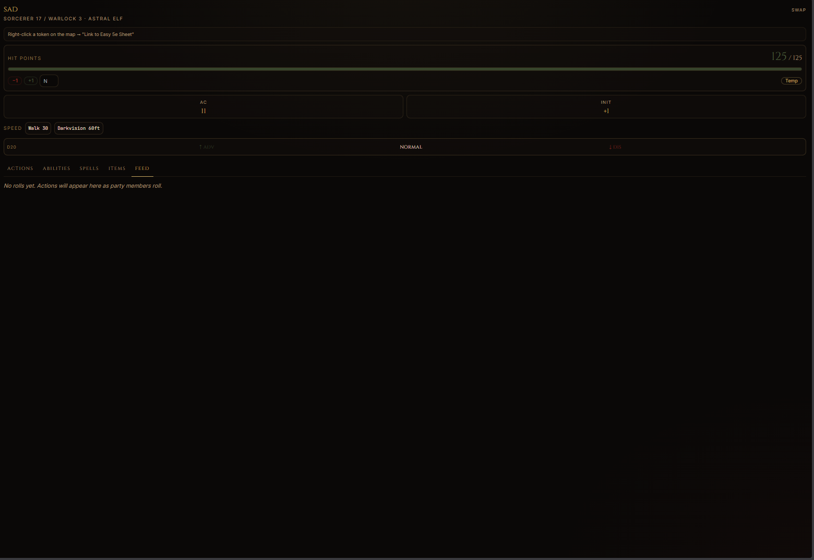

# Easy 5e Sheet — Owlbear Rodeo Extension

A live D&D 5e character sheet that lives inside your Owlbear Rodeo
room. Pairs with the full character builder at
[easydnd5e.app](https://easydnd5e.app) so the same character you
build in the browser shows up at the table — HP, slots, dice, the
lot.

## Install (one-step)

1. Open your Owlbear Rodeo room.
2. Click the puzzle-piece icon → **Settings → Extensions**.
3. Paste this URL into "Install Extension":

   ```
   https://easydnd5e.app/obr/manifest.json
   ```

4. The Easy 5e Sheet popover icon appears in your room toolbar.
   Click it to open the live sheet.

That's it — no account, no install on your machine, no permissions
prompt beyond what OBR already shows.

## What it does

- **Full character builder** at easydnd5e.app — race, class,
  multiclass, subclass, equipment, spells. All rules verified
  against [dnd5e.wikidot.com](https://dnd5e.wikidot.com).
- **Live play panel** inside OBR:
  - HP / AC / initiative with token sync — change HP on the sheet,
    the linked token updates instantly.
  - Dice rolls broadcast to the table (Dice+ compatible format).
  - Spell slot tracker, sorcery points, ki, pact slots, mystic
    arcanum 1/LR, Lucky resource.
  - Advantage / disadvantage toggle for the next d20.
  - Death save tracker.
  - Concentration save reminder when you take damage holding a
    spell.
- **Inventory** with coins, weight, and material-component
  auto-consume on cast (Revivify diamond, Stoneskin diamond
  dust, etc.).
- **Reactive ability hints** — War Caster, Mage Slayer, Sentinel,
  and similar feats surface as in-context tooltips.

## Screenshots




## What's in this repo

This repo contains **only** the public artifacts needed to
distribute and document the extension:

- [`manifest.json`](./manifest.json) — the OBR extension manifest.
- `README.md` — this file.
- `LICENSE` — MIT for everything in this repo.
- `screenshots/` — promotional images.

The character builder itself (the engine, spell catalog, rules
data, UI components for the full builder) is a separate proprietary
codebase hosted at easydnd5e.app. The popover URL loads that site
in an iframe — that's where all the gameplay logic actually runs.

## Privacy

- The extension does not phone home. All character state is stored
  in the player's browser (`localStorage`).
- Dice rolls and HP changes broadcast to the OBR room via the OBR
  SDK's room-scoped broadcast channel — they do not leave the room.
- No analytics, no tracking pixels, no third-party scripts in the
  popover bundle.

## Versioning

The extension version is tracked in `manifest.json`. OBR caches the
manifest by version string, so a bump forces a refetch on the next
room open.

- `0.1.0` — Initial release
- `0.2.x` — Comprehensive D&D rules audit, live HP/init token sync,
  inventory with coins/weight, autoSource badges, reactive feat
  hints, multiclass header, OBR-iframe-safe dialogs.

## Compatibility

- Owlbear Rodeo 2.x rooms (manifest version 1).
- Tested on Chromium-based browsers (Chrome, Edge, Brave) and
  Firefox 120+.
- Requires a modern browser with `localStorage` and ES2020 support.

## Support

- Bug reports / feature requests: open an issue in this repo.
- General questions: [easydnde@easydnd5e.app](mailto:easydnde@easydnd5e.app)
- D&D rules questions about a specific feature: open an issue with
  a wikidot link to the relevant rule and we'll cross-check.

## License

MIT. See [LICENSE](./LICENSE).

The MIT license covers the manifest and the contents of this repo.
The character builder hosted at easydnd5e.app is a separate
proprietary product and is not covered by this license.
